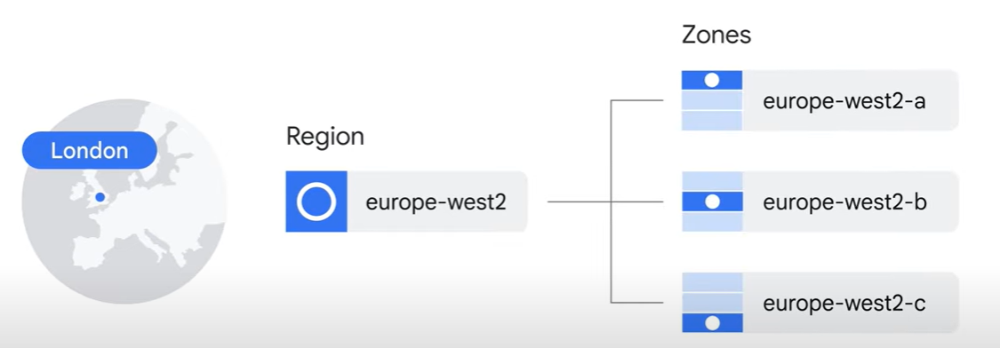

# Google Cloud Introduction

Google Cloud offerings can be broadly categorized as:

- compute
- storage
- big data
- machine learning
- application services for web, mobile, analytics, and back-end solutions

## Cloud Computing

**Cloud Computing** is the delivery of a **shared pool** of **on-demand computing services** over the public internet, that can be rapidly provisioned and released with minimal management effort or service provider interaction.

Some examples of cloud services are:

- servers
- storage
- databases
- networking

The 5 characteristics of cloud computing are:

- **On-demand self-service**: the ability to provision computing capabilities as needed without human interaction
- **Broad network access**: capabilities are available over the network and accessed through standard mechanisms
- **Resource pooling**: the provider's computing resources are pooled to serve multiple consumers using a multi-tenant model
- **Rapid elasticity**: capabilities can be rapidly and elastically provisioned to scale rapidly outward and inward with demand
- **Measured service**: cloud systems automatically control and optimize resource use by leveraging a metering capability at some level of abstraction appropriate to the type of service

### Story of Cloud Computing

The story of cloud computing can be divided into 4 main waves:

1. **Colocation**: companies would rent space in a data center to house their servers
2. **Virtualization**: companies would rent virtual machines from a cloud provider
3. **Container based architectures**: companies would rent containers from a cloud provider
4. **Cloud Computing**: companies would rent services from a cloud provider

### Cloud Service Models

The move to virtualized data centers introduced customers to new types of offerings:

- **IaaS**: infrastructure as a service.
  - IaaS delivers on-demand infrastructure resources via the cloud, such as: raw compute, storage, and network capabilities, organized virtually into resources that are similar to physical data centers.
  - Compute Engine is an example of a Google Cloud IaaS service.
  - In the IaaS model, customers pay for the resources they allocate ahead of time

- **PaaS**: platform as a service
  - PaaS offerings, in contrast, bind code to libraries that provide access to the infrastructure application needs.
  - App Engine is an example of a Google Cloud PaaS service.
  - In the PaaS model, customers pay for the resources they actually use.
  
- **SaaS**: software as a service. 
  - SaaS provides the entire application stack, delivering an entire cloud-based application that customers can access and use.
  - Saas applications are not installed on your local computer, instead, they run in the cloud as a service and are consumed directly over the internet by end users Popular.
  - Google applications such as Gmail, Docs, and Drive, that are a part of Google Workspace, are all examples of SaaS.

### Google Cloud Network

Google Cloud’s infrastructure is based in five major geographic locations: 

- North America
- South America
- Europe
- Asia
- Australia.

Having multiple service locations is important because choosing where to locate applications affects qualities like:

- **availability**
- **durability** 
- **latency** (the time a packet of information takes to travel from its source to its destination)

Each of these locations is divided into several different regions and zones.

- **Regions** are independent geographic areas that consist of zones.
- **Zones** are deployment areas for Google Cloud resources within a region.

For example, London, or europe-west2, is a region that currently comprises three different zones.

Run resources in multiple regions is useful for bringing applications closer to users, and for providing redundancy and disaster recovery.

### Google Cloud Security

The security infrastructure can be explained in progressive layer, starting from the physical security of our data centers, continuing on to how the hardware and software that underlie the infrastructure are secured, and finally, describing the technical constraints and processes in place to support operational security.

1. **Hardware infrastructure layer**:

   - **Hardware design and provenance**: 
     - Both the server boards and the networking equipment in Google data centers are custom-designed by Google.
     - Google also designs custom chips, including a hardware security chip that's currently being deployed on both servers and peripherals.
   - **Secure boot stack**:
     - Google server machines use a variety of technologies to ensure that they are booting the correct software stack, such as cryptographic signatures over the BIOS, bootloader, kernel, and base operating system image.
   - **Premises security**:
     - Google designs and builds its own data centers, which incorporate multiple layers of physical security protections.

2. **Service deployment layer**:

   - **Encryption of inter-service communication**:
     - Google’s infrastructure provides cryptographic privacy and integrity for remote procedure call (“RPC”) data on the network.

3. **User identity layer**:
  
    - **User Identity**:
      - Google’s central identity service, which usually manifests to end users as the Google login page, goes beyond asking for a simple username and password.

4. **Storage services layer**:

    - **Encryption at rest**:
      - Most applications at Google access physical storage (in other words, “file storage”) indirectly via storage services, and encryption using centrally managed keys is applied at the layer of these storage services.

5. **Internet communication layer**:

    - **Google Front End (GFE)**:
      - Google services that are being made available on the internet, register themselves with an infrastructure service called the Google Front End, which ensures that all TLS connections are ended using a public-private key pair and an X.509 certificate from a Certified Authority (CA), as well as following best practices such as supporting perfect forward secrecy.
    - **Denial of Service (DoS) protection**:
      - Google’s infrastructure provides protection against Distributed Denial of Service (DDoS) attacks.

6. **Operational security layer**:

    - **Intrusion detection**:
      - Rules and machine intelligence give Google’s operational security teams warnings of possible incidents.
    - **Reducing insider risk**:
      - Google aggressively limits and actively monitors the activities of employees who have been granted administrative access to the infrastructure.
    - **Employee Universal Second Factor (U2F)**:
      - To guard against phishing attacks against Google employees, employee accounts require use of U2F-compatible Security Keys.
    - **Software development practices**:
      - Google employs central source control and requires two-party review of new code.

### Google Cloud Pricing

How can I make sure I don’t accidentally run up a big Google Cloud bill?

- You can define **budgets** at the billing account level or at the project level. A budget can be a fixed limit, or it can be tied to another metric; for example, a percentage of the previous month’s spend.
- To be notified when costs approach your budget limit, you can create an **alert**.
- **Reports** is a visual tool in the Google Cloud Console that allows you to monitor expenditure based on a project or services.
- Finally, Google Cloud also implements **quotas**, which are designed to prevent the over-consumption of resources because of an error or a malicious attack, protecting both account owners and the Google Cloud community as a whole. There are two types of quotas, both are applied at the project level: 
  - **rate quotas**, that reset after a specific time.
  - **allocation quotas**, that govern the number of resources you can have in your projects.

## QUIZ

1. What is the primary benefit to a Google Cloud customer of using resources in several zones within a region?

   - For expanding services to customers in new areas check
   - ***For improved fault tolerance***
   - For better performance
   - For getting discounts on other zones

2. Why might a Google Cloud customer use resources in several regions around the world?

   - ***To bring their applications closer to users around the world, and for improved fault tolerance***
   - To offer localized application versions in different regions.
   - To improve security
   -  To earn discounts

3. What type of cloud computing service lets you bind your application code to libraries that give access to the infrastructure your applicationneeds?

   - ***Platform as a service***
   - Software as a service
   - Infrastructure as a service 
   - Virtualized data centers
   - Hybrid cloud