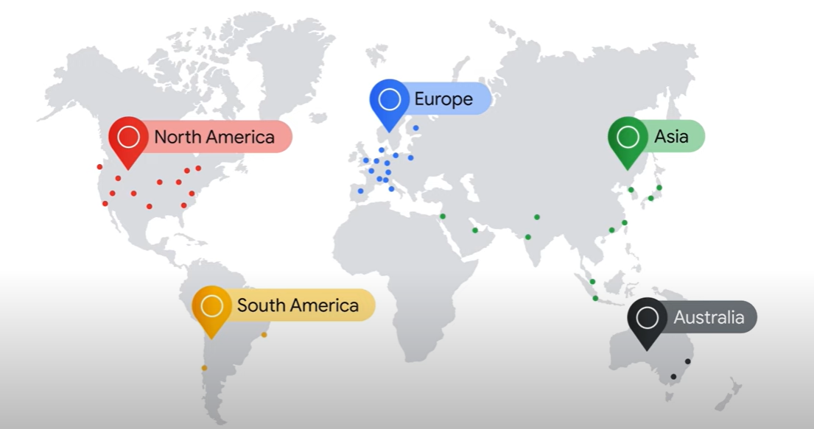
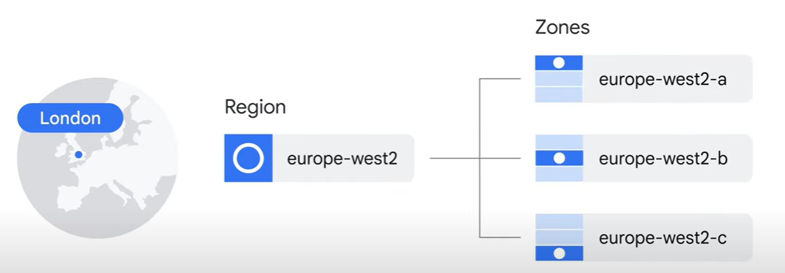

# Introduzione a Google Cloud

Le offerte di Google Cloud possono essere ampiamente categorizzate come:

- compute (calcolo)
- storage (archiviazione)
- big data
- machine learning (apprendimento automatico)
- application services (servizi applicativi) per web, mobile, analisi e soluzioni back-end

## Cloud Computing

**Cloud Computing** è la fornitura di un **pool condiviso** di **servizi di calcolo on-demand** tramite Internet pubblico, che possono essere rapidamente forniti e rilasciati con un minimo sforzo di gestione o interazione con il provider di servizi.

Alcuni esempi di servizi cloud sono:

- server
- archiviazione
- database
- networking

Le 5 caratteristiche del cloud computing sono:

- **On-demand self-service**: la capacità di fornire capacità di calcolo secondo necessità senza interazione umana
- **Broad network access**: le capacità sono disponibili tramite la rete e accessibili tramite meccanismi standard
- **Resource pooling**: le risorse di calcolo del provider sono raggruppate per servire più utenti utilizzando un modello multi-tenant
- **Rapid elasticity**: le capacità possono essere fornite rapidamente ed elasticamente per scalare rapidamente verso l'esterno e verso l'interno in base alla domanda
- **Measured service**: i sistemi cloud controllano e ottimizzano automaticamente l'uso delle risorse sfruttando una capacità di misurazione a un certo livello di astrazione appropriato al tipo di servizio

### Storia del Cloud Computing

La storia del cloud computing può essere divisa in 4 principali fasi:

1. **Colocation**: le aziende affittavano spazio in un data center per ospitare i propri server
2. **Virtualizzazione**: le aziende affittavano macchine virtuali da un provider cloud
3. **Architetture basate su container**: le aziende affittavano container da un provider cloud
4. **Cloud Computing**: le aziende affittano servizi da un provider cloud

### Modelli di servizio cloud

Il passaggio a data center virtualizzati ha introdotto ai clienti nuovi tipi di offerte:

- **IaaS**: infrastructure as a service (infrastruttura come servizio).
  - IaaS fornisce risorse di infrastruttura on-demand tramite il cloud, come calcolo grezzo, archiviazione e capacità di rete, organizzate virtualmente in risorse simili a data center fisici.
  - Compute Engine è un esempio di servizio IaaS di Google Cloud.
  - Nel modello IaaS, i clienti pagano per le risorse che allocano in anticipo.

- **PaaS**: platform as a service (piattaforma come servizio).
  - Le offerte PaaS, al contrario, legano il codice a librerie che forniscono accesso all'infrastruttura necessaria per l'applicazione.
  - App Engine è un esempio di servizio PaaS di Google Cloud.
  - Nel modello PaaS, i clienti pagano per le risorse effettivamente utilizzate.

- **SaaS**: software as a service (software come servizio).
  - SaaS fornisce l'intero stack dell'applicazione, offrendo un'applicazione basata su cloud che i clienti possono accedere e utilizzare.
  - Le applicazioni SaaS non vengono installate sul computer locale, ma vengono eseguite nel cloud come servizio e vengono utilizzate direttamente via Internet dagli utenti finali.
  - Le applicazioni Google come Gmail, Docs e Drive, che fanno parte di Google Workspace, sono tutti esempi di SaaS.

### Rete di Google Cloud

L'infrastruttura di Google Cloud si basa su cinque principali posizioni geografiche:

- Nord America
- Sud America
- Europa
- Asia
- Australia

Avere posizioni di servizio multiple è importante perché la scelta di dove posizionare le applicazioni influisce su qualità come:

- **disponibilità**
- **durabilità**
- **latenza** (il tempo che impiega un pacchetto di informazioni per viaggiare dal suo punto di origine alla sua destinazione)

Ogni posizione è divisa in diverse regioni e zone.

- **Regioni** sono aree geografiche indipendenti che consistono in zone.
- **Zone** sono aree di distribuzione delle risorse di Google Cloud all'interno di una regione.

Ad esempio, Londra, o europe-west2, è una regione che attualmente comprende tre diverse zone.

Eseguire risorse in più regioni è utile per avvicinare le applicazioni agli utenti e fornire ridondanza e ripristino da disastro.

### Sicurezza di Google Cloud

L'infrastruttura di sicurezza può essere spiegata in strati progressivi, a partire dalla sicurezza fisica dei nostri data center, passando a come l'hardware e il software che sottostanno all'infrastruttura sono protetti, e infine descrivendo i vincoli tecnici e i processi in atto per supportare la sicurezza operativa.

1. **Strato dell'infrastruttura hardware**:

   - **Progettazione e provenienza dell'hardware**:
     - Sia le schede server che l'equipaggiamento di rete nei data center di Google sono progettati su misura da Google.
     - Google progetta anche chip personalizzati, inclusi un chip di sicurezza hardware che attualmente viene implementato su server e periferiche.
   - **Stack di avvio sicuro**:
     - Le macchine server di Google utilizzano una varietà di tecnologie per garantire che venga avviato il corretto stack software, come firme crittografiche sul BIOS, bootloader, kernel e immagine del sistema operativo di base.
   - **Sicurezza delle strutture**:
     - Google progetta e costruisce i propri data center, che incorporano molteplici livelli di protezione fisica.

2. **Strato di distribuzione dei servizi**:

   - **Crittografia delle comunicazioni tra servizi**:
     - L'infrastruttura di Google fornisce privacy e integrità crittografica per i dati di chiamata di procedura remota ("RPC") sulla rete.

3. **Strato di identità dell'utente**:

   - **Identità dell'utente**:
     - Il servizio di identità centrale di Google, che di solito si manifesta agli utenti finali come la pagina di accesso di Google, va oltre la semplice richiesta di un nome utente e una password.

4. **Strato dei servizi di archiviazione**:

   - **Crittografia a riposo**:
     - La maggior parte delle applicazioni di Google accede all'archiviazione fisica (ovvero "archiviazione di file") in modo indiretto tramite servizi di archiviazione, e viene applicata la crittografia utilizzando chiavi gestite centralmente a livello di questi servizi di archiviazione.

5. **Strato di comunicazione Internet**:

   - **Google Front End (GFE)**:
     - I servizi di Google che sono resi disponibili su Internet si registrano presso un servizio di infrastruttura chiamato Google Front End, che garantisce che tutte le connessioni TLS vengano terminate utilizzando una coppia di chiavi pubbliche-private e un certificato X.509 da un'autorità certificata (CA), oltre a seguire le migliori pratiche come il supporto della segretezza perfetta in avanti.
   - **Protezione da attacchi di negazione del servizio (DoS)**:
     - L'infrastruttura di Google fornisce protezione contro gli attacchi di negazione del servizio distribuiti (DDoS).

6. **Strato di sicurezza operativa**:

   - **Rilevazione delle intrusioni**:
     - Regole e intelligenza artificiale forniscono avvisi alle squadre di sicurezza operative di Google in caso di possibili incidenti.
   - **Riduzione del rischio interno**:
     - Google limita aggressivamente e monitora attivamente le attività dei dipendenti a cui è stato concesso l'accesso amministrativo all'infrastruttura.
   - **Employee Universal Second Factor (U2F)**:
     - Per proteggersi dagli attacchi di phishing contro i dipendenti di Google, gli account dei dipendenti richiedono l'uso di chiavi di sicurezza compatibili con U2F.
   - **Pratiche di sviluppo del software**:
     - Google utilizza un controllo centralizzato del codice sorgente e richiede la revisione a due parti del nuovo codice.

### Prezzi di Google Cloud

Come posso assicurarmi di non accumulare accidentalmente un grosso conto su Google Cloud?

- Puoi definire **budget** a livello di account di fatturazione o a livello di progetto. Un budget può essere un limite fisso o può essere legato a un'altra metrica; ad esempio, una percentuale della spesa del mese precedente.
- Per essere avvisato quando i costi si avvicinano al limite del budget, puoi creare un **avviso**.
- **Reports** è uno strumento visivo nella Console di Google Cloud che consente di monitorare le spese in base a un progetto o a servizi.
- Infine, Google Cloud implementa anche **quote**, che sono progettate per prevenire il consumo eccessivo di risorse a causa di un errore o di un attacco malevolo, proteggendo sia i proprietari dell'account che l'intera comunità di Google Cloud. Ci sono due tipi di quote, entrambe applicate a livello di progetto:
  - **quote di velocità**, che si azzerano dopo un determinato periodo di tempo.
  - **quote di allocazione**, che regolano il numero di risorse che è possibile avere nei propri progetti.

## QUIZ

1. What is the primary benefit to a Google Cloud customer of using resources in several zones within a region?

   - For expanding services to customers in new areas check
   - ***For improved fault tolerance***
   - For better performance
   - For getting discounts on other zones

2. Why might a Google Cloud customer use resources in several regions around the world?

   - ***To bring their applications closer to users around the world, and for improved fault tolerance***
   - To offer localized application versions in different regions.
   - To improve security
   -  To earn discounts

3. What type of cloud computing service lets you bind your application code to libraries that give access to the infrastructure your applicationneeds?

   - ***Platform as a service***
   - Software as a service
   - Infrastructure as a service 
   - Virtualized data centers
   - Hybrid cloud