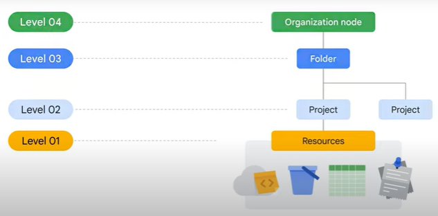
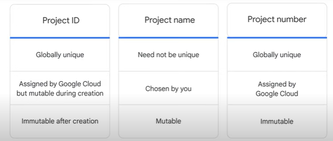
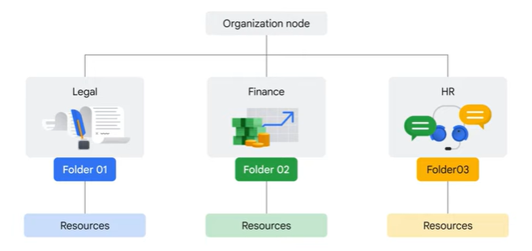
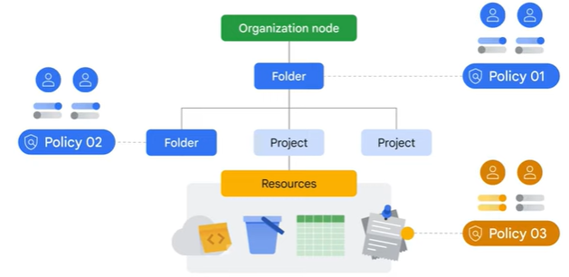
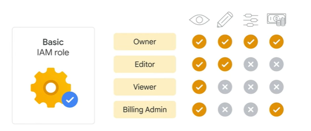
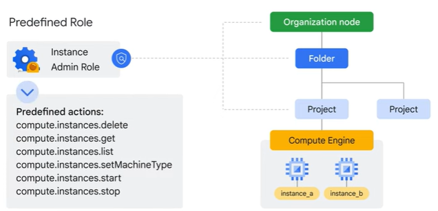

# Resources and Access in the Cloud

## Google Cloud Resources Hierarchy

Google Cloud’s resource hierarchy contains four levels, and starting from the bottom up they are:

- **Resources**: These represent virtual machines, Cloud Storage buckets, tables in BigQuery, or anything else in Google Cloud. 
- **Projects**: Resources are organized into projects, which sit on the second level.
- **Folders**: Projects can be organized into folders, or even subfolders.
- **Organization node**: encompasses all the projects, folders, and resources in your organization.

Resource Hierarchy directly relates to *how policies are managed and applied when you use Google Cloud.*

**Policies** can be defined at the *project*, *folder*, and *organization* node levels. Policies are also inherited downward.

### Projects

**Projects** are the basis for enabling and using Google Cloud services, like managing APIs, enabling billing, adding and removing collaborators, and enabling other Google services.

Each project is a separate entity under the organization node, and each resource belongs to exactly one project.

Projects can have different owners and users because they’re billed and managed separately.

Each Google Cloud project has three identifying attributes:

- a **project ID** (globally unique identifier assigned by Google that can’t be changed after creation)
- a **project name** (user-created, they don’t have to be unique and they can be changed at any time)
- a **project number** (unique)

#### Resource Manager Tool

Google Cloud’s Resource Manager tool is designed to programmatically help you manage projects.

It’s an API that can gather a list of all the projects associated with an account, create new projects, update existing projects, and delete projects.

It’s an API that can gather a list of all the projects associated with an account, create new projects, update existing projects, and delete projects.

### Folder

Folders let you assign policies to resources at a level of granularity you choose.

The resources in a folder inherit policies and permissions assigned to that folder.

A folder can contain projects, other folders, or a combination of both.

You can use folders to group projects under an organization in a hierarchy. For example, folders allow you to group these resources on a per-department basis.

If you have two different projects that are administered by the same team, you can put policies into a common folder so they have the same permissions, instead of having to set them individually on each project, and duplicate the policies management.

### Organization Node

To use folders, you must have an organization node, which is the very topmost resource in the Google Cloud hierarchy.

Everything else attached to that account goes under this node, which includes folders, projects, and other resources.

There are some special roles associated with this top-level organization node. For example, you can designate an organization policy administrator so that only people with privilege can change policies.

## IAM (Identity and Access Management)

When an organization node contains lots of folders, projects, and resources, a workforce might need to restrict who has access to what. To help with this task, administrators can use Identity and Access Management, or IAM.

With IAM, administrators can apply policies that define **who** can do **what** and on **which** resources.

- The "who" part of an IAM policy can be a Google account, a Google group, a service account, or a Cloud Identity domain 
  - A "who" is also called a "**principal**"
  - Each principal has its own identifier, usually an email address.

- The "**can do what**" part of an IAM policy is defined by a **role**.
  - An IAM role is a collection of permissions.

When you grant a role to a principal, you grant all the permissions that the role contains.

When a principal is given a role on a specific element of the resource hierarchy, the resulting policy applies to both the chosen element and all the elements below it in the hierarchy.

You can define deny rules that prevent certain principals from using certain permissions, regardless of the roles they're granted.

There are three kinds of roles in IAM:

- **basic**
- **predefined**
- **custom**

### Basic Roles

When applied to a Google Cloud project, they affect all resources in that project. Basic roles include:

- **Viewer**: Viewers can access resources but can’t make changes.
- **Editor**: Editors can access and make changes to a resource.
- **Owner**: Owners have the same permissions as editors, but they can also manage the associated roles and permissions and set up billing.
- **Billing Administrator**: Billing administrators can manage billing for a project, but they can’t access the resources in the project.

**NOTE**: If several people are working together on a project that contains sensitive data, basic roles are probably too broad.

### Predefined Roles

Predefined roles are collections of permissions that grant access to specific Google Cloud resources and prevent access to others.

For example, with Compute Engine, you can apply specific predefined roles—such as "instanceAdmin" to Compute Engine resources in a given project, a given folder, or an entire organization. This then allows whoever has these roles to perform a specific set of predefined actions.

### Custom Roles

Many companies use a "**least-privilege**" model in which each person in your organization is given the minimal amount of privilege needed to do their job.

So, for example, maybe you want to define an “instanceOperator” role to allow some users to stop and start Compute Engine virtual machines, but not reconfigure them.

Custom roles will allow you to define those exact permissions.

**NOTE**:

- You’ll need to manage the permissions that define the custom role you’ve created. 
- Custom roles can only be applied to either the project level or organization level. 

## Service Accounts

Service accounts are used to authenticate and authorize applications and virtual machines (VMs) to access Google Cloud APIs.

Service accounts are named with an email address, but instead of passwords they use cryptographic keys to access resources.

Service accounts do need to be managed.

## Cloud Identity

With Cloud Identity, organizations can define policies and manage their users and groups using the Google Admin Console.

Admins can log in and manage Google Cloud resources using the same usernames and passwords they already use in existing Active Directory or LDAP systems.

Using Cloud Identity also means that when someone leaves an organization, an administrator can use the Google Admin Console to disable their account and remove them from groups.

## Interacting with Google Cloud

There are four ways to access and interact with Google Cloud:

- Google Cloud Console
- Cloud SDK and Cloud Shell
- Cloud APIs
- Google Cloud App

### Google Cloud Console

First is the Google **Cloud Console**, which is Google Cloud’s graphical user interface, or GUI, that helps you deploy, scale, and diagnose production issues in a simple web-based interface.

With the Cloud Console, you can easily find your resources, check their health, have full management control over them, and set budgets to control how much you spend on them.

The Cloud Console also provides a search facility to quickly find resources and connect to instances via SSH in the browser.

### Cloud SDK and Cloud Shell

The **Cloud SDK** is a set of tools that you can use to manage resources and applications hosted on Google Cloud.
These include the Google Cloud CLI, which provides the main command-line interface for Google Cloud products and services, and bq, a command-line tool for BigQuery.

**Cloud Shell** provides command-line access to cloud resources directly from a browser.
Cloud Shell is a Debian-based virtual machine with a persistent 5 gigabyte home directory, which makes it easy to manage Google Cloud projects and resources.

### Cloud APIs

The third way to access Google Cloud is through application programming interfaces, or APIs. The services that make up Google Cloud offer APIs so that code you write can control them.

Google provides Cloud Client libraries and Google API Client libraries in many popular languages, such as Java, Python, PHP, C#, Go, Node.js, Ruby, and C++.

### Google Cloud App

And finally, the fourth way to access and interact with Google Cloud is with the Google Cloud app, which can be used to:

- start, stop, and use SSH to connect to Compute Engine instances and see logs from each instance.
- stop and start Cloud SQL instances.
- administer applications deployed on App Engine by viewing errors, rolling back deployments, and changing traffic splitting.

The Google Cloud app provides up-to-date billing information for your projects and billing alerts for projects that are going over budget.

## Lab: Getting Started with Cloud Marketplace

### Overview

In this lab, you use Google Cloud Marketplace to quickly and easily deploy a LAMP stack on a Compute Engine instance. The Bitnami LAMP Stack provides a complete web development environment for Linux that can be launched in one click.

| Component              | Role                     |
|------------------------|--------------------------|
| Linux                  | Operating system         |
| Apache HTTP Server     | Web server               |
| MySQL                  | Relational database      |
| PHP                    | Web application framework|
| phpMyAdmin             | PHP administration tool  |

You can learn more about the Bitnami LAMP stack from the Bitnami Documentation article [Google Cloud Platform](https://docs.bitnami.com/google/).

### Objectives

In this lab, you learn how to launch a solution using Cloud Marketplace.

### Task 1. Sign in to the Google Cloud Console

For each lab, you get a new Google Cloud project and set of resources for a fixed time at no cost.

1. Sign in to Qwiklabs using an incognito window.
2. Note the lab's access time (for example, 1:15:00), and make sure you can finish within that time. There is no pause feature. You can restart if needed, but you have to start at the beginning.
3. When ready, click Start lab.
4. Note your lab credentials (Username and Password). You will use them to sign in to the Google Cloud Console.
5. Click Open Google Console.
6. Click Use another account and copy/paste credentials for this lab into the prompts. If you use other credentials, you'll receive errors or incur charges.
7. Accept the terms and skip the recovery resource page.

**Note:** Do not click End Lab unless you have finished the lab or want to restart it. This clears your work and removes the project.

### Task 2. Use Cloud Marketplace to deploy a LAMP stack

1. In the Google Cloud Console, on the Navigation menu (Navigation menu icon), click Marketplace.
2. In the search bar, type LAMP and then press ENTER.
3. In the search results, click Bitnami package for LAMP. If you choose another LAMP stack, such as the Google Click to Deploy offering, the lab instructions will not work as expected.
4. On the LAMP page, click GET STARTED.
5. On the Agreements page, check the box for Terms and agreements, and click AGREE.
6. On the Successfully agreed to terms pop up, click DEPLOY. If this is your first time using Compute Engine, the Compute Engine API must be initialized before you can continue.
7. For Zone, select the deployment zone to ZONE.
8. For Machine Type, select E2 as the Series and e2-medium as the Machine Type.
9. Leave the remaining settings as their defaults.
10. Click Deploy.
11. If a Welcome to Deployment Manager message appears, click Close to dismiss it.

**Note**: Warnings may appear as the deployment is happening. You can disregard these for this lab.

The status of the deployment appears in the console window: lampstack-1 is being deployed. When the deployment of the infrastructure is complete, the status changes to lampstack-1 has been deployed.

After the software is installed, a summary of the details for the instance, including the site address, is displayed.

Click Check my progress to verify the objective.

### Task 3. Verify your deployment

1. When the deployment is complete, click the Site address link in the right pane. (If the website is not responding, wait 30 seconds and try again.) If you see a redirection notice, click on that link to view your new site. 
   
   Alternatively, you can click Visit the site in the Get started with Bitnami package for LAMP section of the page. A new browser tab displays a congratulations message. This page confirms that, as part of the LAMP stack, the Apache HTTP Server is running.

**Note**: If you can't see the web page in the browser on your corporate laptop: If possible, exit any corporate VPN/network and try again. Enter the IP address on another device, such as a tablet or even a phone.

### Congratulations!

In this lab, you deployed a LAMP stack to a Compute Engine instance.

### End your lab

When you have completed your lab, click End Lab. Google Cloud Skills Boost removes the resources you’ve used and cleans the account for you.

You will be given an opportunity to rate the lab experience. Select the applicable number of stars, type a comment, and then click Submit.

The number of stars indicates the following:

- 1 star = Very dissatisfied
- 2 stars = Dissatisfied
- 3 stars = Neutral
- 4 stars = Satisfied
- 5 stars = Very satisfied

You can close the dialog box if you don't want to provide feedback.

For feedback, suggestions, or corrections, please use the Support tab.

More resources
Read the [Google Cloud documentation on Cloud Marketplace](https://cloud.google.com/marketplace/docs/).

## QUIZ

1. Which of these values is globally unique, permanent, and unchangeable, but can be modified by the customer during creation?

   - The project name
   - The project's billing credit-card number
   - The project number
   - ***The project ID***

2. Order these IAM role types from broadest to finest-grained.

   - Custom roles, predefined roles, basic roles
   - ***Basic roles, predefined roles, custom roles***
   - Predefined roles, custom roles, basic roles

3. Choose the correct completion: Services and APIs are enabled on a per-__________ basis.

   - ***Project***
   - Folder
   - Organization
   - Billing account