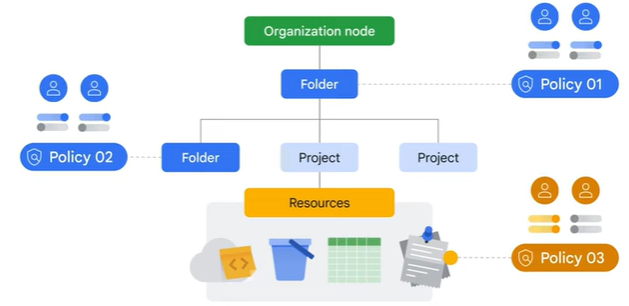
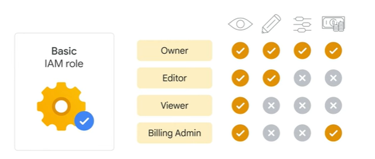
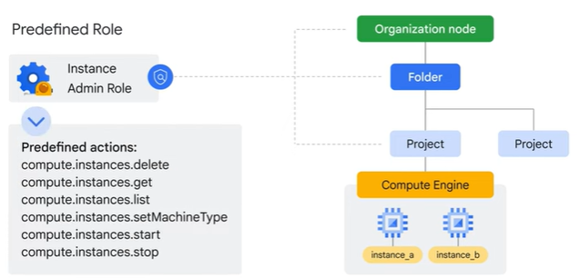

# Risorse e Accesso nel Cloud

## Gerarchia delle Risorse di Google Cloud

La gerarchia delle risorse di Google Cloud è composta da quattro livelli, e partendo dal basso verso l'alto sono:

- **Risorse**: Rappresentano macchine virtuali, bucket di Cloud Storage, tabelle in BigQuery o qualsiasi altra cosa in Google Cloud.
- **Progetti**: Le risorse sono organizzate in progetti, che si trovano al secondo livello.
- **Cartelle**: I progetti possono essere organizzati in cartelle, o anche sottocartelle.
- **Nodo di organizzazione**: Comprende tutti i progetti, le cartelle e le risorse dell'organizzazione.

La gerarchia delle risorse è direttamente correlata a *come le politiche vengono gestite e applicate quando si utilizza Google Cloud.*

Le **politiche** possono essere definite ai livelli di nodo *progetto*, *cartella* e *organizzazione*. Le politiche vengono anche ereditate verso il basso.

### Progetti

I **progetti** sono la base per abilitare e utilizzare i servizi di Google Cloud, come la gestione delle API, l'abilitazione della fatturazione, l'aggiunta e la rimozione dei collaboratori e l'abilitazione di altri servizi Google.

Ogni progetto è un'entità separata sotto il nodo di organizzazione e ogni risorsa appartiene esattamente a un progetto.

I progetti possono avere proprietari e utenti diversi perché vengono fatturati e gestiti separatamente.

Ogni progetto di Google Cloud ha tre attributi identificativi:

- un **ID del progetto** (un identificatore univoco assegnato da Google che non può essere modificato dopo la creazione)
- un **nome del progetto** (creato dall'utente, non è necessario che sia univoco e può essere modificato in qualsiasi momento)
- un **numero del progetto** (unico)

#### Strumento di Gestione delle Risorse

Lo strumento di gestione delle risorse di Google Cloud è progettato per aiutarti a gestire i progetti in modo programmato.

È un'API che può raccogliere un elenco di tutti i progetti associati a un account, creare nuovi progetti, aggiornare progetti esistenti ed eliminare progetti.

È un'API che può raccogliere un elenco di tutti i progetti associati a un account, creare nuovi progetti, aggiornare progetti esistenti ed eliminare progetti.

### Cartella

Le cartelle ti consentono di assegnare politiche alle risorse a un livello di granularità che scegli.

Le risorse in una cartella ereditano le politiche e le autorizzazioni assegnate a quella cartella.

Una cartella può contenere progetti, altre cartelle o una combinazione di entrambi.

Puoi utilizzare le cartelle per raggruppare i progetti in un'organizzazione in una gerarchia. Ad esempio, le cartelle ti consentono di raggruppare queste risorse su base dipartimentale.

Se hai due progetti diversi che sono amministrati dallo stesso team, puoi inserire le politiche in una cartella comune in modo che abbiano le stesse autorizzazioni, anziché doverle impostare singolarmente su ogni progetto e duplicare la gestione delle politiche.

### Nodo di Organizzazione

Per utilizzare le cartelle, è necessario avere un nodo di organizzazione, che è la risorsa più alta nella gerarchia di Google Cloud.

Tutto il resto collegato a quell'account viene inserito sotto questo nodo, che include cartelle, progetti e altre risorse.

Ci sono alcuni ruoli speciali associati a questo nodo di organizzazione di alto livello. Ad esempio, è possibile designare un amministratore delle politiche dell'organizzazione in modo che solo le persone con privilegi possano modificare le politiche.

## IAM (Identity and Access Management)

Quando un nodo di organizzazione contiene molte cartelle, progetti e risorse, un team potrebbe avere bisogno di limitare l'accesso a determinate risorse. Per aiutare in questo compito, gli amministratori possono utilizzare Identity and Access Management, o IAM.

Con IAM, gli amministratori possono applicare politiche che definiscono **chi** può fare **cosa** e su **quali** risorse.

- La parte "chi" di una politica IAM può essere un account Google, un gruppo Google, un account di servizio o un dominio di identità cloud.
  - Un "chi" viene anche chiamato "**principale**".
  - Ogni principale ha il proprio identificatore, di solito un indirizzo email.

- La parte "**cosa può fare**" di una politica IAM è definita da un **ruolo**.
  - Un ruolo IAM è una collezione di autorizzazioni.

Quando concedi un ruolo a un principale, concedi tutte le autorizzazioni contenute nel ruolo.

Quando a un principale viene assegnato un ruolo su un elemento specifico della gerarchia delle risorse, la politica risultante si applica sia all'elemento scelto che a tutti gli elementi sottostanti nella gerarchia.

Puoi definire regole di negazione che impediscono a determinati principali di utilizzare determinate autorizzazioni, indipendentemente dai ruoli loro assegnati.

Esistono tre tipi di ruoli in IAM:

- **base**
- **predefiniti**
- **personalizzati**

### Ruoli Base

Quando vengono applicati a un progetto di Google Cloud, influiscono su tutte le risorse in quel progetto. I ruoli base includono:

- **Visualizzatore**: I visualizzatori possono accedere alle risorse ma non possono apportare modifiche.
- **Editor**: Gli editor possono accedere alle risorse e apportare modifiche.
- **Proprietario**: I proprietari hanno le stesse autorizzazioni degli editor, ma possono anche gestire i ruoli e le autorizzazioni associate e configurare la fatturazione.
- **Amministratore della fatturazione**: Gli amministratori della fatturazione possono gestire la fatturazione di un progetto, ma non possono accedere alle risorse del progetto.

**NOTA**: Se diverse persone lavorano insieme su un progetto che contiene dati sensibili, i ruoli base sono probabilmente troppo ampi.

### Ruoli Predefiniti

I ruoli predefiniti sono collezioni di autorizzazioni che concedono l'accesso a risorse specifiche di Google Cloud e impediscono l'accesso ad altre.

Ad esempio, con Compute Engine, è possibile applicare ruoli predefiniti specifici, come "instanceAdmin" alle risorse di Compute Engine in un determinato progetto, una determinata cartella o un'intera organizzazione. Ciò consente quindi a chiunque abbia questi ruoli di eseguire un insieme specifico di azioni predefinite.

### Ruoli Personalizzati

Molte aziende utilizzano un modello di "**privilegio minimo**" in cui a ciascuna persona dell'organizzazione viene assegnato il minimo privilegio necessario per svolgere il proprio lavoro.

Quindi, ad esempio, potresti voler definire un ruolo "instanceOperator" per consentire a alcuni utenti di arrestare e avviare macchine virtuali di Compute Engine, ma non di riconfigurarle.

I ruoli personalizzati ti consentiranno di definire tali autorizzazioni esatte.

**NOTA**:

- Dovrai gestire le autorizzazioni che definiscono il ruolo personalizzato che hai creato.
- I ruoli personalizzati possono essere applicati solo a livello di progetto o di organizzazione.

## Account di Servizio

Gli account di servizio vengono utilizzati per autenticare e autorizzare applicazioni e macchine virtuali (VM) per accedere alle API di Google Cloud.

Gli account di servizio hanno un indirizzo email come nome, ma invece di password utilizzano chiavi crittografiche per accedere alle risorse.

Gli account di servizio devono essere gestiti.

## Cloud Identity

Con Cloud Identity, le organizzazioni possono definire politiche e gestire i propri utenti e gruppi utilizzando la Console di amministrazione di Google.

Gli amministratori possono accedere e gestire le risorse di Google Cloud utilizzando gli stessi nomi utente e password che già utilizzano nei sistemi Active Directory o LDAP esistenti.

L'utilizzo di Cloud Identity significa anche che quando qualcuno lascia un'organizzazione, un amministratore può utilizzare la Console di amministrazione di Google per disabilitare il loro account e rimuoverli dai gruppi.

## Interazione con Google Cloud

Ci sono quattro modi per accedere e interagire con Google Cloud:

- Console di Google Cloud
- SDK Cloud e Cloud Shell
- API Cloud
- App Google Cloud

### Console di Google Cloud

Il primo è la **Console di Google Cloud**, che è l'interfaccia utente grafica di Google Cloud, o GUI, che ti aiuta a distribuire, scalare e diagnosticare problemi di produzione in un'interfaccia web semplice.

Con la Console di Cloud, puoi trovare facilmente le tue risorse, controllarne lo stato di salute, avere il pieno controllo di gestione su di esse e impostare budget per controllare quanto spendi su di esse.

La Console di Cloud fornisce anche una funzionalità di ricerca per trovare rapidamente le risorse e connettersi alle istanze tramite SSH nel browser.

### SDK Cloud e Cloud Shell

Lo **SDK Cloud** è un insieme di strumenti che puoi utilizzare per gestire risorse e applicazioni ospitate su Google Cloud.
Questi includono il Google Cloud CLI, che fornisce l'interfaccia della riga di comando principale per i prodotti e i servizi di Google Cloud, e bq, uno strumento della riga di comando per BigQuery.

**Cloud Shell** fornisce accesso alla riga di comando alle risorse cloud direttamente da un browser.
Cloud Shell è una macchina virtuale basata su Debian con una directory home persistente di 5 gigabyte, che facilita la gestione dei progetti e delle risorse di Google Cloud.

### API Cloud

Il terzo modo per accedere a Google Cloud è tramite le interfacce di programmazione delle applicazioni, o API. I servizi che compongono Google Cloud offrono API in modo che il codice che scrivi possa controllarli.

Google fornisce librerie client di Cloud e librerie client API di Google in molti linguaggi di programmazione popolari, come Java, Python, PHP, C#, Go, Node.js, Ruby e C++.

### App Google Cloud

E infine, il quarto modo per accedere e interagire con Google Cloud è con l'app Google Cloud, che può essere utilizzata per:

- avviare, arrestare e utilizzare SSH per connettersi alle istanze di Compute Engine e visualizzare i log di ogni istanza.
- arrestare e avviare istanze di Cloud SQL.
- amministrare le applicazioni distribuite su App Engine visualizzando gli errori, annullando le distribuzioni e modificando la suddivisione del traffico.

L'app Google Cloud fornisce informazioni aggiornate sulla fatturazione dei tuoi progetti e avvisi di fatturazione per i progetti che superano il budget.

## Lab: Getting Started with Cloud Marketplace

### Overview

In this lab, you use Google Cloud Marketplace to quickly and easily deploy a LAMP stack on a Compute Engine instance. The Bitnami LAMP Stack provides a complete web development environment for Linux that can be launched in one click.

| Component              | Role                     |
|------------------------|--------------------------|
| Linux                  | Operating system         |
| Apache HTTP Server     | Web server               |
| MySQL                  | Relational database      |
| PHP                    | Web application framework|
| phpMyAdmin             | PHP administration tool  |

You can learn more about the Bitnami LAMP stack from the Bitnami Documentation article [Google Cloud Platform](https://docs.bitnami.com/google/).

### Objectives

In this lab, you learn how to launch a solution using Cloud Marketplace.

### Task 1. Sign in to the Google Cloud Console

For each lab, you get a new Google Cloud project and set of resources for a fixed time at no cost.

1. Sign in to Qwiklabs using an incognito window.
2. Note the lab's access time (for example, 1:15:00), and make sure you can finish within that time. There is no pause feature. You can restart if needed, but you have to start at the beginning.
3. When ready, click Start lab.
4. Note your lab credentials (Username and Password). You will use them to sign in to the Google Cloud Console.
5. Click Open Google Console.
6. Click Use another account and copy/paste credentials for this lab into the prompts. If you use other credentials, you'll receive errors or incur charges.
7. Accept the terms and skip the recovery resource page.

**Note:** Do not click End Lab unless you have finished the lab or want to restart it. This clears your work and removes the project.

### Task 2. Use Cloud Marketplace to deploy a LAMP stack

1. In the Google Cloud Console, on the Navigation menu (Navigation menu icon), click Marketplace.
2. In the search bar, type LAMP and then press ENTER.
3. In the search results, click Bitnami package for LAMP. If you choose another LAMP stack, such as the Google Click to Deploy offering, the lab instructions will not work as expected.
4. On the LAMP page, click GET STARTED.
5. On the Agreements page, check the box for Terms and agreements, and click AGREE.
6. On the Successfully agreed to terms pop up, click DEPLOY. If this is your first time using Compute Engine, the Compute Engine API must be initialized before you can continue.
7. For Zone, select the deployment zone to ZONE.
8. For Machine Type, select E2 as the Series and e2-medium as the Machine Type.
9. Leave the remaining settings as their defaults.
10. Click Deploy.
11. If a Welcome to Deployment Manager message appears, click Close to dismiss it.

**Note**: Warnings may appear as the deployment is happening. You can disregard these for this lab.

The status of the deployment appears in the console window: lampstack-1 is being deployed. When the deployment of the infrastructure is complete, the status changes to lampstack-1 has been deployed.

After the software is installed, a summary of the details for the instance, including the site address, is displayed.

Click Check my progress to verify the objective.

### Task 3. Verify your deployment

1. When the deployment is complete, click the Site address link in the right pane. (If the website is not responding, wait 30 seconds and try again.) If you see a redirection notice, click on that link to view your new site. 
   
   Alternatively, you can click Visit the site in the Get started with Bitnami package for LAMP section of the page. A new browser tab displays a congratulations message. This page confirms that, as part of the LAMP stack, the Apache HTTP Server is running.

**Note**: If you can't see the web page in the browser on your corporate laptop: If possible, exit any corporate VPN/network and try again. Enter the IP address on another device, such as a tablet or even a phone.

### Congratulations!

In this lab, you deployed a LAMP stack to a Compute Engine instance.

### End your lab

When you have completed your lab, click End Lab. Google Cloud Skills Boost removes the resources you’ve used and cleans the account for you.

You will be given an opportunity to rate the lab experience. Select the applicable number of stars, type a comment, and then click Submit.

The number of stars indicates the following:

- 1 star = Very dissatisfied
- 2 stars = Dissatisfied
- 3 stars = Neutral
- 4 stars = Satisfied
- 5 stars = Very satisfied

You can close the dialog box if you don't want to provide feedback.

For feedback, suggestions, or corrections, please use the Support tab.

More resources
Read the [Google Cloud documentation on Cloud Marketplace](https://cloud.google.com/marketplace/docs/).

## QUIZ

1. Which of these values is globally unique, permanent, and unchangeable, but can be modified by the customer during creation?

   - The project name
   - The project's billing credit-card number
   - The project number
   - ***The project ID***

2. Order these IAM role types from broadest to finest-grained.

   - Custom roles, predefined roles, basic roles
   - ***Basic roles, predefined roles, custom roles***
   - Predefined roles, custom roles, basic roles

3. Choose the correct completion: Services and APIs are enabled on a per-__________ basis.

   - ***Project***
   - Folder
   - Organization
   - Billing account