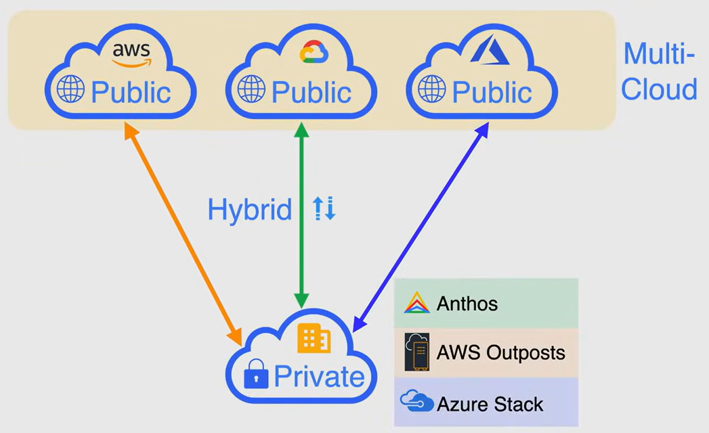

# Cloud Deployment Models

## Public Cloud Models

The public cloud is defined as computing services offered by third-party providers over the public internet, making them available to anyone who wants to use or purchase them. 

Public cloud services are **fully owned and operated by a third-party cloud service provider**, which deliver their computing resources like servers and storage over the internet. Some examples of public cloud services are:

- **Amazon Web Services (AWS)**
- **Microsoft Azure**
- **Google Cloud Platform (GCP)**

## Multi Cloud Models

A multi-cloud strategy involves using two or more cloud computing services from different cloud service providers.

It is useful (if implemented correctly) to avoid vendor lock-in, reduce the risk of downtime, and disaster recovery.

The downside is that it can be more complex to manage, because each cloud provider has its own set of tools, that can be different from the others.

## Private Cloud Models

A private cloud is a cloud service that is not shared with any other organization. It is a single-tenant environment where the hardware, storage, and network are dedicated to a single client or company.

Each cloud service provider has its own private cloud services that can be implemented on-site:

- Anthos (Google Cloud)
- Azure Stack (Microsoft Azure)
- AWS Outposts (Amazon Web Services)

## Hybrid Cloud Models

A hybrid cloud is a computing environment that combines a public cloud and a private cloud by allowing data and applications to be shared between them.

**NOTE**: If your on-premises data center is connected to a public cloud, it is not a hybrid cloud. It is an hybrid environment or hybrid network.