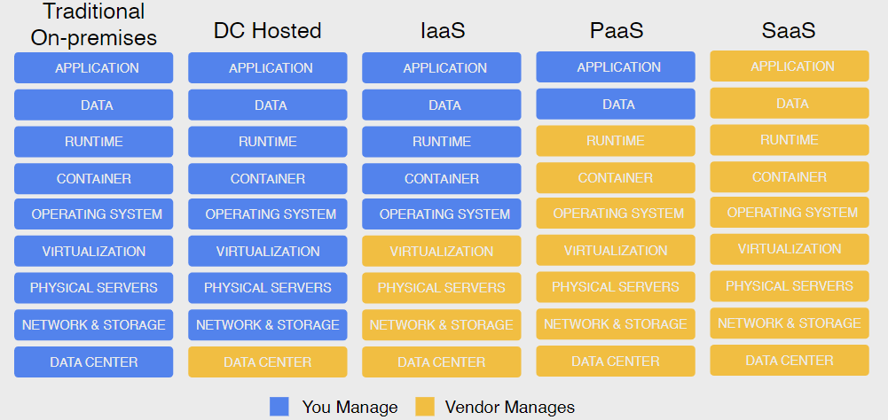

# Cloud Service Models

## XaaS

**Everything as a Service (XaaS)** is a cloud computing term for a variety of services and applications that users can access over the internet, rather than relying solely on local servers or personal devices to handle applications.

When it comes to deploying an application, they are deployed in an infrastructure stack that is composed of different layers. 

A **stack** is a collection of needed infrastructure that the application needs to run on. It is layered, and each layer builds on top of the previous one.

This stack can be divided into two parts:

- one managed by the cloud provider
- one managed by the customer
  
**Priced by unit of consumption**: how the vendor prices the service what they are serving to their customers.

## Data Center Hosted

In this model the data center is managed by the vendor, and the customer is responsible for the rest of the stack.

In this model, the cloud provider is responsible of everything related to the data center, like the racks, the power to the racks, the cooling, the networking cables out of the data center, the physical security, etc.

So, in this case the **unit of consumption** is the rack space in the data center.

## IaaS

In the **Infrastructure as a Service (IaaS)** model all the layers from the data center up to the virtualization layer are managed by the cloud provider. The customer is responsible for the rest of the stack.

This is the most basic model, which is essentially a virtual machine running in the cloud. In Google Cloud Platform, this is called a **Compute Engine**.

In this case the **unit of consumption** is the operating system running on the virtual machine.

## PaaS

In the **Platform as a Service (PaaS)**, the cloud provider is responsible for everything up to the runtime layer. The customer is responsible for the rest of the stack.

In this model the vendor provide a computing platform that includes an operating system, a programming language execution environment, a database, and a web server. The customer does not have to worry about the OS updates or managing the runtime or the middleware. In Google Cloud Platform, this is called **App Engine**.

In this case the **unit of consumption** is the runtime.

## SaaS

In the **Software as a Service (SaaS)** model, the cloud provider is responsible for everything up to the application layer.

In this model the vendor provides the software application that the customer uses. The customer does not have to worry about the OS updates, the runtime, the middleware, or the application itself. In Google Cloud Platform, this is called **G Suite**.