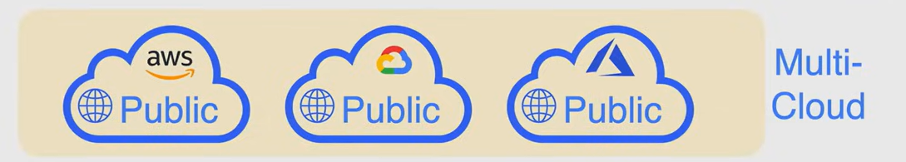
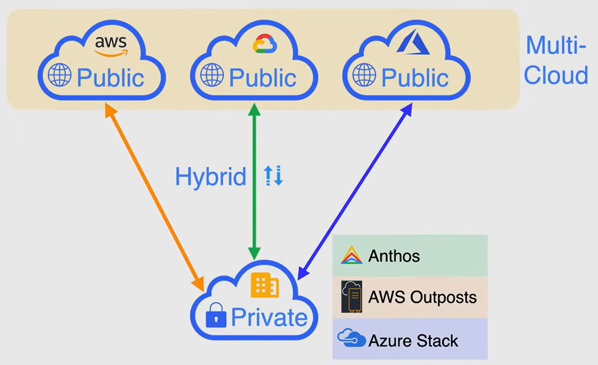

# Modelli di distribuzione del cloud

## Modelli Public Cloud

Il cloud pubblico è definito come servizi di calcolo offerti da fornitori terzi tramite internet pubblico, rendendoli disponibili a chiunque voglia utilizzarli o acquistarli.

I servizi di cloud pubblico sono **interamente di proprietà e gestiti da un fornitore di servizi cloud terzo**, che fornisce le proprie risorse di calcolo come server e storage tramite internet. Alcuni esempi di servizi di cloud pubblico sono:

- **Amazon Web Services (AWS)**
- **Microsoft Azure**
- **Google Cloud Platform (GCP)**

## Modelli Multi Cloud

Una strategia multi-cloud prevede l'utilizzo di due o più servizi di cloud computing da diversi fornitori di servizi cloud.

È utile (se implementata correttamente) per evitare il blocco del fornitore, ridurre il rischio di downtime e il ripristino in caso di disastro.

Il lato negativo è che può essere più complesso da gestire, poiché ogni fornitore di cloud ha il proprio set di strumenti, che possono essere diversi dagli altri.

## Modelli Private Cloud

Un cloud privato è un servizio di cloud che non viene condiviso con nessun'altra organizzazione. È un ambiente a singolo inquilino in cui l'hardware, lo storage e la rete sono dedicati a un singolo cliente o azienda.

Ogni fornitore di servizi cloud ha i propri servizi di cloud privato che possono essere implementati in loco:

- Anthos (Google Cloud)
- Azure Stack (Microsoft Azure)
- AWS Outposts (Amazon Web Services)

## Modelli Hybrid Cloud

Un Hybrid Cloud è un ambiente di calcolo che combina un cloud pubblico e un cloud privato consentendo la condivisione di dati e applicazioni tra di essi.

**NOTA**: Se il tuo data center in loco è connesso a un cloud pubblico, non si tratta di un cloud ibrido. È un hybrid environment o hybrid network.