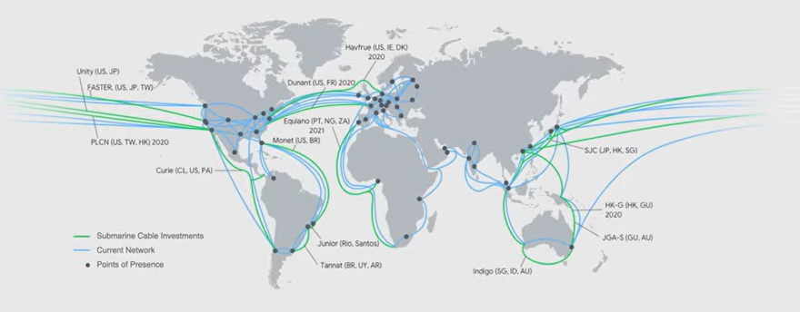
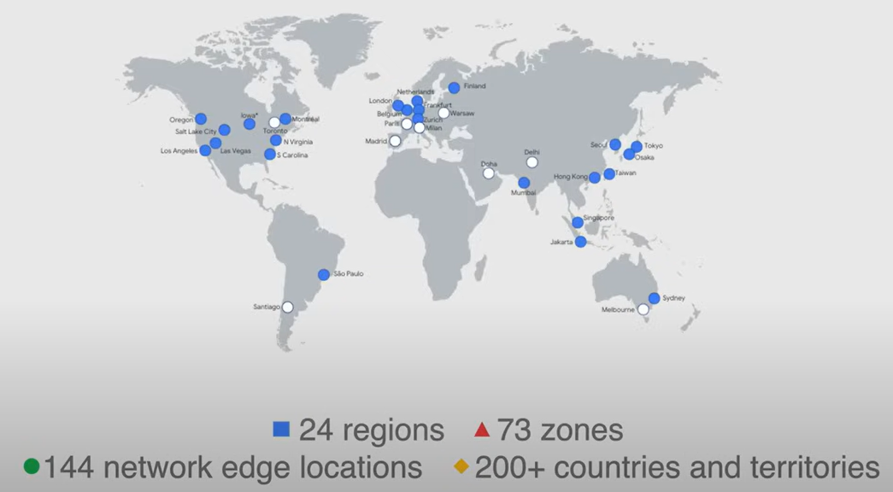
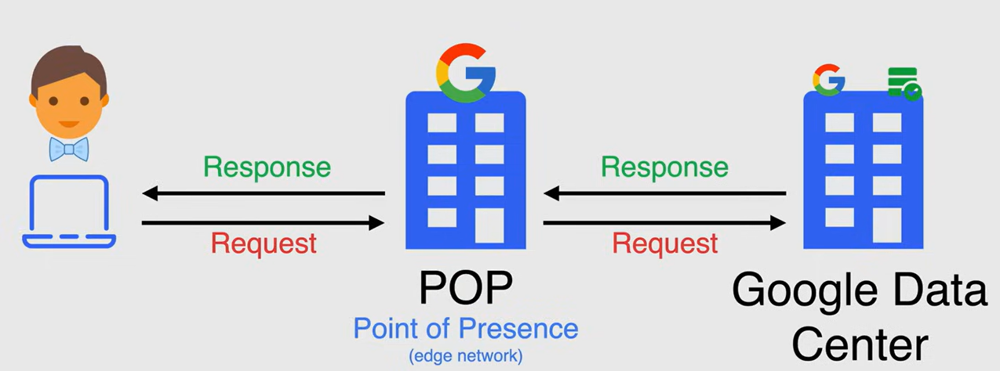
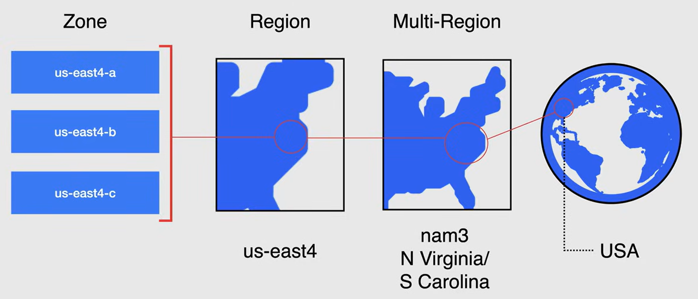

# Google CLooud Global Infrastructure

Google holds a highly provisioned low latency network where your traffic stays on Google's private backbone for of most of its journey, ensuring high performance and low latency. 

Google has 13 subsea cables connecting the continents. The following image is an example of how the subsea cables are built.

Google has 24 regions, 73 zones, 144 points of presence, and more than 200 countries and territories.

- A **region** is a specific geographical location where you can run your resources.
- A **zone** is a deployment area for resources within a region. Each region has at least three zones.
- A **point of presence** is a location where Google has a network presence but may not have a Google Cloud region.

### Example of a Request Flow

A request is routed through Google's network in the following way:

1. A user makes a request to his database in Google Cloud.
2. Google responds to the request from a Point of Presence (POP)
   - This point is where ISPs connect to Google's network.
3. Google edge network directs the request to the nearest Google Data Center.
4. The request is processed in the Google Data Center and the response is sent back to the user.

## Geographiy and Regions

The geographic locations are organized into muli-regions, regions, and zones.

### Zones

A **zone** is a deployment area for Google Cloud resources within a region. It is the smallest entity in the Google's global network.

It can be described as a single failure domain within a region. If a zone fails, all the resources in that zone are lost.

**NOTE**: The best practice is to deploy resources in zones that are closest to the users, for optimal latency and performance.

### Regions

A **region** is an independent geographic area that consists of zones. Each region has at least three zones. Having a region with multiple zones is designed to provide high availability and fault tolerance.

The intercommunication between zones in the same region is fast and reliable (under 5ms latency).

### Multi-Regions

**Multi-regions** are large geographic areas, that contain two or more regions, and this allow Google services to maximize redundancy and distribution within and across regions, and to provide low latency and high availability to users.