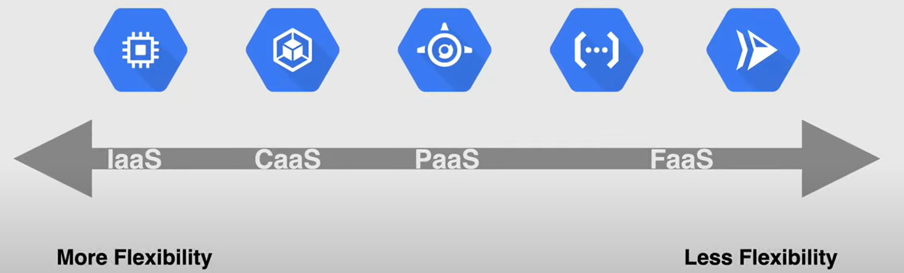

# Compute Sevice Options

## Compute Engine

**Compute Engine** is a **Virtual Machine** that runs on Google's infrastructure. It is a **IaaS** service that allows you to create and run **Virtual Machines** on Google's infrastructure called **instances**. 

You can create **Virtual Machines** with different configurations and run different operating systems on them, and deploy them in different regions and zones.

It is possible to use **public** or **private** images to create **Virtual Machines**, and there are also pre-configured images and software packages available in the **Google Cloud Marketplace**.

In the Compute Engine, you can:

- manage multiple instances using **Instance Groups**.
- add/remove capacity using **Autoscaling** with **Instance Groups**.
- attach/detach **disks** to instances.
  - Google Cloud Storage can be used in conjunction with Compute Engine to store data.

To connect to the **Virtual Machine**, you can use **SSH**.

## Kubernetes Engine

**Kubernetes Engine** is a container orchestration system for automating deploying, scaling, and managing containers.

It is built on top of **Kubernetes**, an open-source container orchestration system.
So, it can be describer as a **managed Kubernetes service** that allows you to run **Kubernetes clusters** on Google's infrastructure.

Under the hood, GKE uses **Compute Engine** instances as **nodes** in the **Kubernetes cluster** (group of nodes).

It is a **CaaS** service, i.e., **Containers as a Service**.

## App Engine

**App Engine** is a fully managed serverless platform (**PaaS**, Platform as a Service) for developing and hosting web applications at scale. 

With App Engine, Google handle most of the management of the resources for you, for example:

- if your application requires more computing resources because traffic to your website increases, Google automatically scales the system to provide more resources.
- if the system software needs to be updated, Google automatically updates it.

So the developer can focus on writing code and deploying applications, using different programming languages.

Finally, it is connected with other Google services (or third-party services) **seamlessly**, and it **integrates** with Web Security Scanner to identify threats.

## Cloud Functions

**Cloud Functions** is a Function as a Service (**FaaS**) service, i.e. a serverless execution environment for building and connecting cloud services.

With Cloud Function you can write **single-purpose functions** that are **attached to events** emitted from your cloud infrastructure and services. Indeed, a function is triggered when an event being watched is fired, and the code is executed in a fully managed environment, so there is no need to provision any infrastructure.

The user can write the code in different programming languages, such as **JavaScript**, **Python**, **Go**, or **Java** runtime.

Cloud Functions are useful in the following **use cases**:

- Data processing or ETL operations (video transcoding, image analysis, etc.)
- Webhooks to respond to HTTP triggers
- APIs that compose loosely coupled logic
- Mobile backend functions

## Cloud Run

**Cloud Run** is a fully managed compute platform for deploying and scaling containerized applications quickly and securely.

It is built upon an open standard called **Knative**, which is a Kubernetes-based platform to build, deploy, and manage modern serverless workloads. Then it **abstracts** away all infrastructure management, by automatically scaling up or down instances to meet the demand.

It is a **FaaS** service, i.e., **Function as a Service**, because it is serverless for containers.