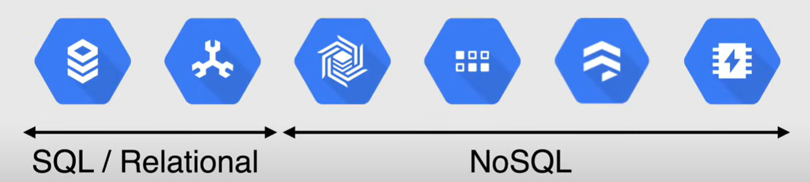

# Storage and Database Options

## Storage Options

Mainly, there are three types of storage options in Google Cloud, each with its own use cases:

- **Cloud Storage**: for **unstructured data** (objects, blobs, files, etc.)
- **Filestore**: for **file storage** (NFS)
- **Persistent Disk**: for **block storage** (like a hard drive)

**NOTE**:

- **Object storage** is a data storage architecture that is not attached to your instance and store your OS and applications, instead, it is used to managing data as objects, such as documents, photos, videos, and other files. 
- It shouldn't be confused with **Block storage**, a raw storage capacity, that is used in drives that are connected to an operating system.

### Cloud Storage

**Cloud Storage** is a consistent, scalable, large-capacity, highly durable **object storage**.

It has **11 9's of durability** (99.999999999%), meaning that if you store 1 million objects, statistically you can expect to lose one file every 659.000 years.

One of the great features of Cloud Storage is the **unlimited storage** that it has with no minimum object size. Then, it is a great option for **content delivery, data lakes, and backups**.

Finally, it is available in different **storage classes** and **availability**.

In terms of **storage classes**, there are four types:

- **Standard**: It is great for storing frequently accessed data.
  - Maximum availability and performance
- **Nearline**: It is great for storing data that you access less than once a month.
  - Low cost archival storage
- **Coldline**: It is great for storing data that you access less than once a quarter.
  - Even lower cost archival storage
- **Archive**: It is great for storing data that you access less than once a year.
  - Lowest cost archival storage
  
In terms of **availability**, there are three types:

- **Region** (Single-region): Data is stored in a single region.
- **Dual-region**: Data is stored in two regions.
- **Multi-region**: Data is stored in multiple regions.

### Filestore

**Filestore** is a fully managed **NFS (Network File System) file server**, that is NFS v3 compliant.

You can store data from running applications, multiple VMs instances, and Kubernetes clusters, accessing the data at the same time.

It is a good option when you need to access data from an instance group, and you need multiple instances to access the same data.

### Persistent Disk

**Persistent Disk** is a durable **block storage** for instances. It offers two different options:

- **Standard Persistent Disk**: It is a **HDD** (Hard Disk Drive) that is good for **sequential read/write**.
- **SSD Persistent Disk**: It is a **SSD** (Solid State Drive) that is good for **random read/write**.

Both options are available in zonal and regional options.

## Database Options

Google Cloud offers a variety of database options, that can be categorized into two main categories:

- **Relational Databases**: like MySQL, PostgreSQL, and SQL Server.
- **NoSQL Databases**: like Cloud Bigtable, Firestore, and Cloud Spanner.

### Relational Databases

- **Cloud SQL** is a fully managed relational database service that supports MySQL, PostgreSQL, and SQL Server. It is high availability across zones.
- **Cloud Spanner** is a scalable relational database service that supports transactions, strong consistency, and synchronous replication, and it is high availability across regions and globally.

### NoSQL Databases

- **Cloud Bigtable** is a fully managed, scalable NoSQL database service, with an high throughput and low latency. it comes with the flexibility of doing cluster resizing without downtime.
- **Cloud Datastore** is a fast, fully managed, serverless, NoSQL document database service. It is designed for mobile, web, IoT applications, and it has the capability of doing multi-region replication as well as *ACID* transactions.
- **Cloud Firestore** is a NoSQL, real-time database service that is optimized for offline use. It offers cluster resizing without downtime.
- **Cloud Memorystore** is an highly available in-memory service for Redis and Memcached, and it is a fully managed service, where Google manages the service for you.