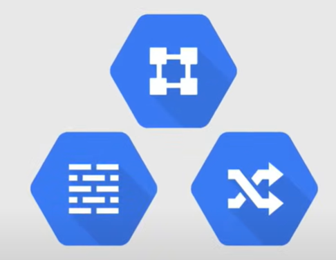
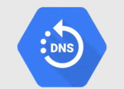

# Networking Services

## Networkk, Firewall, and Routes

### Virtual Private Cloud (VPC)

**VPC** manages networking functionality for your Google Cloud resources. It is a virtualized network within Google Cloud, and it can be seen as a core networking service and a global resource that spans throughout all Google Cloud regions.

Each VPC contains a **default network** as well additional networks can be created in a project, but **networks cannot be shared between projects**.

### Firewall Rules

**Firewall Rules** segment your networks with a global distributed firewall to restrict access to resources, so this governs traffic coming into instances on a network.

Each default network has a default set of firewall rules that have been already been established, but you can create your own rules to allow or deny traffic.

### Routes

**Routes** specify how traffic should be routed within your VPC network, to get a little bit more granular, Routes specify how packets leaving an instance should be directed, so it is a basic way of defining how traffic should be directed.

## Load Balancing

It distributes workloads across multiple instances, and there are two different types of load balancing, that can be broken down into a more granular level.

### HTTP(S) Load Balancing

**HTTP(S) Load Balancing** is the type of load balancing that covers worldwide autoscaling and load balancing over multiple regions (or even a single region), on a single global IP address.

It distribute traffic across regions to ensure that requests are routed to the closest region or, in the event of a failure or over-capacity, to healthy instances in the next closest region.

Another feature of HTTP(S) Load Balancing is that distribute traffic based on content type of the request, so it can route traffic to different instances based on the content of the request.

### Network Load Balancing

**Network Load Balancing** is a regional load balancer, and support any and all ports.

It distributes traffic among server instances in the same region, based on incoming IP protocol data, such as address, port, and protocol type.

## Cloud DNS

Google made this service 100% available, on top of giving any DNS queries the absolute lowest latency possible.

With **Cloud DNS**, you can publish your domain names using Google's infrastructure for DNS, and it is a scalable, reliable, and managed authoritative Domain Name System (DNS) service running on the same infrastructure as Google.

It work with managed zones and DNS records through the CLI, API, or SDK.

## Advanced Connectivity

### Cloud VPN

**Cloud VPN** securely connects your existing network to your VPC through an IPsec connection, so it is a secure way to connect your on-premises network to your Google Cloud VPC network.

The traffic is encrypted and travels over the public internet.

### Cloud Interconnect

**Cloud Interconnect** connects an existing network to your VPC using a highly available, low latency, enterprise-grade connection.

In this case, the traffic does not travel over the public internet, but over a dedicated connection.

### Peering

Peering is a way to connect your VPC network to another network, and there are two types of peering:

- **Direct Peering** exchanges internet traffic between your business network and Google's network at one of Google's broad-reaching edge network locations.
- **Carrier Peering** connects your infrastructure to Google's network edge through highly available, low-latency connections by using service providers.