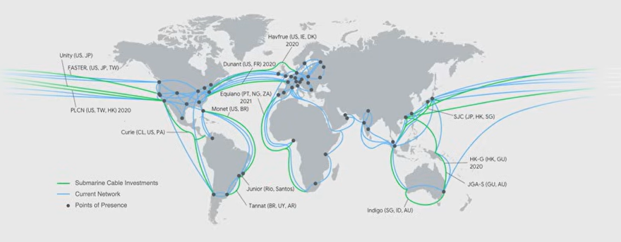
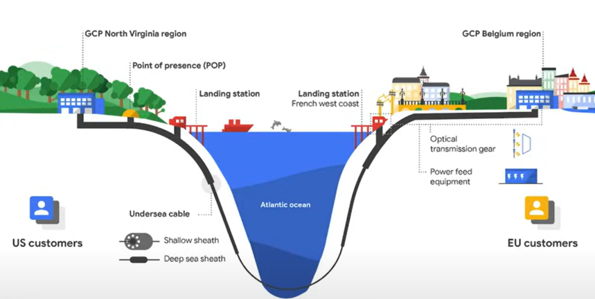
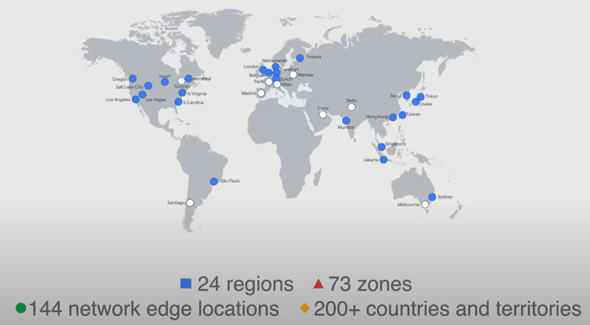
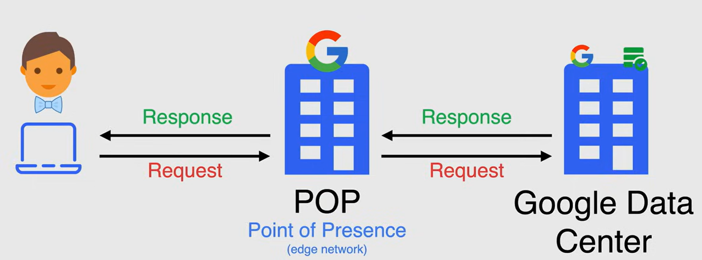
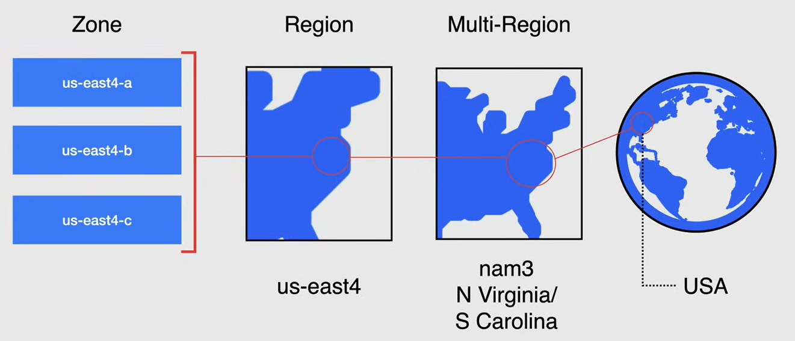

# Infrastruttura globale di Google Cloud

Google possiede una rete ad alta disponibilità e bassa latenza in cui il tuo traffico rimane sulla rete privata di Google per gran parte del suo percorso, garantendo prestazioni elevate e bassa latenza.

Google dispone di 13 cavi sottomarini che collegano i continenti. L'immagine seguente è un esempio di come sono costruiti i cavi sottomarini.

Google ha 24 regioni, 73 zone, 144 punti di presenza e più di 200 paesi e territori.

- Una **regione** è una posizione geografica specifica in cui è possibile eseguire le risorse.
- Una **zona** è un'area di distribuzione delle risorse all'interno di una regione. Ogni regione ha almeno tre zone.
- Un **punto di presenza** è una posizione in cui Google ha una presenza di rete ma potrebbe non avere una regione di Google Cloud.

### Esempio di flusso di richiesta

Una richiesta viene instradata attraverso la rete di Google nel seguente modo:

1. Un utente invia una richiesta al suo database in Google Cloud.
2. Google risponde alla richiesta da un punto di presenza (POP)
   - Questo punto è dove gli ISP si connettono alla rete di Google.
3. La rete di bordo di Google indirizza la richiesta al centro dati di Google più vicino.
4. La richiesta viene elaborata nel centro dati di Google e la risposta viene inviata all'utente.

## Geografia e regioni

Le posizioni geografiche sono organizzate in multi-regioni, regioni e zone.

### Zone

Una **zona** è un'area di distribuzione delle risorse di Google Cloud all'interno di una regione. È l'entità più piccola nella rete globale di Google.

Può essere descritta come un singolo dominio di errore all'interno di una regione. Se una zona fallisce, tutte le risorse in quella zona vengono perse.

**NOTA**: La pratica consigliata è distribuire le risorse nelle zone più vicine agli utenti, per una latenza e prestazioni ottimali.

### Regioni

Una **regione** è un'area geografica indipendente che consiste in zone. Ogni regione ha almeno tre zone. Avere una regione con più zone è progettato per fornire alta disponibilità e tolleranza ai guasti.

L'intercomunicazione tra le zone nella stessa regione è veloce e affidabile (latenza inferiore a 5 ms).

### Multi-regioni

Le **multi-regioni** sono grandi aree geografiche che contengono due o più regioni e consentono ai servizi di Google di massimizzare la ridondanza e la distribuzione all'interno e tra le regioni, e di fornire bassa latenza e alta disponibilità agli utenti.
