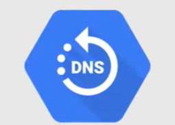

# Networking Services

## Network, Firewall e Routes

### Virtual Private Cloud (VPC)

**VPC** gestisce la funzionalità di rete per le risorse di Google Cloud. È una rete virtualizzata all'interno di Google Cloud e può essere considerata come un servizio di rete principale e una risorsa globale che si estende in tutte le regioni di Google Cloud.

Ogni VPC contiene una **rete predefinita** e possono essere create anche reti aggiuntive in un progetto, ma **le reti non possono essere condivise tra progetti**.

### Regole del firewall

Le **regole del firewall** suddividono le reti con un firewall distribuito globalmente per limitare l'accesso alle risorse, quindi governano il traffico in ingresso alle istanze in una rete.

Ogni rete predefinita ha un insieme predefinito di regole del firewall che sono già state stabilite, ma è possibile creare regole personalizzate per consentire o negare il traffico.

### Routes

Le **routes** specificano come il traffico deve essere instradato all'interno della rete VPC, per essere un po' più dettagliati, le routes specificano come i pacchetti in uscita da un'istanza devono essere diretti, quindi è un modo di base per definire come il traffico deve essere instradato.

## Load Balancing

Distribuisce i carichi di lavoro su più istanze e ci sono due tipi diversi di bilanciamento del carico, che possono essere scomposti in un livello più dettagliato.

### HTTP(S) Load Balancing

Il **HTTP(S) Load Balancing** è il tipo di bilanciamento del carico che copre il ridimensionamento automatico globale e il bilanciamento del carico su più regioni (o anche su una singola regione), su un singolo indirizzo IP globale.

Distribuisce il traffico tra le regioni per garantire che le richieste vengano instradate alla regione più vicina o, in caso di guasto o sovraccarico, alle istanze funzionanti nella regione successiva più vicina.

Un'altra caratteristica del bilanciamento del carico HTTP(S) è che distribuisce il traffico in base al tipo di contenuto della richiesta, quindi può instradare il traffico verso diverse istanze in base al contenuto della richiesta.

### Load Balancing Network

Il **Load Balancing Network** è un bilanciatore del carico regionale e supporta tutte le porte.

Distribuisce il traffico tra le istanze del server nella stessa regione, in base ai dati del protocollo IP in ingresso, come indirizzo, porta e tipo di protocollo.

## Cloud DNS

Google ha reso questo servizio disponibile al 100%, oltre a garantire la latenza più bassa possibile per le query DNS.

Con **Cloud DNS**, è possibile pubblicare i nomi di dominio utilizzando l'infrastruttura di Google per il DNS ed è un servizio di sistema di nome di dominio (DNS) autoritativo, scalabile, affidabile e gestito che viene eseguito sulla stessa infrastruttura di Google.

Funziona con zone gestite e record DNS tramite CLI, API o SDK.

## Connettività avanzata

### Cloud VPN

**Cloud VPN** connette in modo sicuro la tua rete esistente alla tua VPC tramite una connessione IPsec, quindi è un modo sicuro per connettere la tua rete in loco alla tua rete VPC di Google Cloud.

Il traffico è crittografato e viaggia su Internet pubblico.

### Cloud Interconnect

**Cloud Interconnect** connette una rete esistente alla tua VPC utilizzando una connessione aziendale altamente disponibile, a bassa latenza e di qualità enterprise.

In questo caso, il traffico non viaggia su Internet pubblico, ma su una connessione dedicata.

### Peering

Il peering è un modo per connettere la tua rete VPC a un'altra rete e ci sono due tipi di peering:

- **Direct Peering** scambia il traffico Internet tra la tua rete aziendale e la rete di Google presso una delle posizioni di rete di Google a larga portata.
- **Carrier Peering** connette la tua infrastruttura al bordo della rete di Google tramite connessioni altamente disponibili e a bassa latenza utilizzando fornitori di servizi.