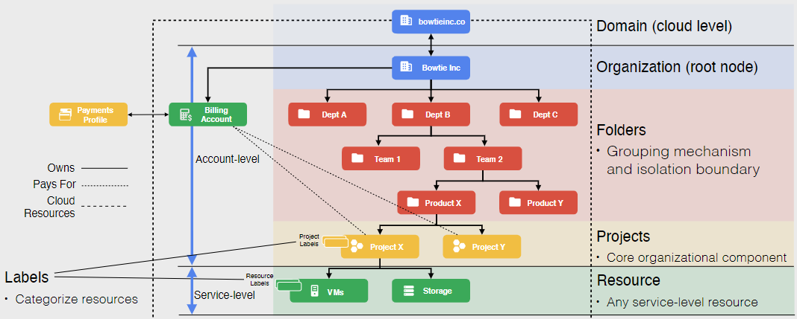

# Resource Hierarchy

In the context of Google Cloud, a **Resource** can refer to:

- the service-level resources used to prcess your workloads, such as:

  - Compute Instances VMs
  - Cçloud Storage Buckets
  - Cloud SQL Databases

- the account-level resources that sit above the service, such as:

  - Organizations
  - Folders
  - Projects

The **Resource Hierarchy** is Google Cloud's way to configure and grant access to the various cloud resources for your organization, both at the service and account levels. It can truly define the granular permissions needed to manage your resources.

The resource are organized hierarchically, in a parent-child relationship, where the parent resource can grant access to the child resources. It is designed to map organizational structure to Google Cloud and to manage access control and permissions for group of related resources.

The policies are controlled by **IAM** (Identity and Access Management), so when the IAM policies are set at a higher level in the hierarchy, they are **inherited** by the lower levels.

**NOTE**: Each child object has exactly one parent, and each parent can have multiple children.

## Domain

The **Domain** is the top level of the hierarchy, and it is the root node of the hierarchy. It is the highest level of the hierarchy and it is the parent of all other resources in the hierarchy.

This is where we manage our users in our organization, and they are linked to G-Suite or Cloud Identity accounts.

## Organization

The **Organization** is the second level of the hierarchy, and it represents the organization, ans is the root node of GCP resource hierarchy. 

It is associated exactly with one domain, and all policies set at the organization level are inherited by all resources under it.

## Folders

**Folders** are an additional grouping mechanism and isolation boundary between each project, in essence, it is a grouping of folders, projects, and resources.

So if there are different departments and teams in the organization, they can be grouped into folders, and the folders can be nested to create a hierarchy.

To use folder you must have an organization node and while a folder can contain multiple folders, or resources, a folder or resource can only have exactly one parent.

## Projects

**Projects** are the lowest level of the hierarchy, and they are used to organize resources and manage billing.

Any given resource can only belong to one project, and all resources must belong to a project.

## Resources

**Resources** are the service-level resources used to process your workloads.

## Labels

**Labels** are key-value pairs that can be attached to resources, and they can be used to organize resources, and to filter and group resources.

Finally, we can make a distinction between **Account-level resources** and **Service-level resources**:

- **Account-level resources** are the resources that sit above the service-level resources, such as Organizations, Folders, and Projects.

- **Service-level resources** are the resources used to process your workloads, such as Compute Instances VMs, Cloud Storage Buckets, and Cloud SQL Databases.