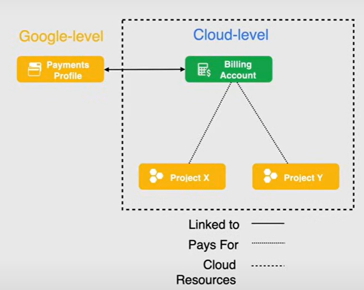
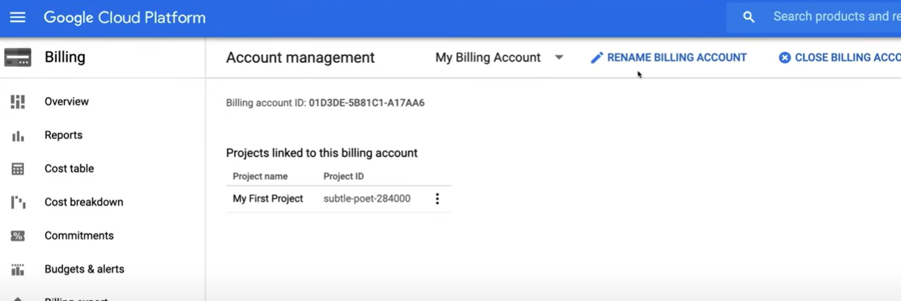
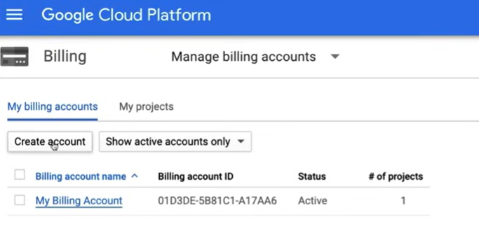

# Cloud Billing

## Billing Account

A Cloud Billing account is a cloud level resource managed in the cloud console.

It defines **who pays** for a given set of resources, and it is used to **track billing activity** for those resources, so it is connected to a **Payments Profile**, which include a payment method defining how you pay for your charges.

A Cloud Billing account is connected to **one or more projects**, and it has specific **roles** and **permissions** to control accessing and modifying billing related functions.

It is offered in two different account types:

- **Self-service** (online): You manage your billing account and payments profile. The payment method is usally a credit or debit card and costs are automatically charged to it.
- **Invoiced** (offline): Google sends you an invoice for your usage.

Another feature of Billing accounts is the **Sub-Accounts**. They are used to manage billing for different departments or teams within an organization. Each sub-account has its own billing settings and payment methods.

Billing account can pay for projects in a different organization, but it can only be linked to one organization.

Projects that are not linked to a Cloud Billing account cannot use paid Google Cloud services.

## Payments Profile

A Payments Profile is a Google Cloud resource that contains the payment method information for a Cloud Billing account. It is used to pay for the charges incurred by the resources in the projects linked to the billing account.

The Payment Profile functions as a single pane of glass for viewing invoices and payment history, and it can be used to manage payment methods and billing contacts.

It also control who can view and receive billing information.

There are two types of Payments Profiles, that cannot be changed once created:

- **Individual**: Used for personal accounts. You can't add or remove users, or change permissions on the profile.
- **Business**: Used for business accounts. It gives you the ability to add users and set permissions on the profile.

## Billing Roles

- **Billing Account Administrator**: Can manage billing accounts and assign billing roles, but cannot create them. It is useful if you need to set budget alerts or manage payment methods.
- **Billing Account Creator**: Can create new self-serve online billing accounts.
- **Billing Account User**: Allows you to link projects to billing accounts.
- **Billing Account Viewer**: Can view billing accounts cost information, and transactions.
- **Project Billing Manager**: Can link and unlink projects to billing accounts.

## Demo

A demo of how to create, manage, and close a billing account, is shown in the following video [Google Cloud Associate Cloud Engineer Course - Pass the Exam!](https://youtu.be/jpno8FSqpc8?si=k6SMDn0MyQN5VRiI&t=8350) at 2:19:10.

1. Go to `Billing` section in the Cloud Console.
   - In the main section we can view the projects linked to the billing account.

2. To view all the billing accounts information, click on the down arrow near to  `My Billing accounts`. This will show the all the billing accounts and their details.

3. To create a new billing account, click on `Create Account` and fill the required information in the new window.

4. To attach a project to a billing account, click on `My Projects` and then click on the 3 dots near the project name. Select `Change billing` and then select the billing account to link.

5. To delete a billing account, we need first to remove all the projects linked to it. Then go to the `Account management` section on the left side bar and click on `Close billing account`.

6. Google Cloud allows you to restore a closed billing account within 30 days.