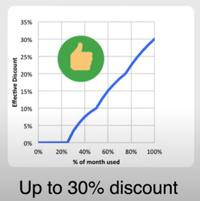
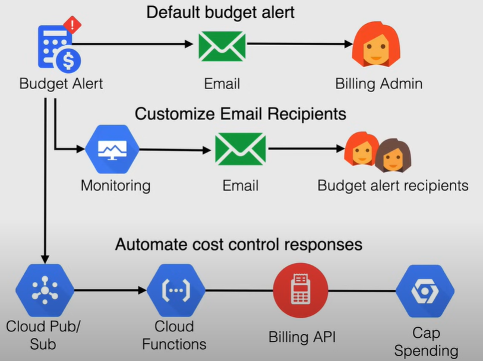
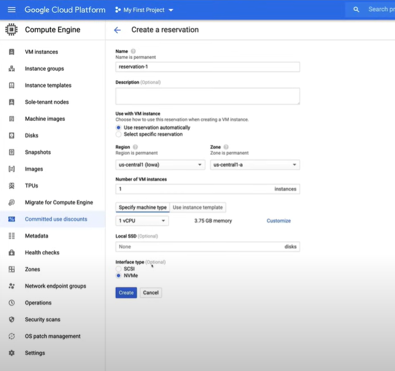
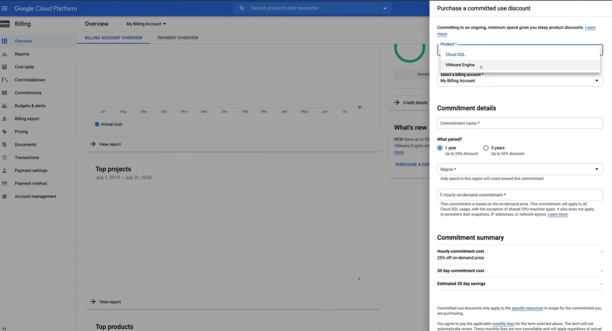

# Controlling Costs and Budget Alerts

*This section is not included in the Associate Cloud Engineer exam guide, but it is important to understand how to control costs and set budget alerts in GCP.*

## Committed Use Discounts (CUD's)

CUDs provide discounted prices in exchange for your commitment to use a minimum level of resources for a specified term.

You can commit to a consistent amount of usage for a one- or three-year period.

The commitment fee id billed monthly, and there are two types of commitments:

- **Spend-based**
  - Discount for a commitment to spend a minimum amount for a service (hours) in a particular region.
  - 25% discount for 1 year, 52% discount for 3 years.
  - It si available for the following resources:
    - **Cloud SQL** databases instances
    - Google Cloud **VMWare Engine**
  - It is applied only to CPU and memory usage.
- **Resource-based**
  - Discount for a commitment to spend a minimum amount for Compute Engine resources in a praticular region. **Ideal for predictable workloads**.
  - It is available for the following resources:
    - **vCPU**, **Memory**, **GPU**, and **Local SSD**.
  - 57% discount for most resources, 70% for memory-optimized instances.
  - For use across Projects

### Sustained-use discounts

Automatica discounts for running COmpute Engine resources a significant portion of the billing month.

Applies to vCPUs and memory for most Compute Engine instance types. THey are applied automatically to usage within a project, seperately for each region, so there is no action required to enable them.

For example, when you are running one of these resources for more than 25% of the month, Compute Engine automatically gives you a discount for every incremental minute you use.

They automatically apply to VM's created by **GKE** and **Compute Engine**, but they do not apply to VMs created using **App Engine** flexible environment, Dataflow, and E2 machine types.

## GCP Pricing Calculator

GCP Pricing Calculator is a tool that helps you understand the costs of running your GCP resources.

## Cloud Billing Budget

Cloud Billing Budgets allow you to **track your actual GCP spend** against your planned spend.

Budget alert thresholds rules that are used to **trigger email notifications** to help you stay informed about your spending.

You can define the scope of the budget, for example, you can scope the budget to apply:

- To the spend of billing account or more granular
- To a specified total, or based on previous month's spend

**Alert emails** are sent to billing account administrators and specific users when costs exceed a percentage of the busget.

Email recipients can be customized by using **Cloud Monitoring** to specify other people to receive the alerts.

You can also use **Pub/Sub** for programmatic notifications or to automate cost management tasks. It can be used also in conjunction with Billing Budgets to automate cost management tasks.

## Demo: Controlling Costs and Budget Alerts

Demo at the following link: [Controlling Costs and Budget Alerts Follow Along](https://youtu.be/jpno8FSqpc8?si=VzK8483q2zY7owvJ&t=9534).

### Committed Use Discounts

#### Resource-based commitment

1. Go to `Compute Engine`, using the **Navigation menu** on the left.

2. Go to `Committed use discounts`.
   1. The commitment for Compute Engine are resource-based.

   

3. Click on `Committed use discounts`, and fill in the details, in the new window.

    

4. `Reservations` is when you reserve the VM instances you need, so when the reservation has been placed, it ensures that those resources are always available for you. 
   1. Indeed, when you go to spin up a new Compute Engine VM, especially when it comes to auto scaling instance groups, the instances can be sometimes be delayed or not available. So, by having a reservation, you can ensure that those resources are always available for you.
   2. To make a reservation click on `Create Reservation`, and fill in the details.

    

#### Spend-based commitment

1. To make **Spend-based commitment**, go to `Billing` section, using the **Navigation menu** on the left.

   1. Go to `Commitments`, and you can see the commitment you have made.

2. Go to the `Overview` Billing section, and make a commitment by clicking on `Purchase Commitment`.

    

### Budget Alerts

1. Go to `Billing` section, using the **Navigation menu** on the left.

2. Go to `Budgets & alerts`, and click on `Create Budget`.

   1. If you want to create a budget and set an alert to specific users, you can link it to **Cloud Monitoring**.

    

    2. To do this we need to go to `Monitoring` section, using the **Navigation menu** on the left.
    
    3. Go to `Alerting`, and click on `Edit Notification Channels`, and add a new email address, in the new window.
 
    