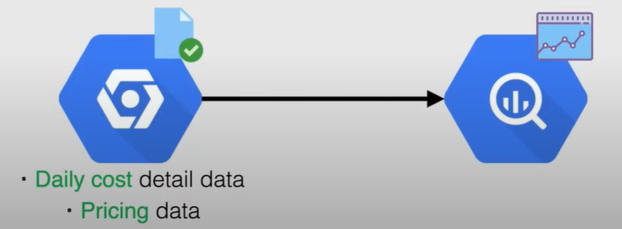
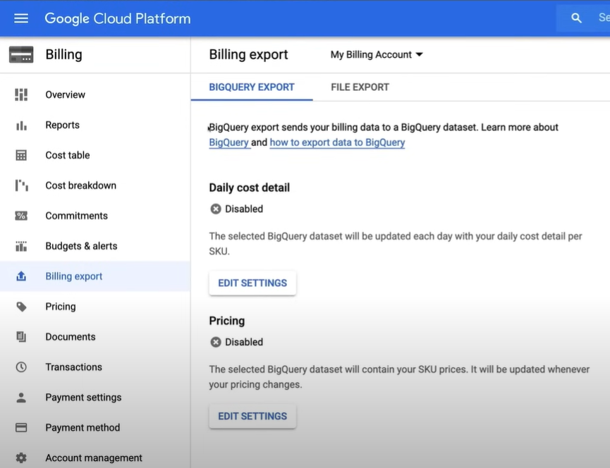

# Billing Export

Billing export enables **granular billing data** (such as usage, cost details, and pricing data) to be **exported automatically to BigQuery** for detailed analysis and reporting.

The billing export is **not retroactive**. 

There are two types of billing data that can be exported (they can be selected in the console depending on the use case):

- *Daily cost* detail data
- *Pricing* data

## Demo: Billing Export

Demo at the following link: [Billing Export Follow Along](https://youtu.be/jpno8FSqpc8?si=Ze40OpOie3td3_AD&t=10489).

1. Go to the `Billing` page, using the **Navigation menu** on the left.

2. Go to `Billing export` section, and choose between `Daily cost detail data` and `Pricing data`.

    

    1. First you need to create a **dataset** in BigQuery, if you don't have one already. If it's your first time, you will be prompted to create a dataset, click on `Go to BigQuery`.

    2. In the BigQuery console, click on `Create Dataset`, and fill in the details.

3. Click on `Edit Settings` to configure the export settings.

4. Now we need to enable the BigQuery data transfer API. To do this, go on the `APIs & Services` page, using the **Navigation menu** on the left.
    
     1. Click on `Dashboard`, and search in the search bar for `BigQuery Data Transfer API`, and click on it, then click on `Enable`.