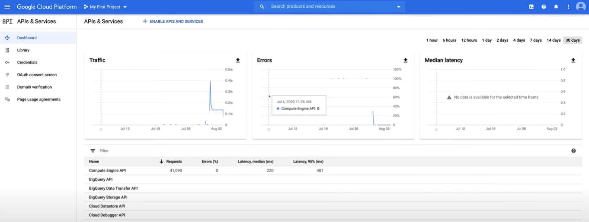
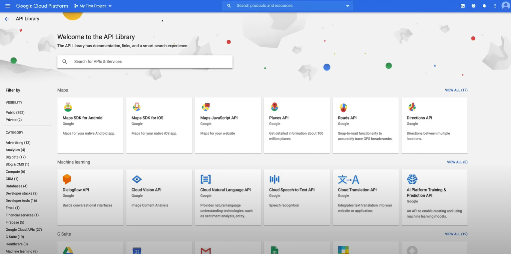

# Cloud APIs

## Demo

A video guide on Google Cloud APIs is available [here](https://youtu.be/jpno8FSqpc8?si=DWSVcAemJrRcWJCa&t=10820).

1. Go to the `APIs & Services` section in the Google Cloud Console, using the navigation menu on the left.

2. Through the `Dashboard` tab, you can enable APIs and services, create credentials, and view usage statistics. 

    

3. To add an API, click on the `Enable APIs and Services` button, to go on the API Library page.

    