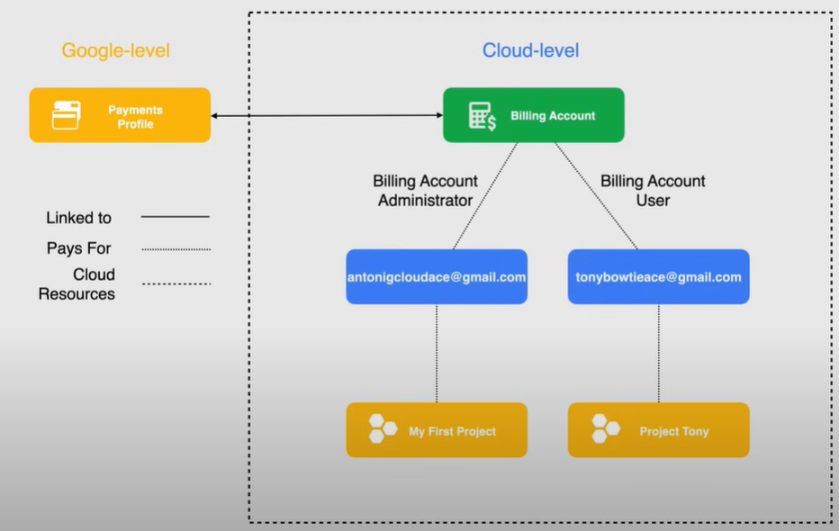

# Adding an Admin User

To follow Google's best practices, we need a user that has lesser privileges than the user account that we set up previously.

## Super Admin User

A super administrator account is created to administer the domain. This account has the highest level of access to Google Workspace services and can perform any task in the Admin console. The super administrator account is created when you sign up for Google Workspace.

The Super Admin account has irrevocable Admin permissions, and it can:

- Grant Organization Admin role (or nay other role)
- Recovers accounts at the domain level

The following schema is an example of admin user account architecture.

As we discussed in the previous lessons, Billing Accounts have the option of paying for projects in a different organization. So, when creating new projects using the two different Gmail accounts they were created without any organization amd so each account is standalone and can create their own project.

What makes them different is the `antonigcloudace@gmail.com` account owns the Billing Account and is set as a billing account administrator, instead the `tonybowtieace@gmail.com` account is a billing account user that is able to link projects to that billing account but does not hold full access to the billing.

So in the spirit of least privilege, we use the `tonybowtieace@gmail.com` account.

## Demo

A video demo of the steps to add an Admin User is available [here](https://youtu.be/jpno8FSqpc8?si=ldco4JK-snxw1esE&t=11282).

1. Go to the `Billingx` page, using the left-hand navigation menu.

2. Go to the `Account management` section of `Billing` page.

3. Click on `Add members` on the right side of the page, and fill in the email address of the user, and select the `Billing Account User` role, to give the user the possibility to associate projects with billing accounts.

    

4. Now we can switch the account in GCP Console and login with the other user.

5. Now, we can create a new project with the new user. 

6. After that, go to the `Billing` page and select the `Overview` section.

7. Click on the drop down menu of the `Billing Account` and click on `MANAGE BILLING ACCOUNT`. In the new page, we can see that the number of projects associated with the billing account has increased to 2.

    
