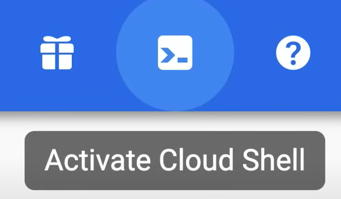

# Cloud Shell and Editor


## Cloud Shell

**Cloud Shell** is a virtual machine that is loaded with development tools. It offers a persistent 5GB home directory and runs on the Google Cloud.

It is accessible from the Google Cloud Console, and it is available for free.

It provides a command-line interface to manage resources and develop in the cloud.

It also include a built-in code editor, which is a **web-based editor** that allows you to edit files directly in the Cloud Shell.

### Demo

A video demo of the Cloud Shell can be found [here](https://youtu.be/jpno8FSqpc8?si=F7wWa9aTn5l9UKRJ&t=14015).

To activate the Cloud Shell, click on the `Activate Cloud Shell` icon in the top right corner of the Google Cloud Console.



It provisions a E2 small Google Compute Engine instance, running a debian-based Linux operating system.

It is an ephemeral, pre-configured VM, and the environment you work with is a Docker container running on the VM.

Cloud Shell instances are provisioned on a per-user, per-session basis.

The instance persists while the session is active, and after an hour of inactivity, the session is terminated and the instance is deleted.

**INFO:** To check the disk space available, you can run the command:

```bash
df -h

## Example of Output
Filesystem                                  Size  Used Avail Use% Mounted on
overlay                                      49G  2.3G   44G   5% /
tmpfs                                        64M     0   64M   0% /dev
tmpfs                                       3.2G     0  3.2G   0% /sys/fs/cgroup
shm                                          64M     0   64M   0% /dev/shm
tmpfs                                       3.2G   12K  3.2G   1% /run
tmpfs                                       3.2G     0  3.2G   0% /media
/dev/disk/by-id/google-persistent-disk-0    4.8G   11M  4.6G   1% /home
```

To change properties using the `gcloud` command-line tool, you can run the following command:

```bash
gcloud config set project [PROJECT_ID]
```

**INFO:** To check where the current Cloud Shell instance is running, you can run the command:

```bash
curl "metadata/computeMetadata/v1/instance/zone"
```

## Cloud Code Editor

To use Code Editor we need to enable the third-party cookies in the browser.
