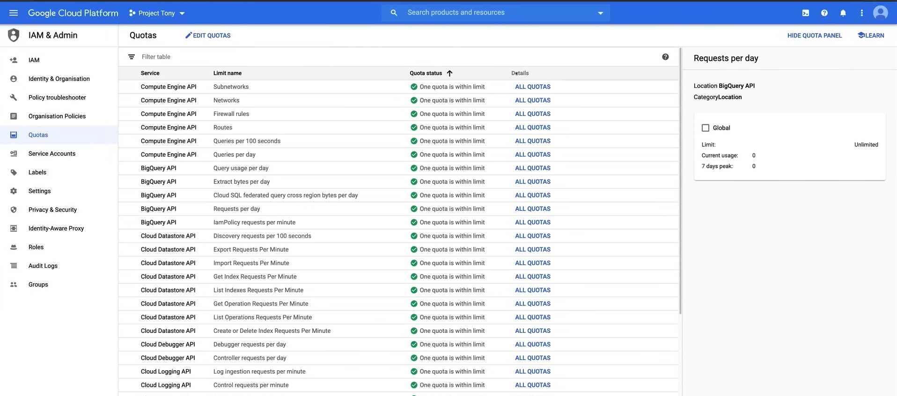
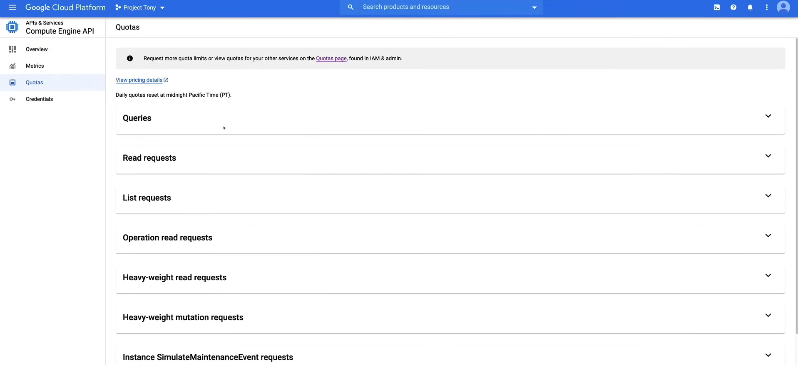

# Limits and Quotas

Google Cloud Platform enforces quotas for project owners, setting limits on how much of a particular resource you can use.

There are two types of resource quotas:

1. **Rate quotas**
   1. Rate quotas are enforced on a per-project basis and protect the community of users from abuse
   2. Rate quotas specify the number of requests that can be made to a particular API within a given time period
   3. This quota resets after a certain time period, such as a minute, hour, or day.

2. **Allocation quotas**
   1. These quotas are enforced on a per-project basis and protect the community of users from abuse 
   2. Allocation quotas specify the maximum number of resources that can be created within a given time period. For example, the number of virtual machines, or load balancer used by a project
   3. This quota **not** reset after a certain time period, but must be explicitly released when you no longer need it

## Enforcement of Quotas

There are three main reasons why quotas are enforced:

1. **To protect the community of users**
   1. Quotas protect the community of users by preventing unforeseen spikes in usage that could lead to performance degradation or downtime
   2. Quotas also help prevent a single user from using all of the resources available to the community

2. **For Resource Management**
   1. Quotas help you manage your resources by preventing you from using more resources than you have paid for
   2. Quotas also help you manage your resources by preventing you from using more resources than you need

3. **Countable Resources**
   1. Each quota limit is expressed in terms of a particular **countable resource**, such as the number of requests per minute, the number of virtual machines, or the amount of storage used.

## Monitoring and Alerting on Quotas

You can monitor your quota usage and set up alerts to notify you when you are approaching your quota limits. This can help you avoid running out of resources and ensure that your applications continue to run smoothly.

The services that support quota metrics include:

1. **Compute Engine**
2. **Dataflow**
3. **Cloud Spanner**
4. **Cloud Monitoring**
5. **Cloud Logging**

Instead the services that do not support quota metrics include:

1. **App Engine**
2. **Cloud Storage**
3. **Cloud SQL**

**NOTE:**

- Quota limits are updated once a day, so it may take up to 24 hours for changes to take effect.
- If our project exceeds a quota limit, the API will return an error message indicating that the quota has been exceeded, precisely Google Cloud will return an **HTTP 429 status code**, which indicates that the request was throttled due to the quota being exceeded, or `ResourceExhausted` error message if we are not using the HTTP API.

## Viewing Quotas

Mainly, there are two ways to view your quotas:

- **Cloud Console**
- **API Dashboard**

**NOTE:** It is also possible to view your quotas programmatically using the `Cloud Resource Manager API`.

### Cloud Console

1. Go to the **IAM & Admin** page in the Cloud Console
2. Click on **Quotas** to view your quotas

To change the quota, select the API you want to change the quota for, click on the `Global` checkbox on the right panel, and then click on the `Edit Quotas` button on the top of the page. Then write a description of why you need to increase the quota and click on the `Submit Request` button.

### API Dashboard

1. Go to the **API & Services** page in the Cloud Console
2. Click on **Dashboard** to view your APIs
3. Click on the API you want to view the quota for, for example, **Compute Engine API**
4. Click on **Quotas** to view your quotas

