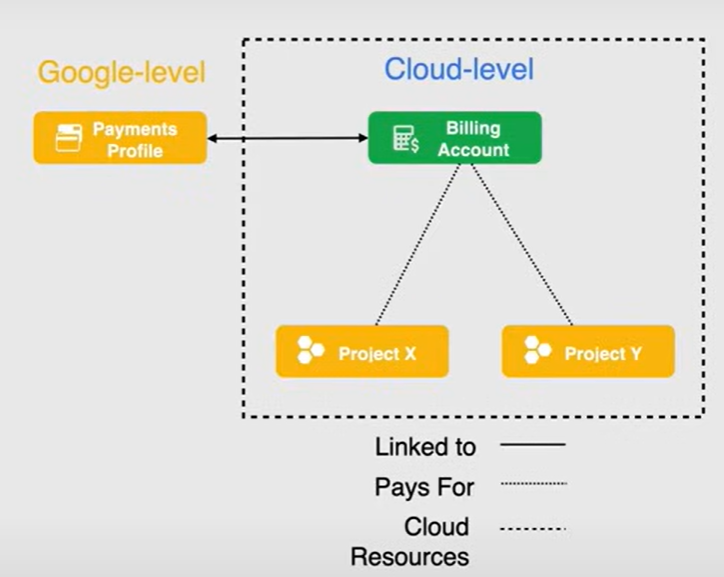
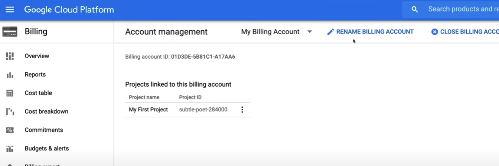
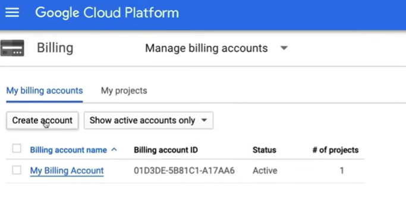

# Cloud Billing

## Billing Account

Un Cloud Billing Account è una risorsa a livello di cloud gestita nella console cloud.

Definisce **chi paga** per un determinato insieme di risorse ed è utilizzato per **tracciare l'attività di fatturazione** per tali risorse, quindi è collegato a un **Payments Profile**, che include un metodo di pagamento che definisce come pagare le spese.

Un Cloud Billing Account è collegato a **uno o più progetti** ed ha ruoli e permessi specifici per controllare l'accesso e la modifica delle funzioni relative alla fatturazione.

Viene offerto in due diversi tipi di account:

- **Self-service** (online): Gestisci il tuo Cloud Billing Account e il tuo Payments Profile. Il metodo di pagamento di solito è una carta di credito o debito e i costi vengono addebitati automaticamente su di essa.
- **Invoiced** (offline): Google ti invia una fattura per l'utilizzo.

Un'altra caratteristica dei Billing Account sono i **Sub-Accounts**. Vengono utilizzati per gestire la fatturazione per diversi dipartimenti o team all'interno di un'organizzazione. Ogni sub-account ha le proprie impostazioni di fatturazione e metodi di pagamento.

Un Billing Account può pagare per progetti in un'organizzazione diversa, ma può essere collegato solo a un'organizzazione.

I progetti che non sono collegati a un Cloud Billing Account non possono utilizzare i servizi a pagamento di Google Cloud.

## Payments Profile

Un Payments Profile è una risorsa di Google Cloud che contiene le informazioni sul metodo di pagamento per un Cloud Billing Account. Viene utilizzato per pagare le spese sostenute dalle risorse nei progetti collegati al Billing Account.

Il Payments Profile funziona come una singola finestra per visualizzare le fatture e la cronologia dei pagamenti e può essere utilizzato per gestire i metodi di pagamento e i contatti di fatturazione.

Controlla anche chi può visualizzare e ricevere informazioni di fatturazione.

Ci sono due tipi di Payments Profiles, che non possono essere modificati una volta creati:

- **Individual**: Utilizzato per account personali. Non è possibile aggiungere o rimuovere utenti o modificare le autorizzazioni sul profilo.
- **Business**: Utilizzato per account aziendali. Ti consente di aggiungere utenti e impostare autorizzazioni sul profilo.

## Billing Roles

- **Billing Account Administrator**: Può gestire i Billing Account e assegnare ruoli di fatturazione, ma non può crearli. È utile se è necessario impostare avvisi di budget o gestire i metodi di pagamento.
- **Billing Account Creator**: Può creare nuovi Billing Account self-service online.
- **Billing Account User**: Consente di collegare progetti a Billing Account.
- **Billing Account Viewer**: Può visualizzare le informazioni sui costi dei Billing Account e le transazioni.
- **Project Billing Manager**: Può collegare e scollegare progetti da Billing Account.

## Demo

Una demo su come creare, gestire e chiudere un Billing Account è mostrata nel seguente video [Google Cloud Associate Cloud Engineer Course - Pass the Exam!](https://youtu.be/jpno8FSqpc8?si=k6SMDn0MyQN5VRiI&t=8350) a 2:19:10.

1. Vai alla sezione `Billing` nella Console Cloud.
   - Nella sezione principale possiamo visualizzare i progetti collegati al Billing Account.

2. Per visualizzare tutte le informazioni sui Billing Account, fai clic sulla freccia verso il basso accanto a `My Billing accounts`. Questo mostrerà tutti i Billing Account e i relativi dettagli.

3. Per creare un nuovo Billing Account, fai clic su `Create Account` e compila le informazioni richieste nella nuova finestra.

4. Per collegare un progetto a un Billing Account, fai clic su `My Projects` e quindi fai clic sui 3 puntini accanto al nome del progetto. Seleziona `Change billing` e quindi seleziona il Billing Account da collegare.

5. Per eliminare un Billing Account, è necessario prima rimuovere tutti i progetti collegati ad esso. Quindi vai alla sezione `Account management` nella barra laterale sinistra e fai clic su `Close billing account`.

6. Google Cloud ti consente di ripristinare un Billing Account chiuso entro 30 giorni.