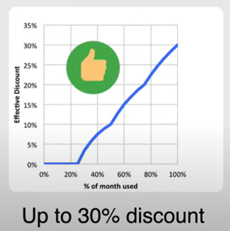
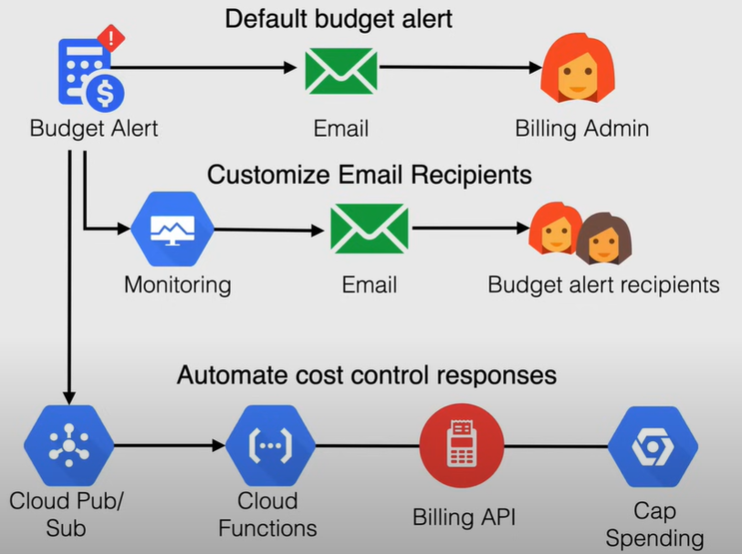
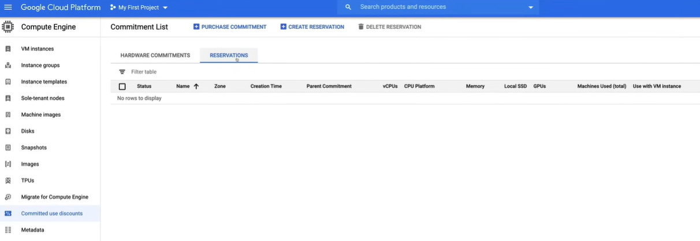
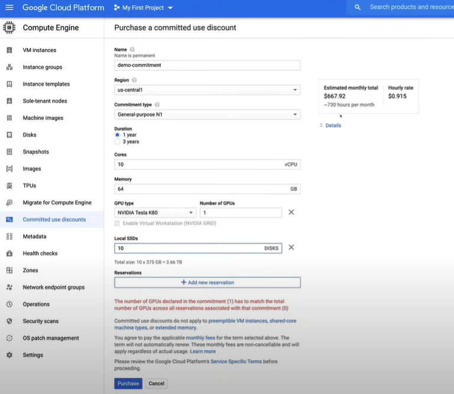
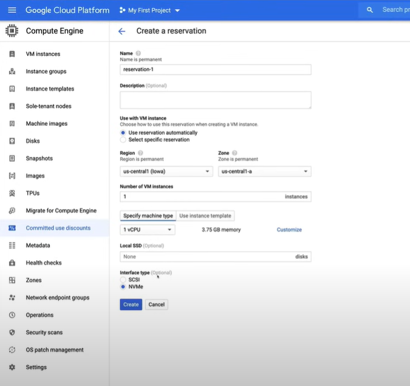
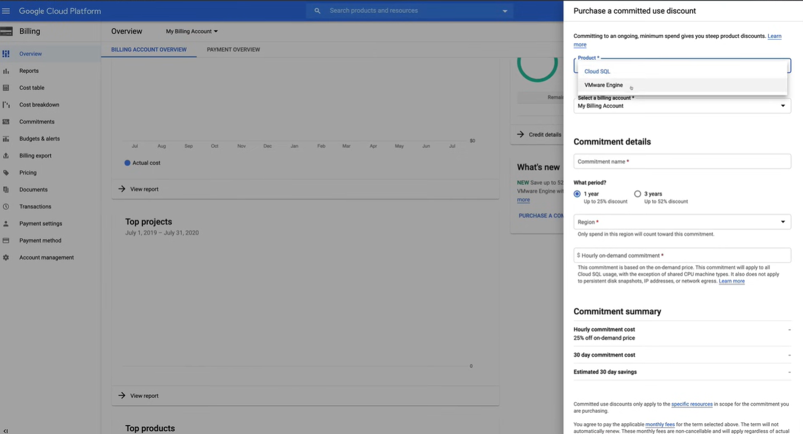
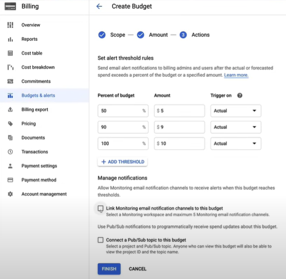
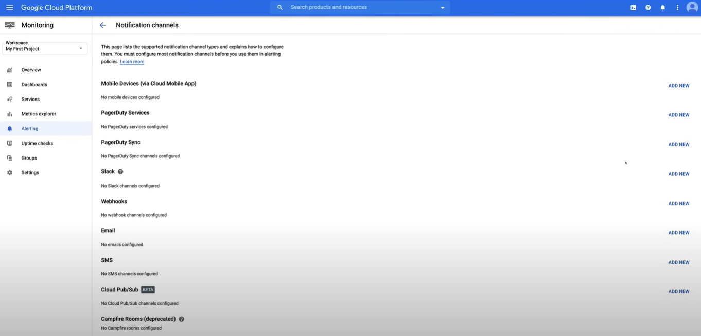

# Controllo dei costi e avvisi di budget

*Questa sezione non è inclusa nella guida all'esame Associate Cloud Engineer, ma è importante capire come controllare i costi e impostare gli avvisi di budget in GCP.*

## Committed Use Discounts (CUD's)

I CUD offrono prezzi scontati in cambio dell'impegno a utilizzare un livello minimo di risorse per un periodo specificato.

È possibile impegnarsi a utilizzare una quantità costante di risorse per un periodo di uno o tre anni.

La quota di impegno viene addebitata mensilmente e ci sono due tipi di impegni:

- **Basato sulla spesa**
  - Sconto per l'impegno a spendere una quantità minima per un servizio (ore) in una determinata regione.
  - Sconto del 25% per 1 anno, sconto del 52% per 3 anni.
  - È disponibile per le seguenti risorse:
    - Istanze di database **Cloud SQL**
    - **Google Cloud VMWare Engine**
  - Viene applicato solo all'utilizzo della CPU e della memoria.
- **Basato sulle risorse**
  - Sconto per l'impegno a spendere una quantità minima per le risorse di Compute Engine in una determinata regione. **Ideale per carichi di lavoro prevedibili**.
  - È disponibile per le seguenti risorse:
    - **vCPU**, **Memoria**, **GPU** e **Local SSD**.
  - Sconto del 57% per la maggior parte delle risorse, sconto del 70% per le istanze ottimizzate per la memoria.
  - Per l'uso tra i progetti

### Sconti per l'utilizzo continuativo

Sconti automatici per l'utilizzo continuativo delle risorse di Compute Engine per una parte significativa del mese di fatturazione.

Si applicano alle vCPU e alla memoria per la maggior parte dei tipi di istanze di Compute Engine. Vengono applicati automaticamente all'utilizzo all'interno di un progetto, separatamente per ogni regione, quindi non è necessaria alcuna azione per abilitarli.

Ad esempio, quando si utilizza una di queste risorse per più del 25% del mese, Compute Engine applica automaticamente uno sconto per ogni minuto incrementale di utilizzo.

Vengono applicati automaticamente alle VM create da **GKE** e **Compute Engine**, ma non si applicano alle VM create utilizzando l'ambiente flessibile di **App Engine**, Dataflow e i tipi di macchine E2.

## Calcolatore dei prezzi di GCP

Il Calcolatore dei prezzi di GCP è uno strumento che ti aiuta a capire i costi di esecuzione delle risorse di GCP.

## Cloud Billing Budget

I Budget di Cloud Billing ti consentono di **monitorare la tua spesa effettiva di GCP** rispetto alla spesa pianificata.

Le regole dei limiti di avviso di budget vengono utilizzate per **inviare notifiche via email** per aiutarti a rimanere informato sulla tua spesa.

È possibile definire la portata del budget, ad esempio, è possibile limitare il budget all'account di fatturazione o essere più granulari.

Le **email di avviso** vengono inviate agli amministratori dell'account di fatturazione e agli utenti specifici quando i costi superano una percentuale del budget.

I destinatari delle email possono essere personalizzati utilizzando **Cloud Monitoring** per specificare altre persone che riceveranno gli avvisi.

È anche possibile utilizzare **Pub/Sub** per le notifiche programmatiche o per automatizzare le attività di gestione dei costi. Può essere utilizzato anche in combinazione con i Budget di Fatturazione per automatizzare le attività di gestione dei costi.

## Demo: Controllo dei costi e avvisi di budget

Demo al seguente link: [Segui la demo sul controllo dei costi e gli avvisi di budget](https://youtu.be/jpno8FSqpc8?si=VzK8483q2zY7owvJ&t=9534).

### Sconti per l'utilizzo impegnato

#### Impegno basato sulle risorse

1. Vai a `Compute Engine`, utilizzando il **menu di navigazione** a sinistra.

2. Vai a `Sconti per l'utilizzo impegnato`.
   1. Gli impegni per Compute Engine sono basati sulle risorse.

   

3. Fai clic su `Sconti per l'utilizzo impegnato` e compila i dettagli nella nuova finestra.

    

4. Le `Prenotazioni` sono quando si riservano le istanze VM di cui si ha bisogno, in modo che quando la prenotazione è stata effettuata, si garantisce che tali risorse siano sempre disponibili per te.
   1. Infatti, quando si avvia una nuova VM di Compute Engine, specialmente quando si tratta di gruppi di istanze con ridimensionamento automatico, le istanze possono essere talvolta ritardate o non disponibili. Quindi, avendo una prenotazione, è possibile garantire che tali risorse siano sempre disponibili per te.
   2. Per effettuare una prenotazione, fai clic su `Crea prenotazione` e compila i dettagli.

    

#### Impegno basato sulla spesa

1. Per effettuare un **impegno basato sulla spesa**, vai alla sezione `Billing`, utilizzando il **menu di navigazione** a sinistra.

   1. Vai a `Impegni` e puoi vedere gli impegni che hai fatto.

2. Vai alla sezione `Panoramica` della fatturazione e fai un impegno cliccando su `Acquista impegno`.

    

### Avvisi di budget

1. Vai alla sezione `Billing`, utilizzando il **menu di navigazione** a sinistra.

2. Vai a `Budget e avvisi` e fai clic su `Crea budget`.

   1. Se desideri creare un budget e impostare un avviso per utenti specifici, puoi collegarlo a **Cloud Monitoring**.

    

    2. Per fare ciò, è necessario andare alla sezione `Monitoring`, utilizzando il **menu di navigazione** a sinistra.
    
    3. Vai a `Alerting` e fai clic su `Modifica canali di notifica` e aggiungi un nuovo indirizzo email nella nuova finestra.

    