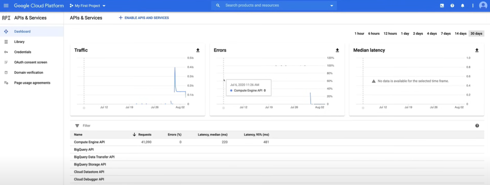
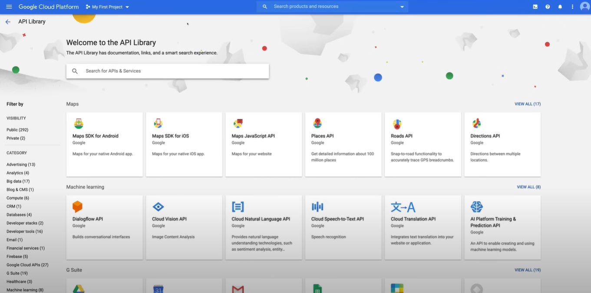

# Cloud APIs

## Demo

Una guida video su Cloud APIs di Google Cloud è disponibile [qui](https://youtu.be/jpno8FSqpc8?si=DWSVcAemJrRcWJCa&t=10820).

1. Vai alla sezione `APIs & Services` nella Console di Google Cloud, utilizzando il menu di navigazione a sinistra.

2. Attraverso la scheda `Dashboard`, puoi abilitare le API e i servizi, creare credenziali e visualizzare le statistiche di utilizzo.

    

3. Per aggiungere un'API, fai clic sul pulsante `Enable APIs and Services`, per accedere alla pagina della Libreria API.

    