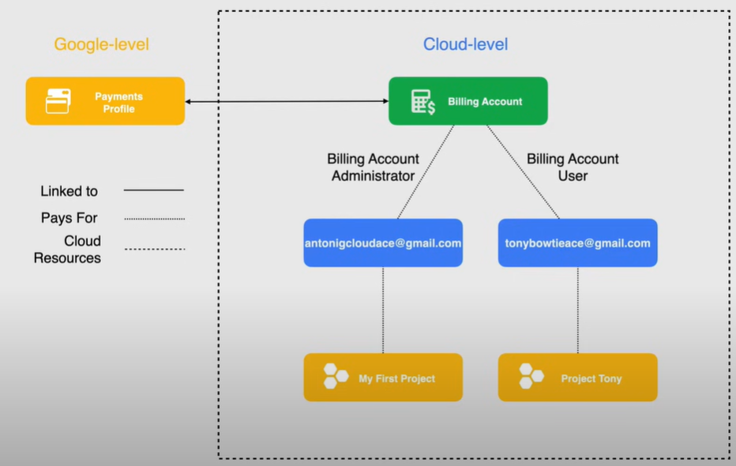
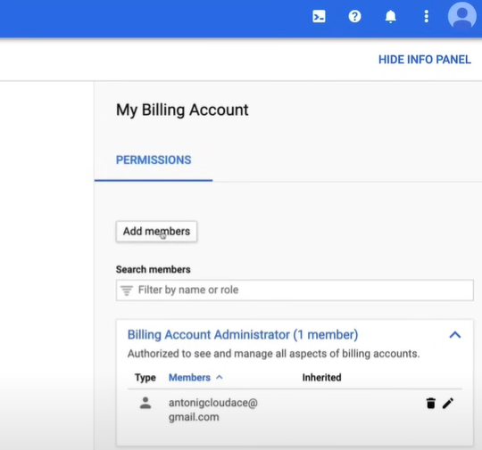
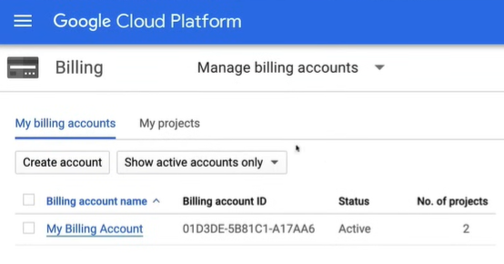

# Aggiunta di un Utente Amministratore

Per seguire le migliori pratiche di Google, abbiamo bisogno di un utente che abbia privilegi inferiori rispetto all'account utente che abbiamo configurato in precedenza.

## Super Admin User

Un account super amministratore viene creato per amministrare il dominio. Questo account ha il più alto livello di accesso ai servizi di Google Workspace e può eseguire qualsiasi operazione nella console di amministrazione. L'account super amministratore viene creato quando ti registri per Google Workspace.

L'account Super Admin ha permessi di amministrazione irrevocabili e può:

- Assegnare il ruolo di Amministratore dell'Organizzazione (o qualsiasi altro ruolo)
- Recuperare account a livello di dominio

Lo schema seguente è un esempio di architettura dell'account utente amministratore.

Come abbiamo discusso nelle lezioni precedenti, gli Account di Fatturazione hanno l'opzione di pagare per i progetti in un'organizzazione diversa. Quindi, quando si creano nuovi progetti utilizzando i due diversi account Gmail, vengono creati senza alcuna organizzazione e quindi ogni account è autonomo e può creare i propri progetti.

Ciò che li rende diversi è che l'account `antonigcloudace@gmail.com` possiede l'Account di Fatturazione ed è impostato come amministratore dell'account di fatturazione, mentre l'account `tonybowtieace@gmail.com` è un utente dell'account di fatturazione che può collegare i progetti a quell'account di fatturazione ma non ha accesso completo alla fatturazione.

Quindi, nel rispetto del principio del privilegio minimo, utilizziamo l'account `tonybowtieace@gmail.com`.

## Demo

Un video dimostrativo dei passaggi per aggiungere un Utente Amministratore è disponibile [qui](https://youtu.be/jpno8FSqpc8?si=ldco4JK-snxw1esE&t=11282).

1. Vai alla pagina `Billingx`, utilizzando il menu di navigazione a sinistra.

2. Vai alla sezione `Gestione account` della pagina `Billing`.

3. Fai clic su `Aggiungi membri` sul lato destro della pagina e inserisci l'indirizzo email dell'utente, quindi seleziona il ruolo `Utente dell'Account di Fatturazione` per consentire all'utente di associare i progetti agli account di fatturazione.

    

4. Ora possiamo passare all'account nella Console di GCP e accedere con l'altro utente.

5. Ora possiamo creare un nuovo progetto con il nuovo utente.

6. Dopo aver fatto ciò, vai alla pagina `Billing` e seleziona la sezione `Panoramica`.

7. Fai clic sul menu a discesa dell'`Account di Fatturazione` e fai clic su `GESTISCI ACCOUNT DI FATTURAZIONE`. Nella nuova pagina, possiamo vedere che il numero di progetti associati all'account di fatturazione è aumentato a 2.

    
