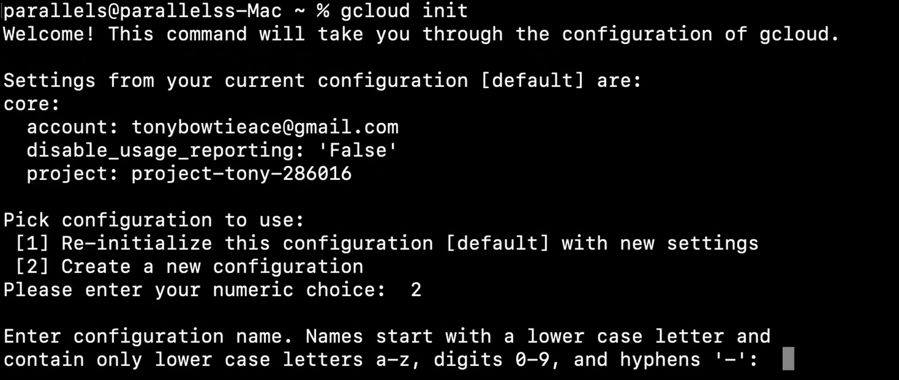
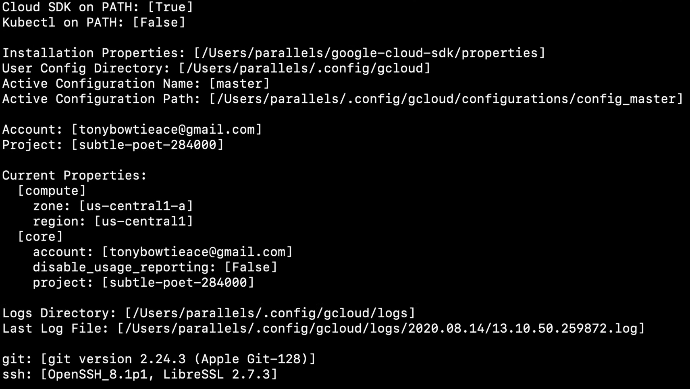

# Cloud SDK e CLI

Cloud SDK è un insieme di **strumenti da riga di comando** che ti permettono di gestire le risorse attraverso il terminale.

Include comandi come:

- `gcloud`
- `gsutil`
- `bq`
- `kubectl`

Per gestire risorse come Compute Engine, Cloud Storage, BigQuery, Kubernetes Engine, ecc.

Questi strumenti possono essere eseguiti interattivamente o con script di automazione, e con essi puoi fare tutto ciò che puoi fare nella console (e anche di più).

Con il comando:

- `gcloud init` puoi inizializzare, autorizzare e configurare il tuo account per utilizzare l'SDK.
- `gcloud auth login` puoi autenticarti con il tuo account Google e impostare l'account corrente come attivo.
- `gcloud config` puoi configurare account e progetti.
  - `gcloud config list` puoi elencare la configurazione e le proprietà correnti.
- `gcloud components` puoi installare, aggiornare e rimuovere i componenti dell'SDK.
- `gcloud --help` puoi ottenere aiuto sul comando (esci con `ctrl+C`).

Tutti i comandi `gcloud` seguono lo stesso schema:

```bash
gcloud [componente] [entità] [operazione] [argomenti posizionali] [flags]
```

Ad esempio:

```bash
gcloud compute instances create my-instance --zone=us-central1-a
```

### Demo

Una demo video del processo di installazione di Cloud SDK e CLI può essere trovata [qui](https://youtu.be/jpno8FSqpc8?si=SMXIuCxNRNHsNPtt&t=11918).

Il video segue la guida Quickstart per il Cloud SDK, che può essere trovata [qui](https://cloud.google.com/sdk/docs/install-sdk?hl=it).

## Gestione del Cloud SDK

### `gcloud init`

Prima inizializza l'SDK con:

```bash
gcloud init
```

che esegue le attività di configurazione iniziale, cioè configura una configurazione Cloud SDK e imposta un insieme base di proprietà e questo di solito copre l'account attivo, il progetto corrente, e se l'API è abilitata, la regione e la zona di Compute Engine predefinite.

**NOTA**: Se sei in una sessione di terminale remoto senza accesso a un browser, puoi utilizzare il flag `gcloud init --console-only` per eseguire l'inizializzazione nel terminale.

1. Quando eseguiamo `gcloud init`, ci darà un paio di opzioni diverse da scegliere.

2. Prima, ci chiederà quale configurazione vogliamo utilizzare. Possiamo creare una nuova configurazione, oppure possiamo utilizzare una esistente.

    

3. Poi, ci chiederà di accedere con il nostro account Google. Saremo reindirizzati a una pagina dove possiamo accedere e dare all'SDK i permessi necessari.

4. Dopo di che, ci verrà chiesto di scegliere un progetto. Possiamo creare un nuovo progetto, oppure possiamo utilizzare uno esistente.

5. Infine, ci verrà chiesto di scegliere una zona Compute Engine predefinita. Possiamo scegliere una delle zone disponibili, oppure possiamo saltare questo passaggio.

### `gcloud auth`

Se non vogliamo impostare l'intera configurazione, possiamo semplicemente autenticarci con il nostro account Google eseguendo:

```bash
gcloud auth login
```

**NOTA**: Quando eseguiamo l'SDK Cloud possiamo avere solo un account attivo alla volta. Se vogliamo cambiare account, possiamo eseguire `gcloud auth login` di nuovo.

Per controllare l'account corrente, possiamo eseguire:

```bash
gcloud auth list
```

Invece, se vogliamo rimuovere un account, cioè le credenziali e i token di accesso, possiamo eseguire:

```bash
gcloud auth revoke [ACCOUNT]
```

### `gcloud info`

Per ottenere informazioni sulla configurazione corrente, possiamo eseguire:

```bash
gcloud info
```




### `gcloud config`

Una configurazione è un insieme nominato di proprietà cli gcloud, e funziona come un profilo.

Per ottenere tutte le informazioni sulla configurazione corrente, possiamo eseguire:

```bash
gcloud config list
```

Invece, per passare tra le configurazioni, possiamo eseguire:

```bash
gcloud config configurations activate [NOME_CONFIGURAZIONE]
```

Per creare una nuova configurazione, possiamo eseguire:

```bash
gcloud config configurations create [NOME_CONFIGURAZIONE]
```

Per vedere le proprietà di una configurazione, possiamo eseguire:

```bash
gcloud config configurations describe [NOME_CONFIGURAZIONE]
```

Possiamo anche cambiare il progetto, l'account, la regione e la zona della configurazione corrente.

Ad esempio, per cambiare il progetto, possiamo eseguire:

```bash
gcloud config set project [ID_PROGETTO]
```

Invece, se è per l'istanza di calcolo, possiamo eseguire:

```bash
gcloud config set compute/zone [ZONA]
```

**NOTA**: Solo le proprietà che **non sono nella sezione delle proprietà core**, sono quelle che possono essere impostate.

### `gcloud components`

Per installare, aggiornare e rimuovere i componenti dell'SDK, possiamo utilizzare il comando `gcloud components`.

Per **elencare** tutti i componenti disponibili, possiamo eseguire:

```bash
gcloud components list
```

Per **installare** un componente, possiamo eseguire:

```bash
gcloud components install [COMPONENTE]
```

Per **rimuovere** un componente, possiamo eseguire:

```bash
gcloud components remove [COMPONENTE]
```

Per **aggiornare tutti** i componenti installati, possiamo eseguire:

```bash
gcloud components update
```

### Shell interattiva `gcloud`

Per utilizzare la shell interattiva `gcloud`, dobbiamo installare il componente beta:

```bash
gcloud components install beta
```

Poi, possiamo eseguire:

```bash
gcloud beta interactive
```

Ora per ogni comando che eseguiamo, avremo l'auto-completamento e i suggerimenti.