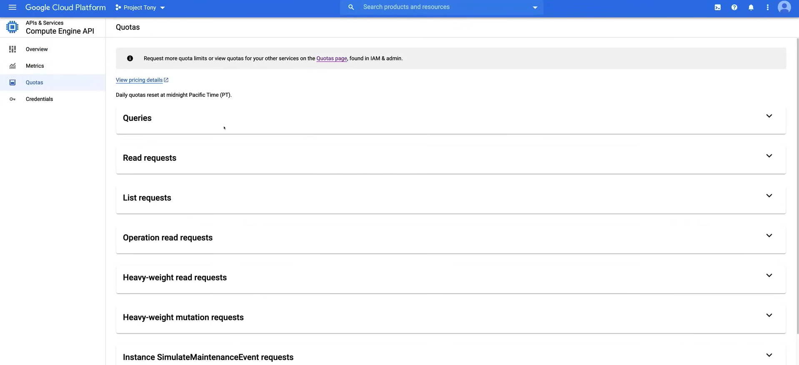

# Limiti e Quote

Google Cloud Platform applica quote per i proprietari dei progetti, stabilendo limiti su quanto di una risorsa specifica è possibile utilizzare.

Ci sono due tipi di quote di risorse:

1. **Quote di velocità**
   1. Le quote di velocità sono applicate su base progetto e proteggono la comunità degli utenti da abusi
   2. Le quote di velocità specificano il numero di richieste che possono essere effettuate a una particolare API entro un determinato periodo di tempo
   3. Questa quota si resetta dopo un certo periodo di tempo, come un minuto, un'ora o un giorno.

2. **Quote di allocazione**
   1. Queste quote sono applicate su base progetto e proteggono la comunità degli utenti da abusi
   2. Le quote di allocazione specificano il numero massimo di risorse che possono essere create entro un determinato periodo di tempo. Ad esempio, il numero di macchine virtuali o bilanciatori di carico utilizzati da un progetto
   3. Questa quota **non** si resetta dopo un certo periodo di tempo, ma deve essere esplicitamente rilasciata quando non è più necessaria

## Applicazione delle Quote

Ci sono tre motivi principali per cui le quote vengono applicate:

1. **Per proteggere la comunità degli utenti**
   1. Le quote proteggono la comunità degli utenti impedendo picchi imprevisti nell'utilizzo che potrebbero causare degrado delle prestazioni o tempi di inattività
   2. Le quote aiutano anche a impedire a un singolo utente di utilizzare tutte le risorse disponibili alla comunità

2. **Per la gestione delle risorse**
   1. Le quote ti aiutano a gestire le tue risorse impedendoti di utilizzare più risorse di quelle per cui hai pagato
   2. Le quote ti aiutano anche a gestire le tue risorse impedendoti di utilizzare più risorse di quelle necessarie

3. **Risorse contabili**
   1. Ogni limite di quota è espresso in termini di una particolare **risorsa contabile**, come il numero di richieste al minuto, il numero di macchine virtuali o la quantità di storage utilizzata.

## Monitoraggio e avviso sulle quote

È possibile monitorare l'utilizzo delle quote e impostare avvisi per essere avvisati quando si sta avvicinando ai limiti di quota. Ciò può aiutarti a evitare di esaurire le risorse e garantire che le tue applicazioni continuino a funzionare correttamente.

I servizi che supportano le metriche di quota includono:

1. **Compute Engine**
2. **Dataflow**
3. **Cloud Spanner**
4. **Cloud Monitoring**
5. **Cloud Logging**

Al contrario, i servizi che non supportano le metriche di quota includono:

1. **App Engine**
2. **Cloud Storage**
3. **Cloud SQL**

**NOTA:**

- I limiti di quota vengono aggiornati una volta al giorno, quindi potrebbe essere necessario fino a 24 ore affinché le modifiche abbiano effetto.
- Se il nostro progetto supera un limite di quota, l'API restituirà un messaggio di errore che indica che la quota è stata superata, precisamente Google Cloud restituirà un **codice di stato HTTP 429**, che indica che la richiesta è stata limitata a causa del superamento della quota, o un messaggio di errore `ResourceExhausted` se non stiamo utilizzando l'API HTTP.

## Visualizzazione delle quote

Principalmente, ci sono due modi per visualizzare le tue quote:

- **Console Cloud**
- **Dashboard API**

**NOTA:** È anche possibile visualizzare le quote in modo programmato utilizzando l'API `Cloud Resource Manager`.

### Console Cloud

1. Vai alla pagina **IAM e amministrazione** nella Console Cloud
2. Fai clic su **Quote** per visualizzare le tue quote

Per modificare la quota, seleziona l'API per cui desideri modificare la quota, fai clic sulla casella di controllo `Global` nel pannello di destra e quindi fai clic sul pulsante `Modifica quote` in alto nella pagina. Successivamente, scrivi una descrizione del motivo per cui è necessario aumentare la quota e fai clic sul pulsante `Invia richiesta`.

### Dashboard API

1. Vai alla pagina **API e servizi** nella Console Cloud
2. Fai clic su **Dashboard** per visualizzare le tue API
3. Fai clic sull'API per cui desideri visualizzare la quota, ad esempio **Compute Engine API**
4. Fai clic su **Quote** per visualizzare le tue quote

