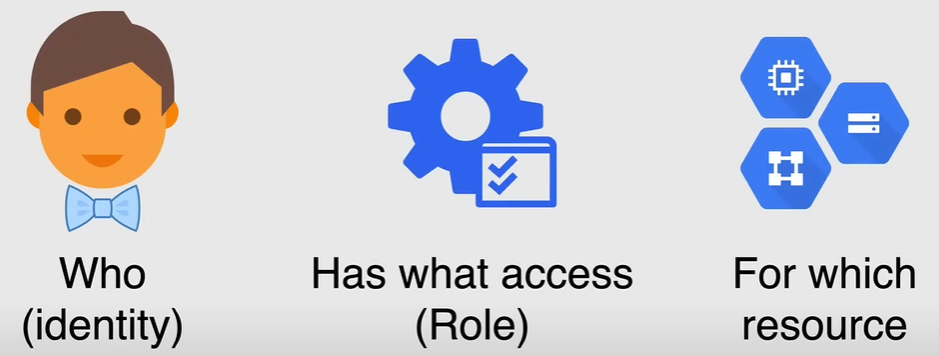

# Cloud IAM

## Principles of Least Privilege

**A user, program, or process should have only the bare minimum privileges necessary to perform its function.**

For example if a user performs a create function to a cloud storage bucket, the user should be restricted to only creating objects only on one storage bucket.


## Identity and Access Management

**Identity and Access Management (IAM)** lets you manage access control by defining **who** (identity) has **what** access (role) for **which** resource. IAM is a fundamental component of Google Cloud, and it is essential to understand how it works to secure your resources.



It also includes organization, folder, and project. 

In IAM permissions to access resources isn't granted directly to users, but **permissions are grouped into roles**, and roles are granted to authenticated members.

IAM policies define and enforce what roles are granted to which members, and theses policies are attached a to resource.

So when an authenticated member tries to access a resource, IAM checks the policies attached to the resource to determine if the member has the necessary permissions.

## Policy Architecture


A **Policy** is a collection of **bindings**, **audit configuration**, and other **metadata** that describes what **roles** are granted to which members.

- **Bindings** specify how access should be granted on resources, and it binds one or more members with a single role and any contact specific conditions that change how and when the role is granted.
- **Metadata** includes additional information about the policy, such an etag, which is a unique identifier for the policy, and a version number, to facilitate policy management.
- **Audit configuration** specifies configuration data of how access attempts should be audited.

### Members

A **member** is an *identity* that can access a resource. So, the identity of a member is an email address associated with a user service account or Google group, or even a domain name, associated with a G Suite or cloud identity domain.

- **Google Account**: It represents any person who interacts with Google Cloud, i.e. any email address that is associated with a Google account can be an identity, including `gmail.com` or other domain.

- **Service Account**: It is an account that belongs to your application instead of to an individual end user. So, when you run your code hosted on GCP, this is the identity that you specify to run you code.

- **Google Group**: It is a named collection of Google accounts and service accounts. The advantage of Google Groups is that you can grant and change permissions for multiple users at once.

- **G Suite Domain**: It represents your organization's internet domain (such as `example.com`) and when you add a user to your G Suite domain, they get a Google account with the same name. It represents a virtual group of all the Google accounts that have been created. Like Google Groups, G Suite domains cannot be used to establish identity but they simple enable permission management.

- **Cloud Identity Domain**: It is like a G Suite domain, but the difference is that the users don't have access to G Suite applications and features.

**NOTE:**

- **All Authenticated Users**: It is a special identifier that represents any user who is authenticated with a Google account.

- **All Users**: It is a special identifier that represents any user, including unauthenticated users.

### Roles

**Roles** are a named *collection of permissions* that grant access to perform certain actions on resources.

**Permissions**:

- Determine what operations are allowed on a resource.
- They usually (but not always) correspond **one-to-one with REST** API methods.
- They are **not granted to users directly**
  - You grant a role to a user and all the permissions that the role contains.
- You grant roles which contain one or more permissions.
- It is possible to create custom roles, combining one or more of the available AIM permissions.

Permissions are defined in the form of `service.resource.verb`, for example `compute.instance.list`.

There are three types of roles im IAM:

1. **Primitive Roles**:
   - These roles are the basic roles that existed when IAM was first introduced.
   - They are:
     - `Owner`, it includes the permissions of the `Editor` and `Viewer` roles.
     - `Editor`, it includes the permissions of the `Viewer` role.
     - `Viewer`
   - These roles are **not recommended** for production use because they grant broad access across all resources in a project.

2. **Predefined Roles**:
   - These roles are mantained by Google Cloud and grant access to specific resources and predefined set of permissions.
   - They are
     - `roles/owner`
     - `roles/editor`
     - `roles/viewer`.
   - New roles are added as new services are added to Google Cloud.

3. **Custom Roles**:
   - These roles are user-defined and grant access to specific resources and a custom set of permissions.
   - Unlike predefined roles, they are not mantained by Google Cloud.
   - When you create a custom role, you must choose an organization or project to create it in, you can then grant the custom role on the organization or project as well any resources within the organization or project.
     - *You cannot create custom roles at the folder level.* If you need to define a custom role for a folder, you need to define it on the parent of that folder.
   - Only project owners can create custom roles.
   - A feature of custom roles is the **Launch Stage** which indicates the level of support for the role.
     - **Alpha**: The role is still in testing.
     - **Beta**: The role is tested and awaiting approval.
     - **GA**: The role is generally available and fully supported.

### Condition

A **condition** is a **logical expression** used to define and enforce *conditional*, *attribute-based* access control for Google Cloud Resources.

Conditions allow you to choose granting resources access to identities (members) only if configured conditions are met.

For example, this could be done to configure temporary access for users that are contractors and have been given specific access for a specific amount of time. A condition could be put in place to remove the acces they need one the contract is over.

Conditions are specified in the role binding of a resource of a resource IAM policy.

When a condition exists, the access request is only granted **if the condition expression evaluates to true**.

### Metadata

This component carries both the **etag** and the **version** of the policy.

- **etag**: It is a unique identifier for the policy.
  - *To help prevent a race condition when updating the policy, IAM supports concurrency control through the use of an etag field in the policy.*
    - When multiple systems try to write the same IAM policy at the same time there is a risk of overwriting each other's changes. The etag is used to prevent this from happening.
- **version**: It is a number that is incremented each time the policy is updated.
  - To avoid breaking your existing integrations on new features releases that rely on consistency in the policy structure, new policy schema version are introduced.

### Audit Configuration

Audit configuration component is used in order to configure audit logging for the policy.

It determines which permission type are logged and what identities if any are exempt from logging.

## Policy Inheritance

You can set an IAM policy in any level in the resources hierarchy, and resources inherit the policies from the parent resources.

The effective policy for a resource **is the union** of the policy set on the resource and the policies inherited from the parent resources.

**NOTE:** The organization level policies also apply at the resource level.

For example if we apply a policy on `Project X`, any resources within that project will inherit the policy.


## Demo

A video demo of the IAM concepts can be found [here](https://youtu.be/jpno8FSqpc8?si=GwX8rTLDLGgdN3Z4&t=17252).

1. Go to `IAM & Admin` page using the left side menu.

Now we explain each menu item on the left side menu:

- `IAM` page is where you can add or edit permissions with regards memebers and roles, for the policy added to your given project.
  - To add a member, click on `Add` and then enter the email address of the member you want to add.
  - To add a permission to the new member, we can use the command line, run the following command:

    ```bash
    gcloud projects add-iam-policy-binding [PROJECT_ID] --member=[MEMBER] --role=[ROLE]
    ```

    This command will add the role to the member.

  

- `Identity & Organization` page is where you can manage Cloud Identity, i.e. a Google Cloud's identity as a service solution and it allows you to create and manage users and groups, within Google Cloud.
  
- `Organization Policies` page is where you can set organization-wide policies that apply to all projects in the organization.

- `Quotas` page is where you can view and manage quotas for your project (see [Limits and Quotas](../02_Account_Setup/10_Limits_and_Quotas.md)).

- `Service Accounts` page is where you can create and manage service accounts.

- `Labels` page is where you can create and manage labels for your resources. They are key-value pairs that you can attach to resources to help you organize and identify them.

- `Settings` page is where you can manage settings for your project, for example changing the project name, or see the project number and project ID, or migrate or shut down the project.

- `Privacy & Security` page is where Google supplies all of their clients of Google Cloud the compliance that they need in order to meet regulations across the globe and industry standards, such as health care, and education.

- `Identity Aware Proxy` page is where you can manage access to your cloud applications and VMs without a VPN.

- `Roles` page is where you can view and manage roles for your project. For example we can create roles, custom roles, and we have access to all the permissions.

- `Audit Logs` page is where you can enable the auto logs without having to use a specific policy by simply clicking on `Default auto config` and then check or uncheck the checkboxes for the logs you want to enable or disable.
  - **NOTE:** Avoid to enable all the logs because it can generate a large amount of data and can quickly blow through your quota.

  - To write audit logs configuration using command line, you can use the following command:

    ```bash
    gcloud projects get-iam-policy [PROJECT_ID] > policy.yaml
    ```

    This command will write the policy to a file called `policy.yaml` in the current directory, so we can paste the audit configuration section (`auditConfigs`) in the file.

    To write the policy back to the project, you can use the following command:

    ```bash
    gcloud projects set-iam-policy [PROJECT_ID] policy.yaml
    ```

    This command will write the policy back to the project.

- `Groups` page is where you can create and manage groups.