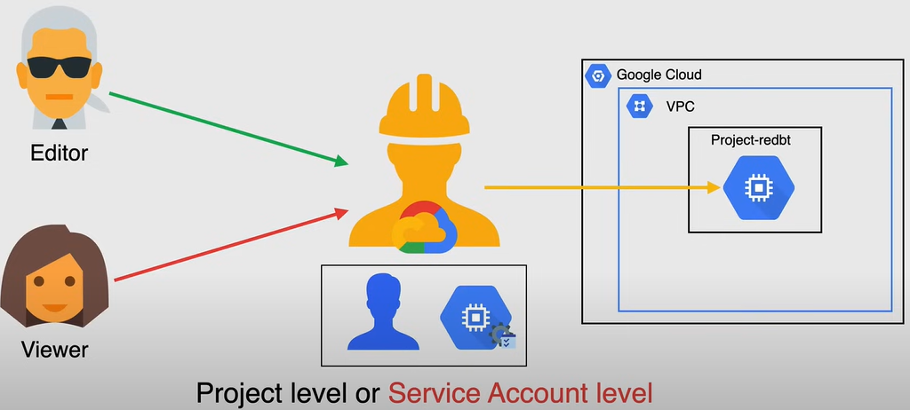
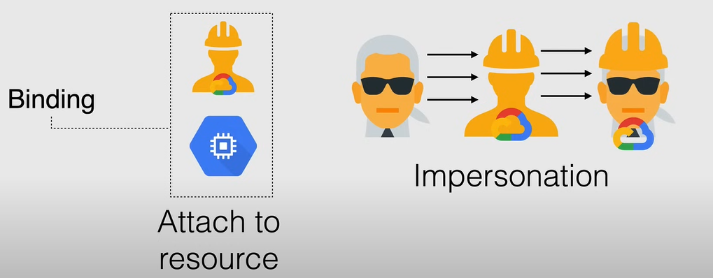

# Service Account

A **Service Account** is a special type of Google account that is used by an application or a virtual machine (VM) instance, and **not a person**, to authenticate itself with application and Google services, so that the users aren't directly involved.

In short it is a special type of Google account intended to represent a non-human user that needs to authenticate and be authorized to access data in Google APIs, this way the service is the identity of the service and the service account permissions control which resources the service can access.

A Service Account is identified by its email address, which is unique to the account.

There are three types of Service Accounts:

- **User-managed**: These are service accounts that you create and manage yourself. You are responsible for managing and securing these service accounts, and by default, you can create up to 100 user-managed service accounts per project.
  - When you create these service accounts, you choose the name, and it appears in the email address of the service account, with the format `<service-account-name>@<project-id>.iam.gserviceaccount.com`.

- **Default**: When you use some Google Cloud services, they create user-managed service accounts (*Default*) that enable the service to deploy jobs that access other Google Cloud resources.
  - when comes to production workloads, Google strongly recommends that you create your own user-managed service accounts, and grant the appropriate roles to each service account
  - when a default service account is created, it is automatically granted the `Editor` role on the project, which gives it full access to all resources in the project.
    - **Google strongly recommends that you disable the automatic role** grant by adding a constraint to your organization policy or by revoking the Editor role manually.
  - The email address of the default service account follows the formats:
    - `<project-id>@appspot.gserviceaccount.com`
    - `<project-number>-compute@developer.gserviceaccount.com`
- **Google-managed**: These are service accounts that are created and managed by Google Cloud. They are used by Google Cloud services, such as Cloud Functions, to run internal processes.
  - Some of these service accounts are visible, but others are not.
  - **NOT CHANGE OR REMOVE** the roles that are granted to Google-managed service accounts, because doing so can cause errors in the services that use them.
  - They follow the following format: `<project-number>@cloudservices.gserviceaccount.com`.

## Service Account Key

Each service account is associated with two sets of public/private RSA key pairs that are used to authenticate the service account.

They are the:

- **Google managed keys**
  - Google stores both the public and private portion of the key, rotates them regularly, and the private key is always held in escrow (encrypted) and is never directly accessible.
  - IAM provide APIs to use these keys to sign on behalf of the service account.

- **User managed keys**
  - You own both the public and private portion of the key pair
  - You can create one or more user managed key pairs, also known as *external keys* that can be used from outside of GCP
  - Google store only the public portion of the key, so you are responsible for the security of the private key, as well the rotation and management of the keys.
  - Private key cannot be retrieved by Google, so if you are using a user managed key and you lose the private key, you will not be able to authenticate as the service account.
    - *Google recommends that you store the private key in cloud key management service (KMS)n*.

A **Service Account Key** is a file that contains a private key and other important information that you can use to authenticate with Google Cloud services.

When you create a service account, you can download a key file that you can use to authenticate as the service account.

## Service Account Permissions

In addition to be an identity a Service Account is a resource which has IAM policies attached to it, and these policies determine who can use the service account.

So for instance, a user can have the Editor role on a Service Account , and another user can have the Viewer role on the same Service Account, so it is similar to granting roles to any another resource in GCP.

**NOTE:** The defaul Compute Engine and APp Engine Service Accounts are granted Editor roles on the project when they are created, so that the code executing in your application or VMs instances, has the necessary permissions.

You can grant the Service Account user role at both the **project level**, for all the Service Accounts in the project, or the **service account level**, and the permissions are inherited from the project level to the service account level.

**Granting the Service Account User role to a user for a project, gives the user access to all the service accounts in the project, including the service accounts that will be created in the future.**

**Service Account Impersonation**: The User can **impersonate** the service account. It happens when a users who are granted the Service Account User role on a Service Account, can use it to undirectly access all the resource to which the service account has access.

## Access Scopes

**Service Account Scopes** are the **legacy** methods of specifying permissions for your instance, and they are used in substitution of IAM roles.

They are used specifically for default or automatically created Service Accounts, based on enabled APIs and services.

You must still set Service Accounts Scopes when configuring an instance to run as service account, however, when you are using a custom service account, you should use IAM roles instead of scopes.

## Use of Service Account

One way of using a Service Account is to attach this Service Account to a resource, so if you want to start a long-running job that authenticates as Service Account, you need to attach a service account to the resource that will run the job, and this will bind the Service Account to the resource.

The other way to use a Service Account is directly impersonate the Service Account.

## Best Practices

- **Audit Service Accounts and keys** using either the `serviceAccount.keys.list()` method or the Log Viewer page in the console.
- **Delete Service Account external keys** if you don't need them anymore.
- Grant the Service Account only the **minimum set of permissions** required to achieve their goals.
- **Create Service Account for each service** with only the permissions required for that service.
- Take advantage of the IAM Service Account API to **implement key rotation**.