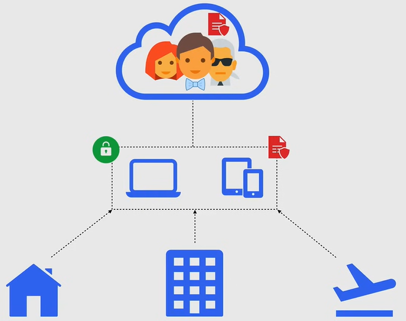
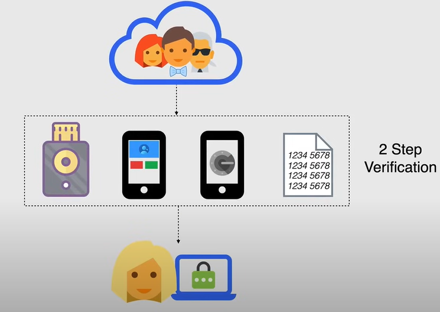
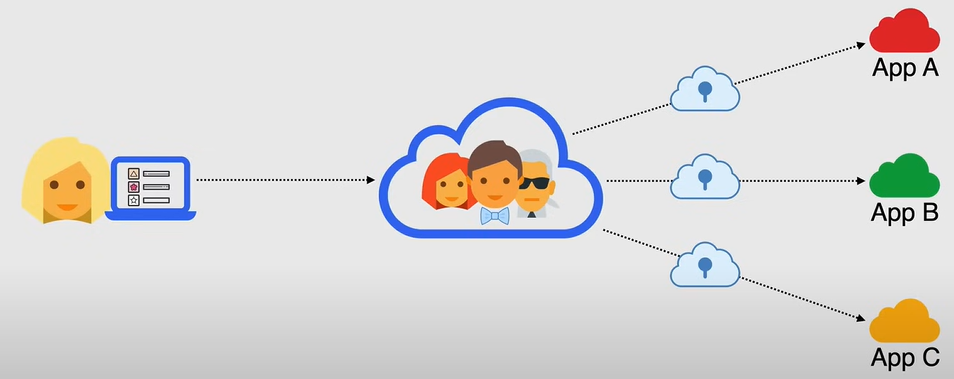
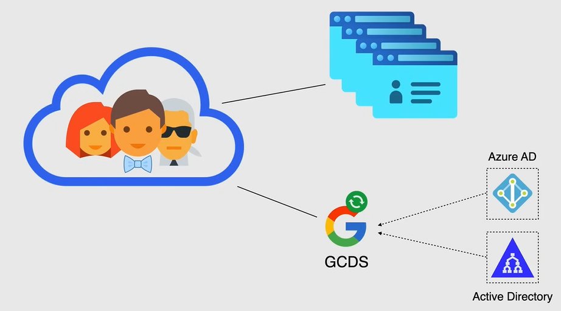
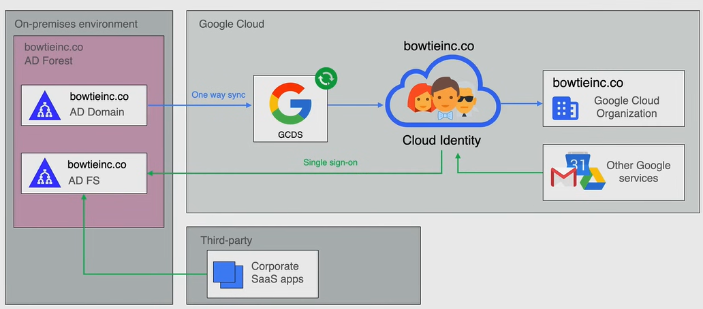

# Cloud Identity

**Cloud Identity** is an **Identity as a Service (IDaaS)** solution that allows you to manage users, and groups, and use them to access Google Cloud resources.

- It gives more control over the accounts that are used in your organization.

  - For example, id developers in your organization use personal accounts, such as Gmail, to access Google Cloud resources, those accounts are outside of your control.

  - So when you adopt Cloud Identity, you can manage access and compliance across all the users in your domain.

- With Cloud Identity, you can create a *cloud identity account for each of your user and groups.* 

  - You can then use IAM to manage access to Google Cloud resources, for each of Google Cloud identity account.

- You can also configure cloud identity to *federate identities between Google and other identity providers*, such as Active Directory and Azure Active Directory.

Cloud Identity provide also other features, such as:

- *Device management*: You can manage devices that are used to access Google Cloud resources.
- *Security*: You can enforce security policies, such as 2-step verification, and enforce security keys.
- *Single sign-on (SSO)*: You can configure SSO to allow users to access multiple applications with a single login.
- *Reporting*: You can view reports on user activity and security events.
- *Directory management*: You can manage users and groups in a central directory.

## Device Management

Device management allows users in any organization access their work accounts from mobile devices while keeping the organization's data secure. This phenomenon is known as **Bring Your Own Device (BYOD)**.

Using mobile device management, there are several ways that can you provide the business applications employees need on their personal devices, while implementing security policies to protect your organization's data.

- You can create a whitelist of approved applications.
- You can enforce work profiles on Android devices and requiring managed application on iOS devices.
- Policies can be pushed on these devices to protect corporate data and identities as well keeping the inventory of devices with the corporate data present on them.

When devices are either no longer being used for corporate use or stolen, the device can be wiped remotely to protect the organization's data.

## Security

The **Security** component of Cloud Identity, is where two-step verification, security keys, and other security policies are enforced.

The 2-step verification is a security process in which the user provides two authentication factors to verify themselves.

It is a method of confirming a user's claimed identity by utilizing a combination of two different components, such as a password and a security token sent to the user's mobile device.

## Single Sign-On (SSO)

Single sign-on (SSO) is where users can access many applications with a single login.

You can set up SSO with Google, that is an Identity Provider, to access a slew of third-party applications.

So a user that logs into Google Cloud, with his employee account, he will have access to many other cloud application approved by the organization.

## Reporting

Reporting is where you can view reports on user activity and security events.

- It covers Audit logs, for logins groups devices and even token usage.
- It is also possible to export this logs to BigQuery for further analysis.
- Then you can create reports and dashboards to monitor user activity and security events.

## Directory Management

Directory management provides profile information for users in your organization, email, and group addresses, and share external contacts in the directory using Google CLoud Directory Sync or `gcds`, you can sycronize the data in your Google account, with your Microsoft Active Directory or LDAP server.

GCDS doesn't migrate any content, such as your email, calendar, or contacts. It only syncs the data in your Google account with your Microsoft Active Directory or LDAP server.

### Google Cloud Directory Sync (GCDS)

**Active Directory** is a directory service developed by Microsoft, it authenticates and authorizes all users and computers in a Windows domain type network, signing and enforcing security policies for all computers and installing or updating software as necessary.

As described in the diagram above, the Active Directory forest contains the *Active Directory* and the *Active Directory Federation Services (AD FS)*. Then the *Active Directory Forest* is the hierarchical structure for the *Active Directory*.

- *Active Directory Domain* is responsible for storing information about memebers of the domain, such as users and devices
  - verifies their credentials
  - defines their access rights.

- *Active Directory Federation Services (AD FS)* is a Single Sign-On (SSO) service where "federation" is the meaning of linking a person's electronic identity and attributes, stored across multiple distinct identity management systems.
  - You can think of it as a subset of SSO as it relates only to authentication technologies used for federated identity, including some common terms such as SAML (Security Assertion Markup Language) and OAuth, openID, and so on.

So when you have identities already in your on-premesis environment, that live in active directory, you need a way to tie these identities to the cloud, so it is here, where you would use Google Cloud Directory Sync (GCDS), to automatically provision users and groups, from Active Directory to Cloud Identity or G-Suite.

GCDS is a free tool provided by Google, that implements the synchronization process and can be run on Google Cloud or in your on-premises environment.

