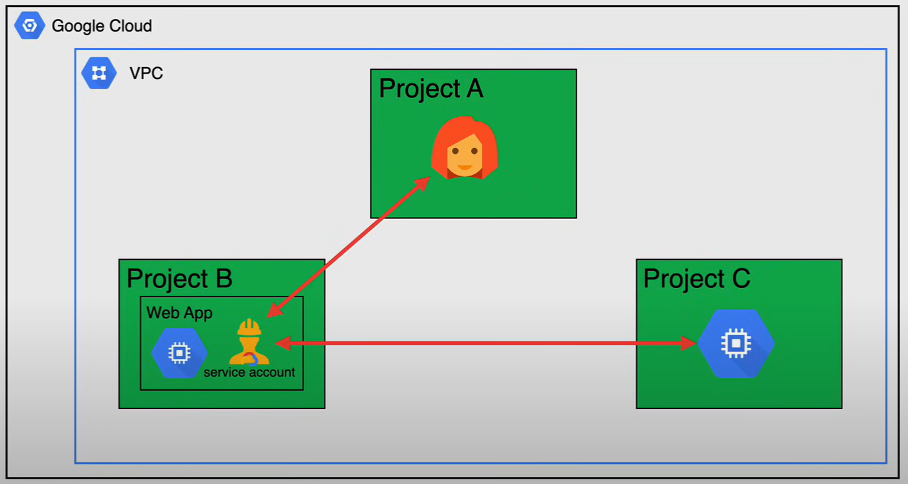
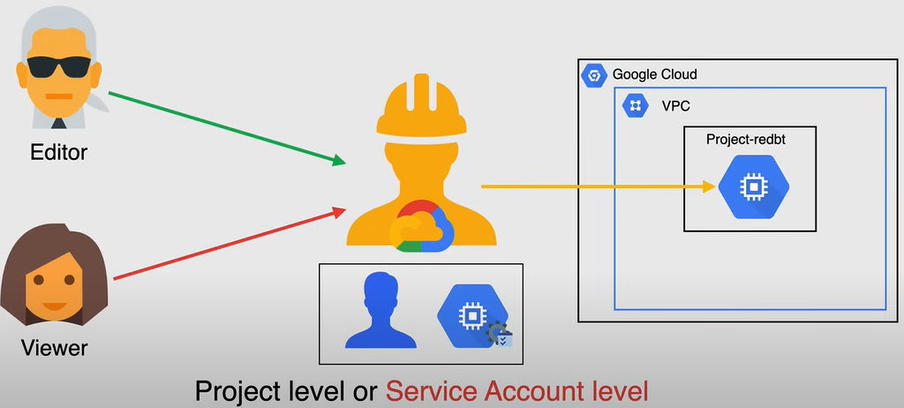
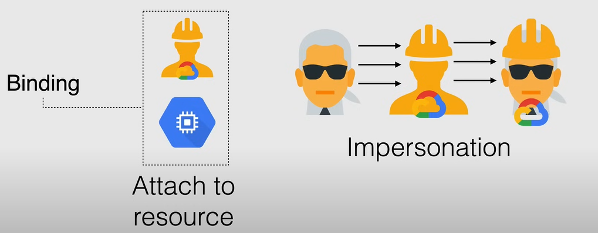
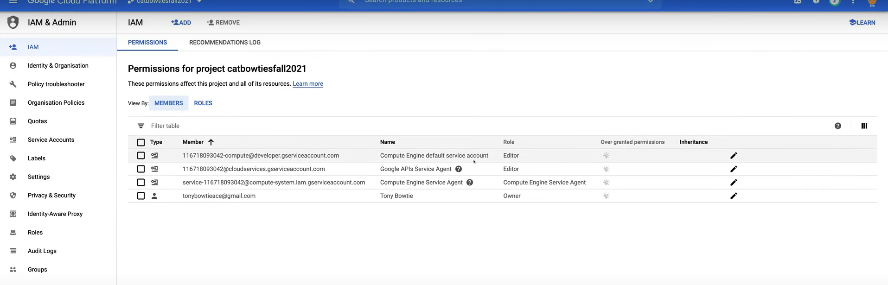
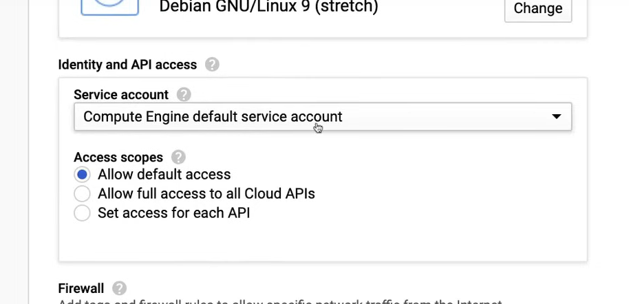
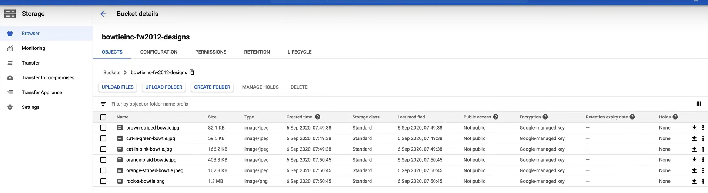

# Account di servizio

Un **Account di servizio** è un tipo speciale di account Google utilizzato da un'applicazione o da un'istanza di macchina virtuale (VM) e **non da una persona**, per autenticarsi con le applicazioni e i servizi di Google, in modo che gli utenti non siano direttamente coinvolti.

In breve, è un tipo speciale di account Google destinato a rappresentare un utente non umano che ha bisogno di autenticarsi e di essere autorizzato ad accedere ai dati nelle API di Google. In questo modo, il servizio è l'identità del servizio e le autorizzazioni dell'account di servizio controllano quali risorse il servizio può accedere.

Un Account di servizio è identificato dal suo indirizzo email, che è univoco per l'account.



Ci sono tre tipi di Account di servizio:

- **Gestiti dall'utente**: Questi sono account di servizio che crei e gestisci tu stesso. Sei responsabile della gestione e della sicurezza di questi account di servizio e, per impostazione predefinita, puoi creare fino a 100 account di servizio gestiti dall'utente per progetto.
  - Quando crei questi account di servizio, scegli il nome e appare nell'indirizzo email dell'account di servizio, con il formato `<nome-account-di-servizio>@<id-progetto>.iam.gserviceaccount.com`.

- **Predefiniti**: Quando utilizzi alcuni servizi di Google Cloud, vengono creati account di servizio gestiti dall'utente (*Predefiniti*) che consentono al servizio di eseguire lavori che accedono ad altre risorse di Google Cloud.
  - Per i carichi di lavoro di produzione, Google consiglia vivamente di creare i propri account di servizio gestiti dall'utente e di assegnare i ruoli appropriati a ciascun account di servizio.
  - Quando viene creato un account di servizio predefinito, viene automaticamente assegnato il ruolo `Editor` al progetto, che gli conferisce pieno accesso a tutte le risorse del progetto.
    - **Google consiglia vivamente di disabilitare l'assegnazione automatica del ruolo** aggiungendo un vincolo alla policy dell'organizzazione o revocando manualmente il ruolo di Editor.
  - L'indirizzo email dell'account di servizio predefinito segue i seguenti formati:
    - `<id-progetto>@appspot.gserviceaccount.com`
    - `<numero-progetto>-compute@developer.gserviceaccount.com`
- **Gestiti da Google**: Questi sono account di servizio creati e gestiti da Google Cloud. Sono utilizzati dai servizi di Google Cloud, come Cloud Functions, per eseguire processi interni.
  - Alcuni di questi account di servizio sono visibili, ma altri no.
  - **NON MODIFICARE O RIMUOVERE** i ruoli assegnati agli account di servizio gestiti da Google, poiché ciò può causare errori nei servizi che li utilizzano.
  - Seguono il seguente formato: `<numero-progetto>@cloudservices.gserviceaccount.com`.


## Chiave dell'account di servizio

Ogni account di servizio è associato a due set di coppie di chiavi RSA pubbliche/private utilizzate per autenticare l'account di servizio.

Sono le:

- **Chiavi gestite da Google**
  - Google memorizza sia la parte pubblica che quella privata della chiave, le ruota regolarmente e la chiave privata è sempre detenuta in escrow (crittografata) e non è mai accessibile direttamente.
  - IAM fornisce API per utilizzare queste chiavi per firmare a nome dell'account di servizio.

- **Chiavi gestite dall'utente**
  - Possiedi sia la parte pubblica che quella privata della coppia di chiavi
  - Puoi creare una o più coppie di chiavi gestite dall'utente, anche note come *chiavi esterne*, che possono essere utilizzate al di fuori di GCP
  - Google memorizza solo la parte pubblica della chiave, quindi sei responsabile della sicurezza della chiave privata, nonché della rotazione e della gestione delle chiavi.
  - La chiave privata non può essere recuperata da Google, quindi se stai utilizzando una chiave gestita dall'utente e perdi la chiave privata, non sarai in grado di autenticarti come account di servizio.
    - *Google consiglia di archiviare la chiave privata nel servizio di gestione delle chiavi cloud (KMS)*.

Una **Chiave dell'account di servizio** è un file che contiene una chiave privata e altre informazioni importanti che puoi utilizzare per autenticarti con i servizi di Google Cloud.

Quando crei un account di servizio, puoi scaricare un file di chiave che puoi utilizzare per autenticarti come account di servizio.

## Autorizzazioni dell'account di servizio

Oltre ad essere un'identità, un Account di servizio è una risorsa a cui sono associate le politiche IAM e queste politiche determinano chi può utilizzare l'account di servizio.

Ad esempio, un utente può avere il ruolo di Editor su un Account di servizio e un altro utente può avere il ruolo di Visualizzatore sullo stesso Account di servizio, quindi è simile all'assegnazione di ruoli a qualsiasi altra risorsa in GCP.

**NOTA:** Gli Account di servizio di Compute Engine e App Engine predefiniti vengono assegnati i ruoli di Editor sul progetto quando vengono creati, in modo che il codice in esecuzione nella tua applicazione o nelle istanze delle VM abbia le autorizzazioni necessarie.



Puoi assegnare il ruolo di utente dell'account di servizio sia a livello di **progetto**, per tutti gli account di servizio nel progetto, che a livello di **account di servizio**, e le autorizzazioni vengono ereditate dal livello di progetto al livello di account di servizio.

**Assegnare il ruolo di utente dell'account di servizio a un utente per un progetto, dà all'utente accesso a tutti gli account di servizio nel progetto, inclusi gli account di servizio che verranno creati in futuro.**

**Impersonificazione dell'account di servizio**: L'utente può **impersonare** l'account di servizio. Questo avviene quando gli utenti a cui è stato assegnato il ruolo di utente dell'account di servizio su un account di servizio, possono utilizzarlo per accedere indirettamente a tutte le risorse a cui l'account di servizio ha accesso.

## Ambiti di accesso

Gli **Ambiti di accesso dell'account di servizio** sono i metodi **legacy** per specificare le autorizzazioni per la tua istanza e vengono utilizzati in sostituzione dei ruoli IAM.

Vengono utilizzati specificamente per gli account di servizio predefiniti o creati automaticamente, in base alle API e ai servizi abilitati.

È comunque necessario impostare gli ambiti di accesso dell'account di servizio quando si configura un'istanza per eseguire come account di servizio, tuttavia, quando si utilizza un account di servizio personalizzato, è consigliabile utilizzare i ruoli IAM anziché gli ambiti.

## Utilizzo dell'account di servizio

Un modo per utilizzare un Account di servizio è associare questo Account di servizio a una risorsa, quindi se si desidera avviare un lavoro a lunga durata che si autentica come Account di servizio, è necessario associare un account di servizio alla risorsa che eseguirà il lavoro e questo vincolerà l'Account di servizio alla risorsa.

L'altro modo per utilizzare un Account di servizio è impersonare direttamente l'Account di servizio.



## Best Practice

- **Verifica gli Account di servizio e le chiavi** utilizzando il metodo `serviceAccount.keys.list()` o la pagina Log Viewer nella console.
- **Elimina le chiavi esterne dell'Account di servizio** se non ne hai più bisogno.
- Assegna all'Account di servizio solo il **minimo set di autorizzazioni** necessarie per raggiungere i propri obiettivi.
- **Crea un Account di servizio per ogni servizio** con solo le autorizzazioni necessarie per quel servizio.
- Approfitta dell'API IAM dell'Account di servizio per **implementare la rotazione delle chiavi**.

## Demo

Un video dimostrativo sull'Account di servizio può essere trovato [qui](https://youtu.be/jpno8FSqpc8?si=_yqfo_iY08qZLyCr&t=19008).

1. Vai alla pagina **IAM e Admin** nella Console di Google Cloud.
2. Se vai alla pagina **Account di servizio**, puoi vedere l'elenco degli account di servizio nel progetto.

Ad esempio, per creare un nuovo account di servizio:

1. Vai alla pagina **Compute Engine** nella Console di Google Cloud.
2. Abilita l'**API di Compute Engine**, e questo creerà automaticamente un account di servizio predefinito.
3. Ora, se torniamo alla pagina **Account di servizio**, possiamo vedere il nuovo account di servizio creato: `<service-116718093042@compute-system.iam.gserviceaccount.com>`.



4. Torna alla pagina **Compute Engine** e crea una nuova istanza di VM (dalla pagina **Istanze VM**).
   1. Scorri verso il basso nella pagina di configurazione e nella sezione **Identità e accesso API**.
   2. Nel menu a discesa **Account di servizio**, possiamo vedere che l'account di servizio predefinito di Compute Engine è stato selezionato automaticamente.
   3. Quindi, abbiamo la sezione **Ambiti di accesso**, in cui possiamo vedere gli ambiti di accesso predefiniti selezionati automaticamente. Se facciamo clic su **Imposta accesso per ogni API**, possiamo vedere l'elenco delle API e gli ambiti di accesso abilitati per ciascuna API. Ad esempio, possiamo abilitare l'autorizzazione `Sola lettura` per l'API `Cloud Storage`.
    
    
   
   4. Infine, fai clic sul pulsante **Crea** per creare l'istanza VM.

5. Per vedere la nuova autorizzazione, vai alla pagina **Cloud Storage** nella Console di Google Cloud.
   1. Supponiamo di avere un bucket, fai clic sul nome del bucket.
   2. Possiamo vedere tutti i file nel bucket.
    
    

6. Accedi tramite SSH all'istanza VM.
   1. Esegui il seguente comando per visualizzare l'utente corrente:
    ```bash
    gcloud config list

    # Output
    [core]
    account = 116718093042@compute-system.iam.gserviceaccount.com>
    disable_usage_reporting = True
    project = catnowtiesfall2021

    Your active configuration is: [default]
    ```

   2. Elenca il contenuto del bucket utilizzando il comando `gsutil`.
    
    ```bash
    gsutil ls gs://<nome-bucket>
    ```

    3. Non possiamo creare un nuovo file nel bucket, perché abbiamo solo l'autorizzazione `Sola lettura`, quindi se eseguiamo il seguente comando, otterremo un errore:
    
    ```bash
    touch file1
    gsutil cp file1 gs://<nome-bucket>

    # Output
    AccessDeniedException: 403 Insufficient Permission
    ```

7. Per creare un altro Account di servizio, vai alla pagina **IAM e Admin** nella Console di Google Cloud.
   1. Fai clic sulla pagina **Account di servizio**.
   2. Fai clic sul pulsante **Crea account di servizio**.
   3. Inserisci il nome dell'account di servizio e fai clic sul pulsante **Crea**.
   4. Nella pagina **Autorizzazioni dell'account di servizio**, possiamo assegnare all'account di servizio alcuni ruoli. Ad esempio, possiamo assegnare i ruoli di `Visualizzatore oggetti di archiviazione` e `Creatore oggetti di archiviazione`.
   5. Fai clic sul pulsante **Continua**.
   6. Nella pagina **Concedi agli utenti l'accesso a questo account di servizio**, possiamo assegnare a alcuni utenti il ruolo di **Utente dell'account di servizio**.
   7. Fai clic sul pulsante **Fine**.

8. Possiamo creare chiavi personalizzate per l'account di servizio, nel caso in cui ospitiamo il nostro codice in locale o su un altro cloud. 
   1. Fai clic sui tre puntini a destra dell'account di servizio e quindi fai clic sul pulsante **Crea chiave**.
   2. Seleziona il tipo di chiave e fai clic sul pulsante **Crea**.
   3. La chiave verrà scaricata come file JSON.

9. Per applicare il nuovo Account di servizio all'istanza VM, è necessario tornare alla pagina **Compute Engine** nella Console di Google Cloud.
   1. Vai alla pagina **Istanze VM**.
   2. *Arresta* l'istanza VM, perché **non è possibile modificare l'account di servizio di un'istanza in esecuzione**.
   3. Fai clic sul nome dell'istanza VM.
   4. Fai clic sul pulsante **Modifica**.
   5. Scorri verso il basso fino alla sezione **Account di servizio** e seleziona il nuovo account di servizio dal menu a discesa.
   6. Riavvia l'istanza VM.

**NOTA:** L'arresto e il riavvio dell'istanza VM cambieranno l'indirizzo IP esterno dell'istanza.

10. Accedi tramite SSH all'istanza VM.
    1. Esegui il seguente comando per visualizzare l'elenco dei file nel bucket:
    ```bash
    gsutil ls gs://<nome-bucket>
    ```

    2. Esegui il seguente comando per creare un nuovo file nel bucket:
    ```bash
    touch file2
    gsutil cp file2 gs://<nome-bucket>
    ```

    3. Possiamo vedere che il file è stato creato nel bucket.

### Riga di comando

Per visualizzare gli Account di servizio utilizzando la riga di comando, è possibile eseguire il seguente comando:

```bash
gcloud iam service-accounts list
```

To create a new Service Account using the command line, we can run the following command:

```bash
gcloud iam service-accounts create <service-account-name> --description "Service Account for the project" --display-name "Service Account"
```

To assign new permissions to the Service Account using the command line, we can run the following command:

```bash
gcloud projects add-iam-policy-binding <project-id> --member 'serviceAccount:<service-account-email>' --role 'roles/storage.objectViewer'
```

Now, as before, to assign the new Service Account to the VM instance, we need to stop the instance, and then assign the new Service Account to the instance, and finally restart the instance.

```bash
gcloud compute instances stop <instance-name> --zone <zone>

gcloud compute instances set-service-account <instance-name> --zone <zone> --service-account <service-account-email>

gcloud compute instances start <instance-name> --zone <zone>
```