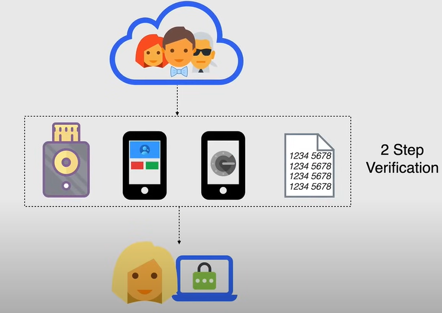
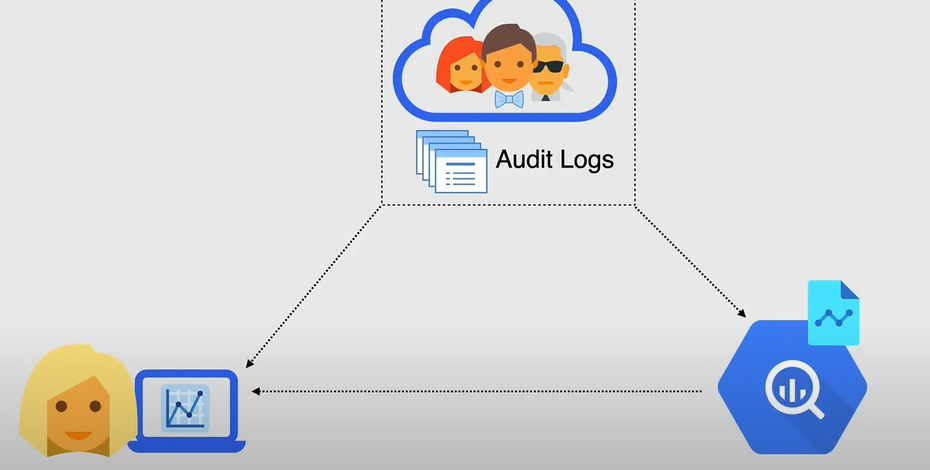
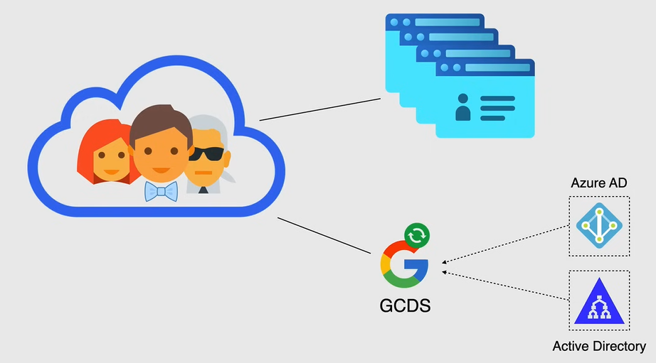

# Identità Cloud

**Cloud Identity** è una soluzione **Identity as a Service (IDaaS)** che consente di gestire utenti e gruppi e utilizzarli per accedere alle risorse di Google Cloud.

- Offre un maggiore controllo sugli account utilizzati nella tua organizzazione.

  - Ad esempio, se gli sviluppatori della tua organizzazione utilizzano account personali, come Gmail, per accedere alle risorse di Google Cloud, quegli account sono al di fuori del tuo controllo.

  - Quindi, quando adotti Cloud Identity, puoi gestire l'accesso e la conformità per tutti gli utenti nel tuo dominio.

- Con Cloud Identity, puoi creare un *account di identità cloud per ciascun utente e gruppo*.

  - Puoi quindi utilizzare IAM per gestire l'accesso alle risorse di Google Cloud per ciascun account di identità cloud di Google Cloud.

- Puoi anche configurare Cloud Identity per *federare identità tra Google e altri provider di identità*, come Active Directory e Azure Active Directory.

Cloud Identity offre anche altre funzionalità, come:

- *Gestione dei dispositivi*: puoi gestire i dispositivi utilizzati per accedere alle risorse di Google Cloud.
- *Sicurezza*: puoi applicare politiche di sicurezza, come la verifica in due passaggi, e imporre chiavi di sicurezza.
- *Single sign-on (SSO)*: puoi configurare SSO per consentire agli utenti di accedere a più applicazioni con un'unica autenticazione.
- *Reporting*: puoi visualizzare rapporti sull'attività degli utenti e sugli eventi di sicurezza.
- *Gestione della directory*: puoi gestire utenti e gruppi in una directory centrale.

## Gestione dei dispositivi

La gestione dei dispositivi consente agli utenti di qualsiasi organizzazione di accedere ai propri account di lavoro da dispositivi mobili, mantenendo al contempo la sicurezza dei dati dell'organizzazione. Questo fenomeno è noto come **Bring Your Own Device (BYOD)**.

Utilizzando la gestione dei dispositivi mobili, ci sono diversi modi per fornire le applicazioni aziendali necessarie ai dipendenti sui loro dispositivi personali, implementando al contempo politiche di sicurezza per proteggere i dati dell'organizzazione.

- Puoi creare una lista bianca delle applicazioni approvate.
- Puoi imporre profili di lavoro sui dispositivi Android e richiedere applicazioni gestite sui dispositivi iOS.
- Puoi inviare politiche su questi dispositivi per proteggere i dati e le identità aziendali, nonché mantenere l'inventario dei dispositivi con i dati aziendali presenti su di essi.

Quando i dispositivi non vengono più utilizzati per scopi aziendali o vengono rubati, è possibile cancellare i dati dell'organizzazione in remoto per proteggerli.

## Sicurezza

Il componente **Sicurezza** di Cloud Identity è dove vengono applicate la verifica in due passaggi, le chiavi di sicurezza e altre politiche di sicurezza.

La verifica in due passaggi è un processo di sicurezza in cui l'utente fornisce due fattori di autenticazione per verificare la propria identità.

È un metodo per confermare l'identità dichiarata di un utente utilizzando una combinazione di due componenti diversi, come una password e un token di sicurezza inviato al dispositivo mobile dell'utente.

## Single Sign-On (SSO)

Il Single Sign-On (SSO) consente agli utenti di accedere a molte applicazioni con un'unica autenticazione.

Puoi configurare SSO con Google, che è un Identity Provider, per accedere a numerose applicazioni di terze parti.

Quindi, un utente che accede a Google Cloud con il suo account aziendale avrà accesso a molte altre applicazioni cloud approvate dall'organizzazione.

## Reporting

Il Reporting è dove puoi visualizzare rapporti sull'attività degli utenti e sugli eventi di sicurezza.

- Copre i log di audit, per accessi, gruppi, dispositivi e anche l'utilizzo dei token.
- È anche possibile esportare questi log su BigQuery per ulteriori analisi.
- Successivamente, puoi creare rapporti e dashboard per monitorare l'attività degli utenti e gli eventi di sicurezza.

## Gestione della directory

La gestione della directory fornisce informazioni sul profilo degli utenti nella tua organizzazione, indirizzi email e di gruppo e condivide contatti esterni nella directory utilizzando Google Cloud Directory Sync o `gcds`, puoi sincronizzare i dati nel tuo account Google con il tuo server Microsoft Active Directory o LDAP.

GCDS non migra alcun contenuto, come la posta elettronica, il calendario o i contatti. Sincronizza solo i dati nel tuo account Google con il tuo server Microsoft Active Directory o LDAP.

### Google Cloud Directory Sync (GCDS)

**Active Directory** è un servizio di directory sviluppato da Microsoft, autentica e autorizza tutti gli utenti e i computer in una rete di tipo Windows, firma e applica politiche di sicurezza per tutti i computer e installa o aggiorna il software se necessario.

Come descritto nel diagramma sopra, la foresta di Active Directory contiene l'*Active Directory* e l'*Active Directory Federation Services (AD FS)*. Quindi la *Foresta di Active Directory* è la struttura gerarchica per l'*Active Directory*.

- *Dominio di Active Directory* è responsabile della memorizzazione delle informazioni sui membri del dominio, come utenti e dispositivi
  - verifica le loro credenziali
  - definisce i loro diritti di accesso.

- *Active Directory Federation Services (AD FS)* è un servizio di Single Sign-On (SSO) in cui "federazione" significa collegare l'identità e gli attributi elettronici di una persona, memorizzati in diversi sistemi di gestione delle identità distinti.
  - Puoi pensare ad esso come a un sottoinsieme di SSO in quanto si riferisce solo alle tecnologie di autenticazione utilizzate per l'identità federata, inclusi alcuni termini comuni come SAML (Security Assertion Markup Language) e OAuth, openID, e così via.

Quindi, quando hai identità già presenti nel tuo ambiente on-premises, che risiedono in Active Directory, hai bisogno di un modo per collegare queste identità al cloud, ed è qui che useresti Google Cloud Directory Sync (GCDS) per provvedere automaticamente utenti e gruppi da Active Directory a Cloud Identity o G-Suite.

GCDS è un tool gratuito fornito da Google, che implementa il processo di sincronizzazione e può essere eseguito su Google Cloud o nel tuo ambiente on-premises.

