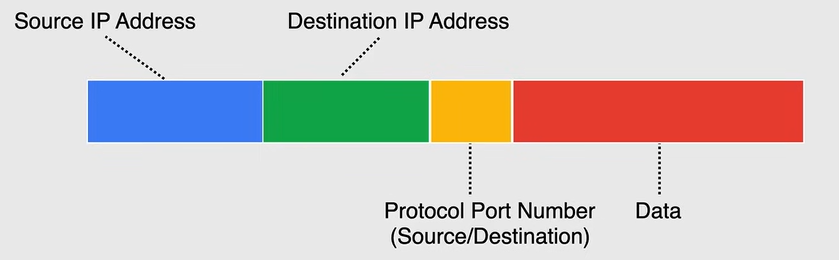

# Networking Refresher

## Internet Protocol - IP

To identify a device on a network, we use an IP address. An IP address is a 32-bit number that is divided into four 8-bit octets. Each octet is separated by a period.

So communication between devices on a network is done using IP addresses.

## Open Systems Interconnection Model - OSI Model

The OSI model is a conceptual framework that standardizes the functions of a telecommunication or computing system into seven abstraction layers. This model helps us understand how data flows from one device to another over a network.

The seven layers are:

1. **Physical Layer**: This layer deals with the physical connection between devices. It defines the hardware and the physical media used to transmit data.
2. **Data Link Layer**: This layer deals with the logical connection between devices. It defines how data is formatted for transmission and how devices are addressed on the network.
3. **Network Layer**: This layer deals with routing and forwarding of data. It defines how data is routed from one device to another.
4. **Transport Layer**: This layer deals with end-to-end communication. It defines how data is transmitted between devices.
5. **Session Layer**: This layer deals with establishing, managing, and terminating connections between devices.
6. **Presentation Layer**: This layer deals with data translation and encryption. It defines how data is presented to the application layer.
7. **Application Layer**: This layer deals with user interfaces and application services. It defines how applications interact with the network.

Now we will describe some of the important layers of the OSI model, i.e. the Network, Transport, and Application layers.

### Network Layer

There are two versions of Internet Protocol (IP) that operate at the Network Layer:

- **IPv4**: This is the most widely used version of IP.
- **IPv6**: This is the latest version of IP.

#### IPv4

It is the most widely used version of IP.

1. It uses a 32-bit address scheme allowing for a total of 2^32 addresses.
2. It can be represented in dotted decimal format (e.g. 192.168.255.255).
3. Each group of 8 bits is called an octet, it ranges from 0 to 255.
4. The IP address is divided into two parts: Network ID and Host ID.
   1. The Network ID identifies the network to which the device belongs.
   2. The Host ID identifies the device on the network.
5. It uses classes to define the size of the Network ID and Host ID:

    

##### Private IP Addresses

Some IP addresses are reserved for private use and they are defined by the standard **RFC1918**. These addresses are not routable on the Internet.

These are the three blocks of IP addresses reserved for private use:

- **Single Class A Network**: range from 10.0.0.0 to 10.255.255.255, i.e. 16,777,216 addresses.
- **16 Class B Networks**: range from 172.16.0.0 to 172.31.255.255, i.e. 1,048,576 addresses.
- **256 Class C Networks**: range from 192.168.0.0 to 192.168.255.255, i.e. 65,536 addresses.

##### Classless Inter-Domain Routing (CIDR)

**CIDR** (Classless Inter-Domain Routing) notation is used to represent IP addresses. It is a method for allocating IP addresses and IP routing. It is used to create unique identifiers for networks and individual devices.

For example, the IP address `192.168.0.0/16` where the first part is called the **Network Address** and the second part is called the **Prefix**, that represent the size of the network. **Smaller the prefix, larger the network, and vice versa.**

This process of dividing the IP address into Network ID and Host ID is called **Subnetting**.

Helpful References:

- **192**.168.0.0/8: 16+ million IP addresses.
- **192.168**.0.0/16: 65,536 IP addresses.
- **192.168.0**.0/24: 256 IP addresses.

#### IPv6

It is the latest version of IP.

1. It uses a 128-bit address scheme allowing for a total of 2^128 addresses.
2. It can be represented in hexadecimal format (e.g. 2001:0db8:85a3:0000:0000:8a2e:0370:7334).
3. It uses colons to separate groups of 16 bits.
4. It uses double colons to represent multiple groups of 16 bits of zeros (e.g. 2001:0db8::7334).
5. It is designed to replace IPv4.

The subnetting process in IPv6 is similar to IPv4. For example, the IP address `2001:de3::/64`.

### Transport Layer

The Transport Layer is responsible for end-to-end communication between devices. It defines how data is transmitted between devices.

Data transmitted are called **IP Packets**. These packets are divided into four parts:

1. **Source IP Address**: The IP address of the sender.
2. **Destination IP Address**: The IP address of the receiver.
3. **Protocol Port Number**: The port number of the application that is sending or receiving the data.
4. **Data**: The actual data being transmitted.

There are two protocols that operate at the Transport Layer:

- **Transmission Control Protocol (TCP)**: It is a connection-oriented protocol that provides reliable data delivery. It ensures that data is delivered in the correct order and without errors.
- **User Datagram Protocol (UDP)**: It is a connectionless protocol that provides unreliable data delivery. It does not guarantee that data is delivered in the correct order or without errors.

### Application Layer

The Application Layer is responsible for user interfaces and application services. It defines how applications interact with the network.

There are many protocols that operate at the Application Layer, some of the most common ones are:

- **Hypertext Transfer Protocol (HTTP)**: It is used for transmitting web pages over the Internet.
- **File Transfer Protocol (FTP)**: It is used for transferring files over the Internet.
- **Simple Mail Transfer Protocol (SMTP)**: It is used for sending emails over the Internet.
- **Post Office Protocol (POP)**: It is used for receiving emails over the Internet.
- **Internet Message Access Protocol (IMAP)**: It is used for accessing emails over the Internet.
- **Domain Name System (DNS)**: It is used for translating domain names into IP addresses.
- **Dynamic Host Configuration Protocol (DHCP)**: It is used for assigning IP addresses to devices on a network.
- **Secure Shell (SSH)**: It is used for secure remote access to devices on a network.
