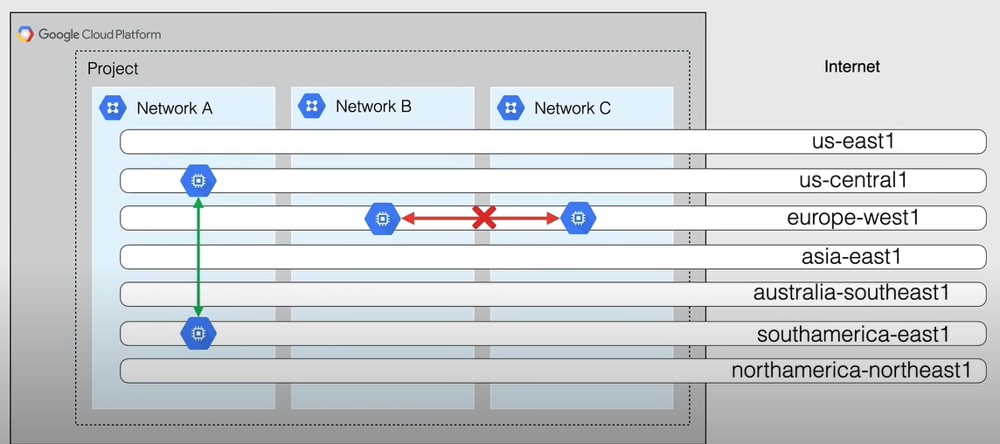
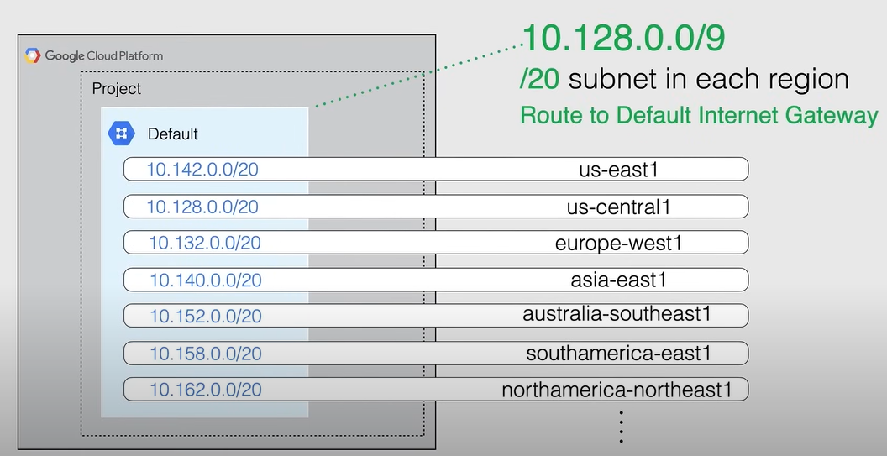
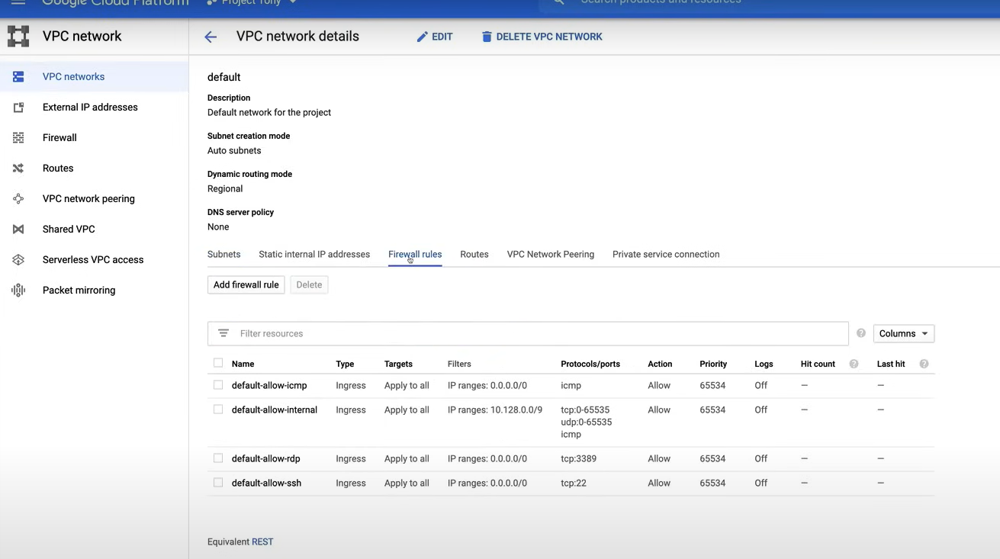
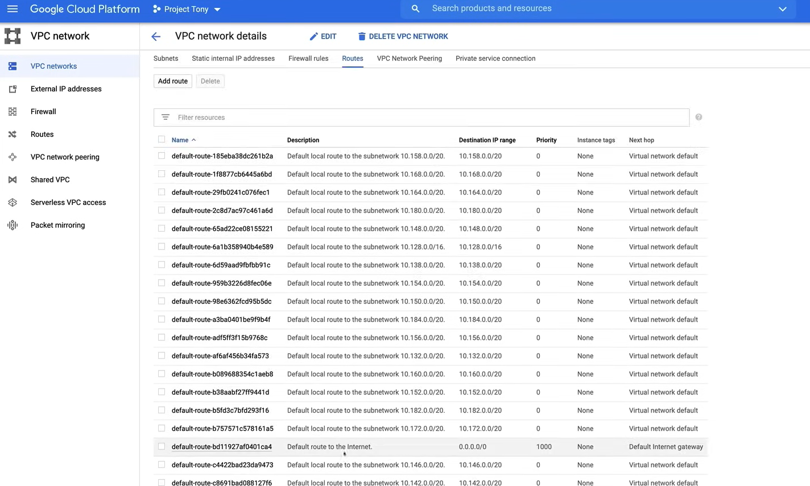
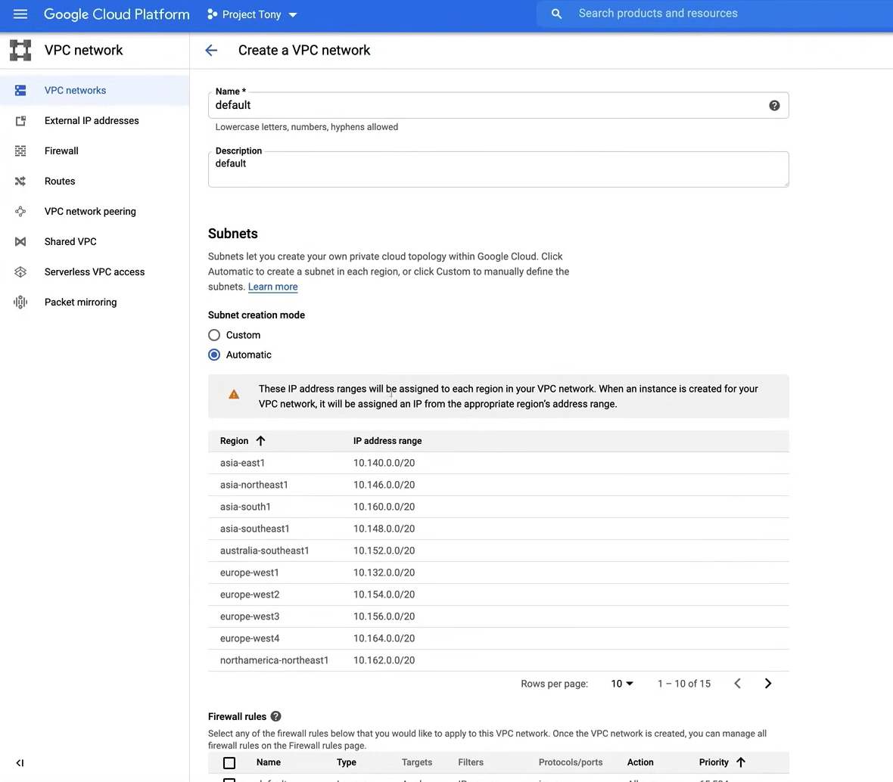
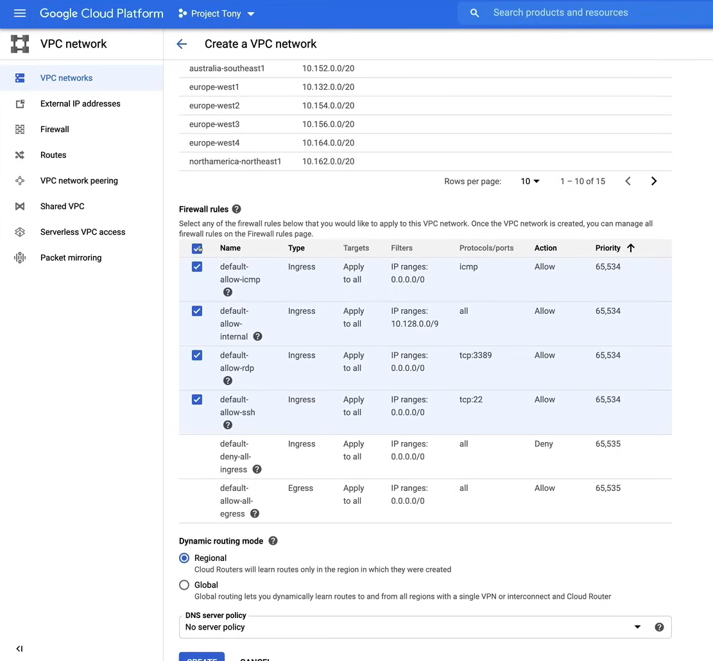

# Virtual Private Cloud

**NOTE:** This section is important, because most of the questions in the exam are based on this topic.

**Virtual Private Cloud (VPC)** is a service that allows you to create networks inside Google Cloud with both private and public connectivity options, both for in-cloud deployments and on-premises hybrid cloud deployments.

- **Virtualized Network** within Google Cloud.
  - It manages the networking functionality for your Google Cloud resources, it is a software-defined network and it is not confined to the physical limitations of networking in a data center, indeed it is abstracted for you.
- A VPC is a ***Global Resource***.
  - It is not confined to a single region, it is a global resource that can span multiple regions.
  - This includes its associated routes and firewall rules.
- Encapsulates **within a Project**.
  - Projects are the logical container where your VPC leaves.
- VPC's **do not have any IP address ranges** associated with them.
  - They are simply a construct of all the individual IP address and services within that network.
  - IP address and ranges are defined within the subnetworks.
- **Firewall rules** control traffic flowing in and out of the VPC.
  - Rules are implemented on the VM instances themselves, so traffic can be controlled and logged as it leaves or arrives at the VM.
- Resources within a VPC **can communicate with one another** by using internal (private) IPv4 addresses.
  - These are subject to applicable network firewall rules.
  - These resources **must be on the same VPC** for communication, otherwise they must traverse the public internet with an assigned public IP or using a VPC peering connection or establish a VPN connection.
- VPC supports **only IPv4** addresses.
  - IPv6 is not supported.
  - However, it is possible to create a IPv6 address range for a global load balancer.
- Each VPC contains a **deafult network**.
  - Each new project starts with a default network in a VPC.
  - The default network is an auto-mode VPC network with predefined subnets, allocated for each region with non-overlapping cider blocks (IP address ranges).
  - Each default network has a **default firewall rule** that allows all internal traffic between instances.
  
There are two types of VPC networks:

- **Auto Mode**
  - It has one subnet per region.
  - The default network is an auto-mode network.
  - These automatically created subnets, use a set of predefined IP address ranges, with a `/20` prefix, that can be expanded to a `/16` prefix.
  - They **can be converted to custom mode**, but this conversion is irreversible.

- **Custom Mode**
  - They are more flexible and better suited for production environments.
  - Google recommends using custom mode VPC networks in production environments.



The above image is an example of a project that contains three different networks, and all of them span multiple regions across the globe, and each network contains separate VMs.

So VMs in the same network (or VPC) can communicate privately even when placed on separate regions.

- Because VMs in the network A are in the same VPC, they can communicate with each other privately.
- Instead the VMs in network B and C are in separate VPCs, so they must communicate over the public internet, even though they are in the same region.

## Default VPC

Unless you create a policy that prevents the creation of a default VPC, when you create a new project, a default VPC is created automatically, which has one subnet per region.

Each subnet use a set of predefined IP address ranges, that is desceibed in the following image:



When a new Google Cloud region become available, a new subnet is automatically created in the default VPC, using an IP address range from that block.

You can also add more subnets manually to **auto-mode** VPCs in regions that you choose by using IP address ranges outside of `10.128.0.0/9`.

**If you are using a default VPC, or have already created an auto-mode VPC, you can switch to a custom mode VPC, but this conversion is irreversible.**

## Demo

A video demo is available [here](https://youtu.be/jpno8FSqpc8?si=1-uBHvINWgnVUUdx&t=23221).

Go to the **VPC Network** page in the Google Cloud Console, using the left-hand navigation menu.

1. We can easly convert the default VPC to a custom VPC by clicking on the dropdown menu (**Auto**), under the column **Mode**, and selecting **Custom**.


Clicking on the **default** network, we can see the subnets that are automatically created in each region.


 1. We can enable the **DNS API** for the default network, by clicking on the **Enable API** button.
 2. If we click on the **Edit** button, we can manage the configuration of the default network, such as the **Routing modes** (custom or auto) or the **Dynamic routing mode** (regional or global), and the **DNS server policy**.
 3. To expand a subnet we can click on it, and in the new page click the **Edit** button, and then we can change the **IP address range** for example to `/16`. Finally we can click the **Save** button.

     
 
 **NOTE:** We can't change the IP address of all the subnets at once, we have to do it one by one.

Then, always in the default network page, we can click on the **Firewall rules** tab, to see the default firewall rules that are automatically created, such as:

- the rules for incoming SSH, RDP, and ICMP traffic.
- the default rule that allows incoming connections for all protocols and ports, among instances in the same network.



Then, we can move to the **Routes** tab, where one of the most important routes is the **Default route to the internet**, that is automatically created when the default network is created, and without it, any of the subnets in the VPC woudn't be able to communicate with the internet.



To delete the default network, we can click on the **Delete** button, and then we have to confirm the deletion by typing the name of the network.

After the deletion, we can create a new VPC network, by clicking on the **Create VPC network** button.




**NOTE:** On the **Firewall rules** tab, if we don't select any rule, the network ***will be created without any firewall rule***.

## Command Line

We want to increase the size of the subnet in the default network, using the command line.

We can use the `gcloud` command line tool to do this.

```bash
gcloud compute networks subnets expand-ip-range [SUBNET_NAME] --region [REGION] --prefix-length [PREFIX_LENGTH]

# Example
gcloud compute networks subnets expand-ip-range default --region us-west1 --prefix-length 16
```

To check the changes, we can use the following command:

```bash
gcloud compute networks subnets describe [SUBNET_NAME] --region [REGION]

# Example
gcloud compute networks subnets describe default --region us-west1

# We can se the new IP address range on the field "ipCidrRange"
```