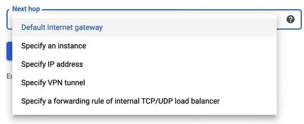
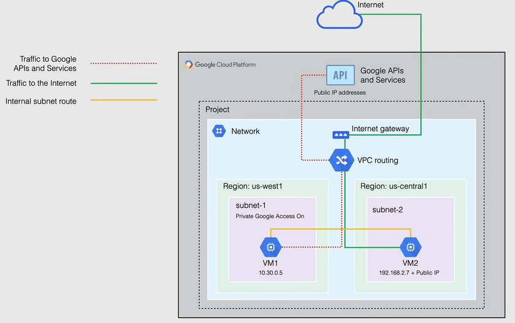

# Routing and Private Google Access

## Routing

- Google Cloud Routes **define the paths that network traffic takes** from a VM instance to other destinations.

  - These destination can be inside the VPC network (for example another VM) or outside of it.

- In a VPC routes consists of a **single destination (CIDR) and a single next hop**.

  - When an instance in a VPC network sends a packet Google Cloud delivers the packet to the route's next hop if the packet's destination IP address is within the route's destination range.

- All routes are **stored in the routing table** for the VPC network.

- Each packet leaving a VM is delivered to the next hop of an applicable route **based on a routing order**.

### Routing Types

There are different routing types available in Google Cloud:

- **System-generated routes**
  - They are automatically created by Google Cloud, for both automatic and custom VPC networks.
  - They offers the *Default* and the *Subnet route*.
    - **Default route**
      - defines the path out of the VPC network, including th epath to the internet.
      - provides a standard path for private Google access.
      - can be deleted only by replacing with **Custom route**.
      - it has the **lowest priority**, because its destination is broadest possible.
    - **Subnet route**
      - system generated routes that **define paths to each subnet** in the VPC network.
      - each subnet has **at least one subnet route** whose **destination matches the primary IP range** of the subnet.
      - when a subnet is created, a corresponding subnet route is created for both primary and secondary IP range.
      - cannot delete a subnet route unless you modify or delete the subnet.

- **Custom routes**
  - They are user-defined routes that support *static* and *dynamic* routing.
    - **Static routes**
      - Can use the next hop feature.
      - Can be created manually
      - Static routes for the remote traffic selectors are **created automatically when creating Cloud VPN tunnels.**

        
        

    - **Dynamic routes**
      - Are managed by one or more Cloud Routers
      - Dynamically exchange routes between a VPC and on-prmises network.
      - Destination IP ranges outside the VPC network
      - Used with dynamically routed VPNs and interconnects.

### Routing Order

Routing Order deals with priority of routes in a VPC network.

The subnet routes are always consider **first**, because Google CLoud requires that subnet routes have the most specific destinations , matching the Ip address ranges of their respective subnet.

If no applicable destination is found, Google Clouds drops the packet and replies with a network unreachable error.

System generated routes apply to all the instances in the VPC network, the scope of instances to which subnet routes apply, cannot be altered, although you can replace the default route.

**NOTE:** Custom Static routes apply to all instances or specific instances in the VPC network.

### Special Return Path

Special return path is a feature that allows you to specify a different next hop for the return path of a packet.

These routes are defined outside of you VPC network, in Google's production network.

They don't appear in the VPC network's routing table, you cannot remove them or override them, or if you delete or replace a default route in your VPC network, although you can control traffic to and these services by using firewall rules.

The services that are covered are load balancers internet aware proxy or IAP as well as Cloud DNS.

## Private Google Access

The VMs instances that only have internal IP addresses can use Private Google Access to reach the external IP addresses of Google APIs and services. 

The source IP address of the packet can be the primary internal IP address of the network interface or an address in an alias IP range that is assigned to the interface.

If you disable private Google access the VM instances can no longer reach Google APIs and will only be able to send traffic within the VPC network.

Private Google Access has no effect on instances that have external IP addresses and still access the internet.

You enable Private Google Access on a subnet basis, and it is enabled by default for all subnets in a VPC network.

Referring to the following diagram:

- Firewall Rules in the VPC network, have been configured to allow internet access.

- `VM1` can access Google APIs and services including Cloud Storage, because its network interface is located in `Subnet1`, which has Private Google Access enabled, and because this instance only has an internal IP address, Private Google Access applies to this instance.

- `VM2` can also access Google APIs and services, including Cloud Storage, because its has an external IP address, so Private Google Access has no effect on this instance, as it has an external IP address and private Google Access has not been enable on that subnet.

- And because both of these instances are in the same network, they are still able to communicate to each other, over an internal subnet route.

