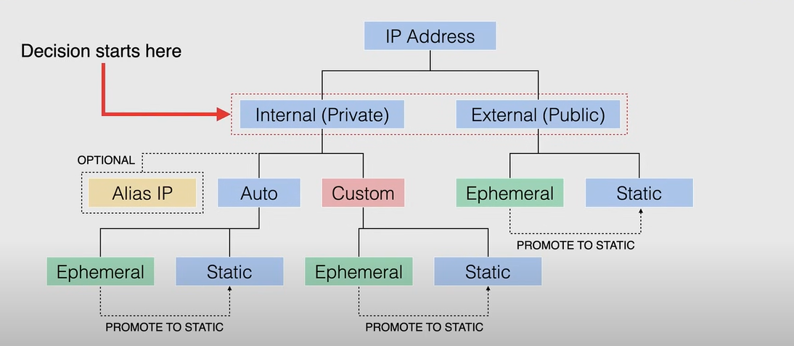
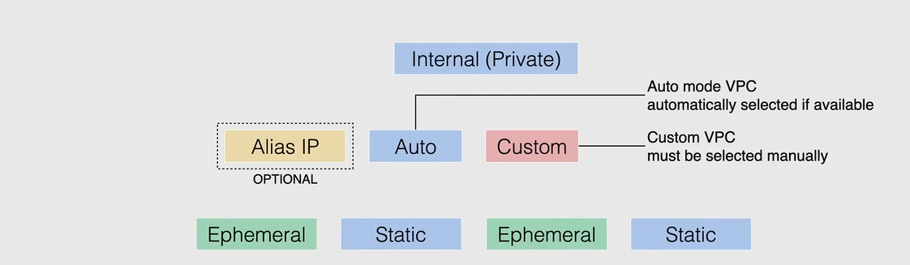
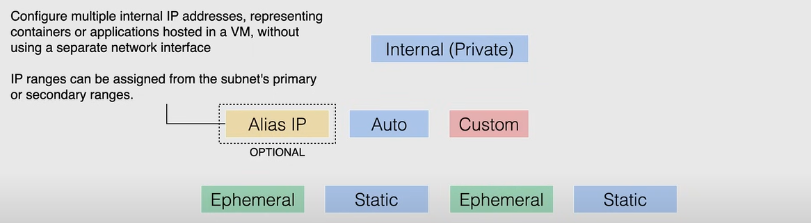
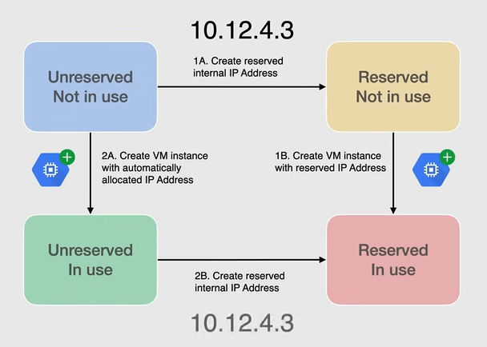
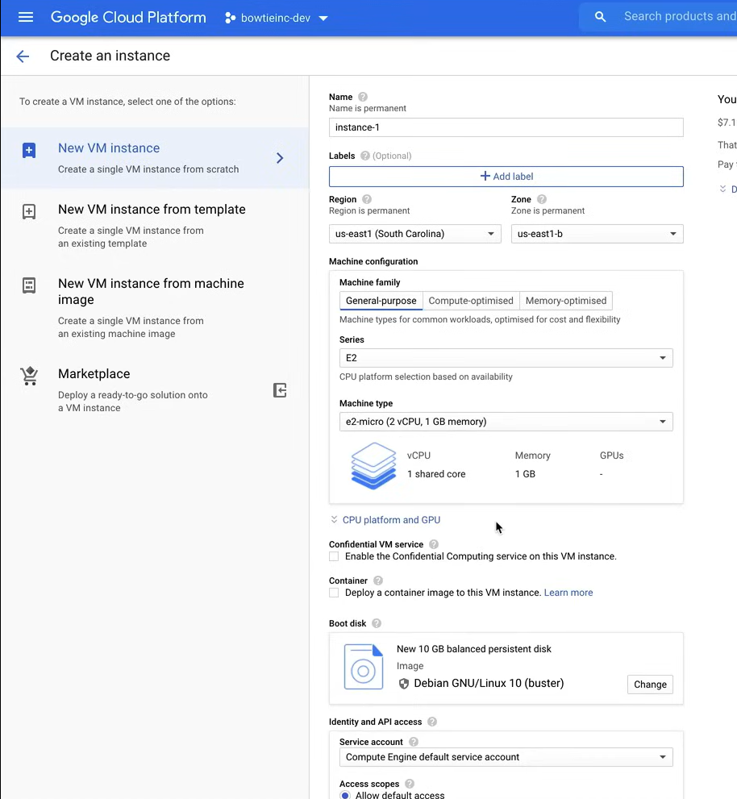
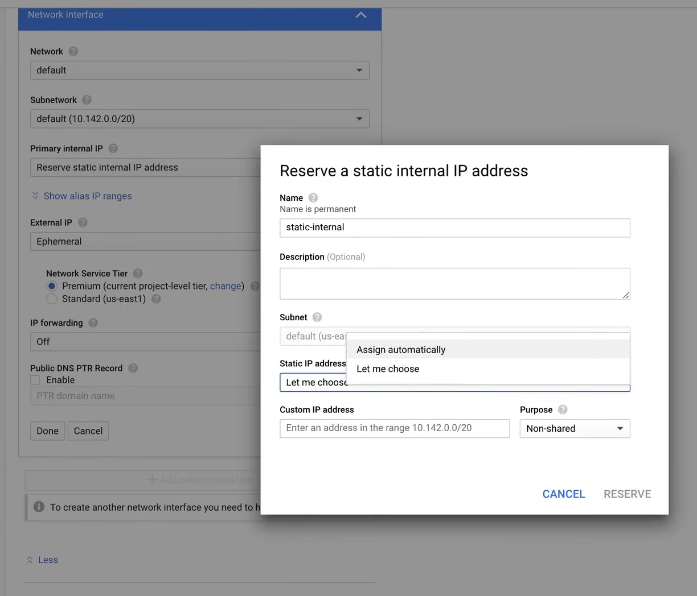
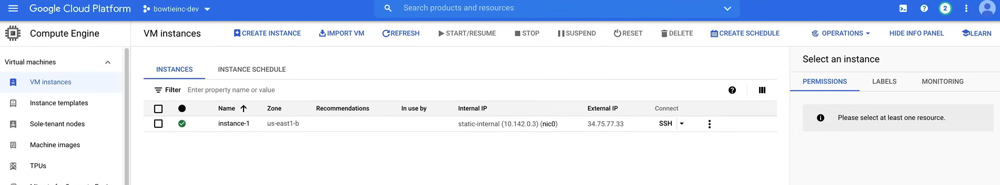
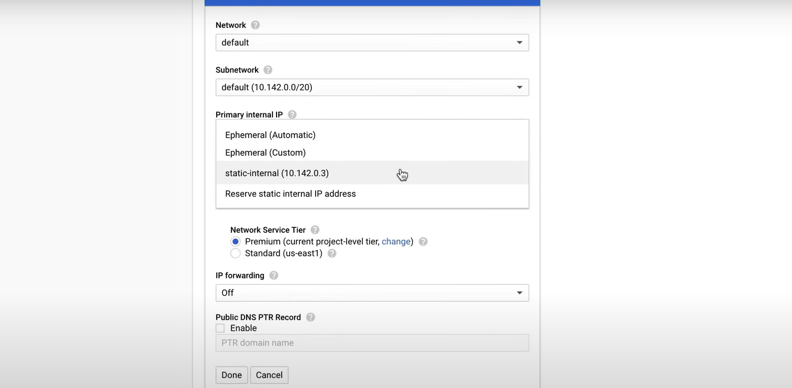
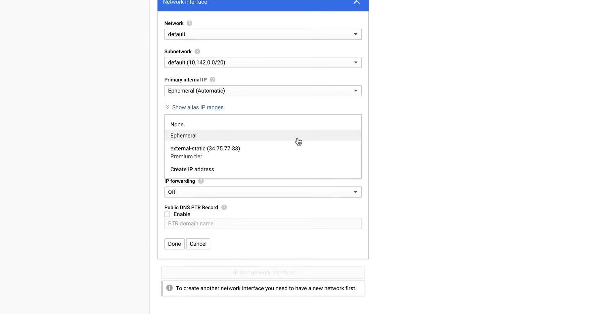

# IP Addressing

IP addressing in Google Cloud holds quite a few categories, and really starts by determining whether you are planning for communication within the VPC network or with the internet.

Once you have determined the type of communication you are planning, you can then decide whether you need:

- Internal IP addresses
- External IP addresses



## Internal IP Addresses

Internal IP addresses are not publicly advertised, they are used only within the VPC network.

Every VPC network or on-premises network, has at least one internal IP address range. Resources within the internal IP addresses communicate with other resources as if they are all on the same private network.

Every VM instance cam have one primary internal IP address, that is unique to the VPC network, and you can assign a specific internal IP address when you create a VM instance or you can reserve a static internal IP address for your project, and assign that address to your resources.

If you don't specify an address one will be assigned automatically to the VM, in either the address must belong to the IP range of the subnet.
if your network is an auto-mode VPC network, the address comes from the region's subnet.
If your network is a custom-mode VPC network, you must specify which subnet the IP address comes from.



All subnet have a primary sider range which is the range of internal IP addresses, that defines the subnets. Each Vm instance gets its primary IP address from this range.

You can also allocate alias IP ranges from that primary range or you can add a secondary range to the subnet, and allocate alias IP ranges from that secondary range.

Use of Alias IP ranges does not requires secondary subnet ranges, these secondary subnet ranges merely provide an organizational tool.

When using IP Aliasing, you can configure multiple internal IP addresses representing containers or applications hosted in a VM, without defining a separate network interface.

You can assign VM alias IP ranges from either the subnet's primary or secondary ranges. When alias IP ranges are configured Google Cloud automatically install VPC network routes for primary and alias IP ranges for the subnet of your primary network interface.

Your container orchestrator or GKE does not need to specify VPC network connectivity for these routes, and this simplifies routing traffic and managing your containers.



When choosing either an **auto-mode** VPC or a **custom** VPC, you will have the option to choose either an *ephemeral* or *static* internal IP address.


- An **ephemeral** internal IP address is an IP address that does not persist beyond the life of the resource. When you delete or stop the resource, the IP address is released back into the general pool of available internal IP addresses. Ephemeral IP addresses are assigned automatically by Google Cloud, when you create a resource, and you do not specify an IP address.


- A **static** internal IP address is an IP address that you reserve in a specific region, and assign to a resource. You can assign a static internal IP address to a resource when you create the resource, or you can reserve a static internal IP address for your project, and assign that address to your resources. To reserve a static internal IP address, you need the value of the IP address you want to promote.


## External IP Addresses

You can assing an external IP address to an instance or a forwarding rule, if you want to communicate with the instance from the internet.

Like internal IP addresses, external IP addresses can be **ephemeral** or **static**.

- An **ephemeral** external IP address is an IP address that does not persist beyond the life of the resource, so it follows the same rules as the internal ephemeral IP address. If you want to permanently assign an external IP address to a resource, you must reserve a static external IP address.

- A **static** external IP address is an IP address that you assign to your project until you explicitly release it. It is avaliable as a regional or global resource. *It is useful when you depend on a specific IP address for a specific service, like a webserver or a global load balancer that need access to the internet.*


## Internal IP Address Reservation

Static internal IP provide the ability to reserve internal IP addresses from the IP range configured in the subnet, then assign those reserved internal IP addresses to resources as needed.

Reserving an internal IP address **takes that address out of the dynamic allocation pool**, and prevents Google Cloud from assigning that address to another resource (automatic allocation).

The ability to reserve static internal IP addresses you can always use the same IP address for the same resource, even if you have to delete and recreate the resource.

So when it comes to internal IP addresses reservation, you can:

1. reserve a static internal IP address before you create a resource, or
2. you can promote a ephemeral internal IP address to a static IP address after you create a resource.

In the following image we have two examples: 

1. In the first one (up-left to the up-right corner)
   1. we create a subnet from our VPC network, 
   2. then we would reserve an internal IP address from that subnet's primary IP range (marked as `10.12.4.3`), and will be held as reserved for later use with a resources and then,
   3. when we decide to create a VM instance or an internal load balancer we can use the reserved IP address that was previously reserved, so this IP address becomes markes as reserved and in use.

2. In the second example (up-left to the down-left corner)
   1. we create a subnet from our VPC network,
   2. then we create a VM instance or an internal load balancer, with either an automatically allocated ephemeral IP address or a specific IP address that we choose from within that specific subnet, and so 
   3. when it is in use, we can promote that ephemeral IP address to a static IP address, so it becomes reserved and in use. 



## External IP Address Reservation

With External Ip address reservation, you are able to obtain a static external IP address, by following one of the following methods:

- Reserve a new static external IP address and then assing it to a resource.
- Specify an ephemeral external IP address for a resource and then promote the address.

In the case of external IP address reservation, you can reserve two different types of IP addresses:

- **Regional** external IP addresses, used by VM instances with one or more network interfaces, or by network load balancers. These IP addresses can be either created in the console or through the command line with the limitation that you will only allowed to create IPv$ IP addresses.

    ```
    gcloud compute addresses create [ADDRESS_NAME] --region=[REGION]
    ```

- **Global** external IP addresses, used by global load balancers, and can be created in the console or through the command line, with the limitation that you must choose the premium network service tier, in order to create a global IP addrtess, and after reserving the IP address, you can assign it to an instance, during instance creation or to an existing instance.

    ```
    gcloud compute addresses create [ADDRESS_NAME] --global --ip-version=[IPV4|IPV6]
    ```

## Demo - Creating Internal and External IP Addresses

A video demo is available [here](https://youtu.be/jpno8FSqpc8?si=C1WC8rjL8s3In6WL&t=25920).

For the demo we use a project with a default VPC network.

To check if the project has a default VPC network:

1. Go to the **VPC network** page in the Google Cloud Console.
2. Move to the **VPC networks** tab.
3. If there is a network named `default` then the project has a default VPC network.

### Internal IP Address

#### Creating a Static Internal IP Address

We will use a VM instance to create a static internal IP address.

1. Go to the **Compute Engine** page in the Google Cloud Console.
2. Click on **Create Instance**, to create a new VM instance.

   

   1. Click on the voice **Management, security, disks, networking, sole tenancy**.
   2. Select the **Networking** tab.
   
      

   3. Under **Network interfaces** select the **default** network interface.
   4. In this section we can create our Static Internal IP address.
   5. Click on the dropdown menu **Primary internal IP** and select **Reserve a static internal IP address**.
   6. It will open the following new window, where you can reserve a new static internal IP address.

      
   
   7. Finally, click on **Create**.



To view the list of internal IP addresses that are available, you can use the following command:

```bash
gcloud compute addresses list

# Output
# NAME          ADDRESS/RANGE  TYPE      PURPOSE       NETWORK  REGION    SUBNET   STATUS
# static-ip-1   10.142.0.3     INTERNAL  GCE_ENDPOINT           us-east1  default  IN_USE
```

**Remark**: The Static Internal IP address persists even if the VM instance is deleted.

To demosntrate it, we will delete the VM instance, clicking on the **Delete** button on the top of the page. Now we can run the same command to check the list of internal IP addresses, and we will see that the IP address is still reserved.

Now we can create a new VM instance, and assign `static-ip-1` to it, by click on **Create Instance** and then on the **Networking** tab (of the voice **Management, security, disks, networking, sole tenancy**), and under **Network interfaces** select the **default** network interface, and in the **Primary internal IP** dropdown menu select the **static-ip-1**.



#### Promote an Ephemeral Internal IP Address to a Static Internal IP Address

From the previous image, instead of selecting `static-ip-1`, we can select the **Ephemeral (Automatic)** option, and then create the VM instance.

Now we can click on the VM instance, and then on the **Edit** button, and under the **Network interfaces** section, we can find the **Internal IP type** dropdown menu, where we can select the **Static** option, and then, on the new popup window, we can select the Static Internal IP address:


We can check the changes with the same command as before:

```bash
gcloud compute addresses list

# Output:
# NAME               ADDRESS/RANGE  TYPE      PURPOSE       NETWORK  REGION    SUBNET   STATUS
# promoted-static    10.142.0.4     INTERNAL  GCE_ENDPOINT           us-east1  default  IN_USE
# static-ip-1        10.142.0.3     INTERNAL  GCE_ENDPOINT           us-east1  default  RESERVED
```

### External IP Address

#### Creating a Static External IP Address

Go to the **VPC network** page in the Google Cloud Console, and then to the **External IP addresses** tab, you can click on the **Reserve Static Address** button, and then you can create a new static external IP address.


**NOTE:**

- IPv6 addresses can be used only with global load balancers (and only for the Premium network tier).
- *Static IP addresses not attached to an instance or load balancer are billed at an hourly rate.*, so if you are not using any Static IP address, you can release them to avoid being billed.

Now we can fill the form to create a new static external IP address, and then click on **Reserve**.


We can see the new static external IP address, in the following page:


Now we need to attach the static external IP address to a resource, for example to a VM instance.

1. Go to the **Compute Engine** page in the Google Cloud Console.
2. Click on the **VM instances** page, and create a new VM instance.

   

   1. Click on the voice **Management, security, disks, networking, sole tenancy**.
   2. Select the **Networking** tab.
   3. Under **Network interfaces** select the **default** network interface.
   4. In the **External IP** dropdown menu, select the `external-static` IP address.

      

   5. Finally, click on **Create**.

We can verify that the external IP address is attached to the VM instance, by using the following command:

```bash
gcloud compute addresses list

# Output:

# NAME               ADDRESS/RANGE  TYPE      PURPOSE       NETWORK  REGION    SUBNET   STATUS
# external-static    34.75.77.33    EXTERNAL                         us-east1           IN_USE
# promoted-static    10.142.0.4     INTERNAL  GCE_ENDPOINT           us-east1  default  RESERVED
# static-ip-1        10.142.0.3     INTERNAL  GCE_ENDPOINT           us-east1  default  RESERVED
```

#### Promote an Ephemeral External IP Address to a Static External IP Address

To do this create a new VM instance.

1. Go to the **Compute Engine** page in the Google Cloud Console.
2. Click on the **VM instances** page, and create a new VM instance.

   

   1. Click on the voice **Management, security, disks, networking, sole tenancy**.
   2. Select the **Networking** tab.
   3. Under **Network interfaces** select the **default** network interface.
   4. In the **External IP** dropdown menu, select the **Ephemeral (Automatic)** option.
   5. Finally, click on **Create**.

So, we have created a new VM instance with an ephemeral external IP address (`instance-2`).


To promote the ephemeral external IP address to a static external IP address, we can use the following command:

```bash
gcloud compute addresses create [ADDRESS_NAME] --addresses [ADDRESS] --region [REGION]

# Example: Copy the IP address from the Console
gcloud compute addresses create promoted-external --addresses 104.196.219.42 --region us-east1
```

We can verify that the external IP address is attached to the VM instance, by using the following command:

```bash
gcloud compute addresses list

# Output:
# NAME               ADDRESS/RANGE     TYPE      PURPOSE       NETWORK  REGION    SUBNET   STATUS
# external-static    34.75.77.33       EXTERNAL                         us-east1           IN_USE
# promoted-external  104.196.219.42    EXTERNAL                         us-east1           IN_USE
# promoted-static    10.142.0.4        INTERNAL  GCE_ENDPOINT           us-east1  default  RESERVED
# static-ip-1        10.142.0.3        INTERNAL  GCE_ENDPOINT           us-east1  default  RESERVED
```

Now we need to clean up any leftover resources, to avoid being billed.

1. Delete the VMs instances, `instance-1` and `instance-2`, using the console in the **VM instances** page (**Compute Engine** section). This frees up the external IP addresses, so they can be released.
2. Go to the **VPC network** page in the Google Cloud Console, and then to the **External IP addresses** tab, and release the external IP addresses, `external-static` and `promoted-external` clicking on the **Release Static Address** button.
3. Now we can delete the static internal IP addresses using the command line:

   ```bash
   gcloud compute addresses delete [ADDRESS_NAME] --region [REGION]

   # Example
   gcloud compute addresses delete promoted-static --region us-east1
   gcloud compute addresses delete static-ip-1 --region us-east1
   ```