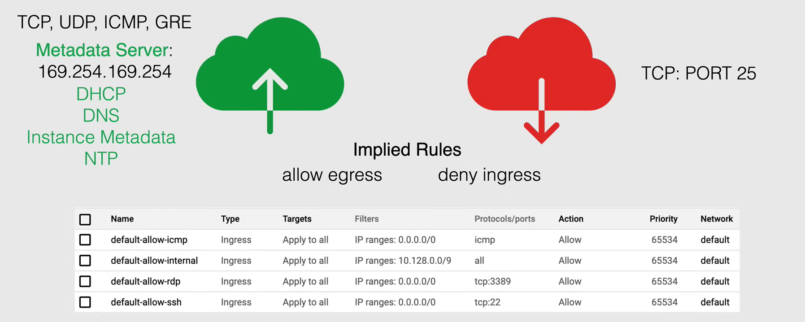

# Firewall and Firewall Rules

## VPC Firewall Rules

**VPC Firewall Rules** is a service used to filter incoming and outgoing traffic, based on a set of user-defined rules. It is used to protect the VPC network from unauthorized access.

- VPC Firewall Rules apply to a given project and network, and it is also possible to apply them across an organization.

- VPC Firewall Rules let you allow or deny connections to or from your VM instances based on a configuration that you specify.
  - These rules are applied to either incoming or outgoing connections, but ***never both at the same time***.
  - Enabled VPC Firewall Rules are always enforced, regardless of their configuration and Operating System, even if they have not started up.

- Every VPC network functions as a distributed firewall
  - When firewall rules are defined at the network level, connections are allowed or denied on a per-instance basis.
  - So, you can think of the VPC Firewall Rules as existing not only between your instances and other networks but also between individual instances within the same network.

- When you create a new VPC Firewall Rule, you specify a VPC network and a set of components that define the rule.
  - The components enable you to target certain type of traffic, based on the traffic's:
    - protocol ports,
    - sources, and
    - destinations.
  - You can specify the instances that the rule applies to, by using the *target* component of the rule.

### Implied and pre-populated rules

In addition to the rules that you define, VPC networks have a set of implied and pre-populated rules that are automatically applied to all incoming and outgoing traffic.

- For instance, Google Cloud doesn't allow certain IP protocols, such as incoming traffic on TCP port 25, (which is used for SMTP), within a VPC network.

- And protocols such as TCP, UDP, ICMP, and GRE to external IP addresses of Google Cloud resources are blocked by default.

Google Cloud always allows communication between a VM instance and the **metadata server**, at `169.254.169.254`, and this server is essential to the operations of VM instances, **so the instance can access it even if you have a firewall rule that denies all incoming traffic.**

- The metadata server provides to the instance some basic services, like:
  - DHCP,
  - DNS resolution,
  - instance metadata, and
  - NTP (Network Time Protocol) services.

**NOTE:** Every network has two implied firewall rules that permit outgoing connections and block incoming connections. Firewall rules that you create can override these implied rules.

- **Implied Rules**
    1. ***Allow egress rule***, lets any instance in the network send traffic to any destination, except for the traffic that is blocked by Google Cloud.
       - **Action:** allow
       - **Destination:** all IPs
       - **Priority:** Lowest possible
    2. ***Deny ingress rule***, blocks all incoming traffic to instances in the network.
      - **Action:** deny
      - **Source:** all IPs
      - **Priority:** Lowest possible

The rules of the above table allow igress connections from any source to any instance of the network, when it comes to ICMP, RDP (on port 3389), and SSH (on port 22) protocols. The last rule allows ingress connections for all protocols and ports among instances in the network, and it permits incoming connections to VM instances from others in the same network. Finally, all of these have a rule priority of 65534, which is the second lowest possible.

**NOTE:** This rules can be deleted or modified as needed.

### Firewall Rule Characteristics

Each firewall rule has the following characteristics:

- Each Firewall rule applies to incoming or an outgoing connections, and ***not both at the same time***.

- Firewall rules ***only support IPv4*** addresses.

- Each Firewall rule action is either ***allow or deny***, you cannot have both at the same time.

- The rule applies to connections as long it is enforced.
  - For example you can disable a rule for troubleshooting purposes, and then re-enable it when you are done.

- When you create a new firewall rule, you must select a VPC network, while the rule is enforced at the instance level, its configuration is associated with the VPC network. 
  - This means ***you cannot share firewall rules among VPC networks***, including networks connected by VPC Network Peering, or by using Cloud VPN tunnels.

- They are ***stateful***, which means when a connection is allowed through the firewall in either direction (incoming or outgoing), return traffic matching that connection is automatically allowed.
  - You cannot configure firewall rules to deny associated response traffic.
  - Return traffic must match the five tuple of the accepted request traffic, but with the source and destination IP addresses swapped.
    - A tuple is a set of five values that uniquely identifies a connection:
      - Source IP address,
      - Source port,
      - Destination IP address,
      - Destination port, and
      - Protocol.

- Google CLoud associates incoming packets with corresponding outbound packets, by using a connection tracking table. Google Cloud implements connection tracking regardless of whether the protocol supports connections.
  - If a connection is allowed between a source and a target, or vice versa, all response traffic is allowed, as long the firewalls connections tracking state is active. 
  - A Firewall Rule tracking state is active if at least one packet is sent every 10 minutes.

### Firewall Rule Components

The components of a firewall rule are:

- **The VPC network** that you want the firewall rule to apply to.
- **Numerical priority** of the rule, which determines the order in which it is evaluated in relation to other rules.
  - Higher priority numbers, lower priority, and vice versa.
- **Direction of traffic** that the rule applies to, either ingress or egress.
- **Action on match**, which is either allow or deny.
- **Target**, which specifies the instances that the rule applies to. We can use three options:
  - *All instances in the network*.
  - *Instances with a specific tag*.
  - *Instances with a specific service account*.
- **Source filter**, which specifies the source of the traffic that the rule applies to.
  - *IP ranges*.
  - *Tags*.
  - *Service accounts*.
- **Protocol and ports**, which specify the type of traffic that the rule applies to.
  - *Protocol*, which can be TCP, UDP, or ICMP (we can select also a combination of them).
  - *Ports*, which can be a single port, a range of ports, or all ports.
- **Enforcement**, which specifies whether the rule is enforced or not.
  - *Enbled*.
  - *Disabled*.

