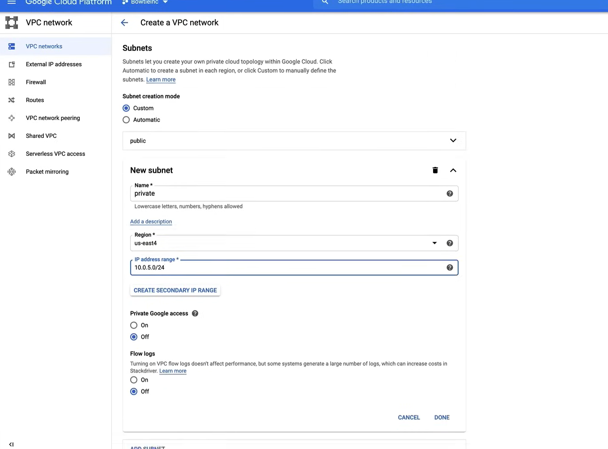
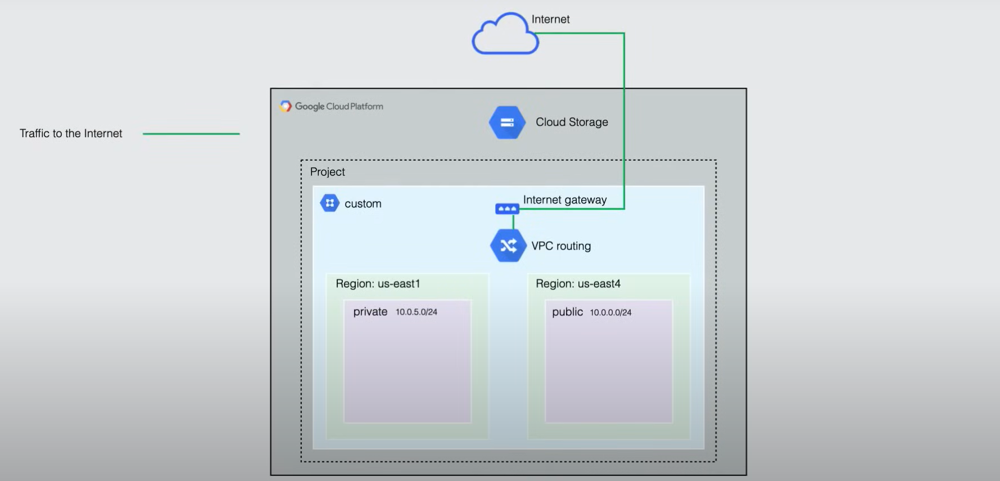
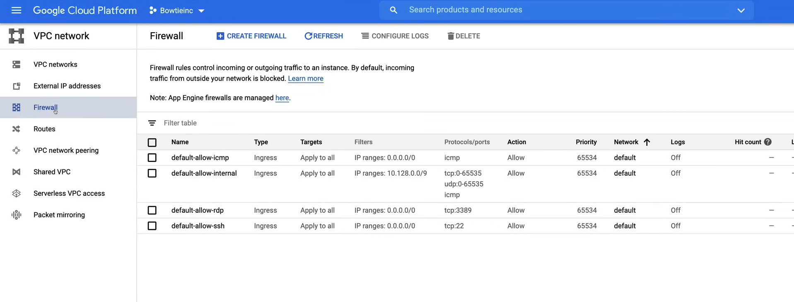
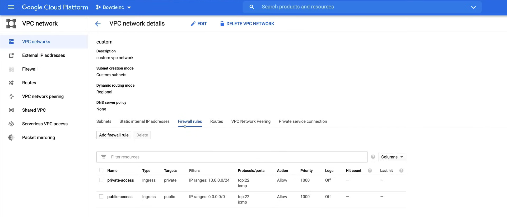

# Custom VPC

A demo on how to create a custom VPC network and subnets in Google Cloud is available [here](https://youtu.be/jpno8FSqpc8?si=0xmIyuWvFpUL8zHP&t=28034).

In this section, we will build the following network topology:


So we will create:

- a custom VPC network,
- two subnets, one private and one public in two separate regions
- a Cloud Storage Bucket,
- some VM instances to demonstrate access to the Cloud Storage Bucket, as well as the communication between the VM instances,
- some firewall rules to route the traffic between the VM instances.
- we will also implement Private Google Access and demonstrate accessibility to the files in CLoud Storage from the private instance without an external IP address.

## Demo

First create a new project called `Bowtieinc` from the Console, and select it.

### Create the Custom VPC Network

Now we can create the custom VPC network.

1. Go to the **VPC network** page in the Console.
2. Enable the **Compute Engine API** if it is not already enabled (this is because VPC networks are tied in Compute Engine API).
3. So we have the `default` VPC network, but we will create a new one, by clicking on **Create VPC network**.

4. We need to set a `Custom` subnet, in particular we need:
   1. Public subnet
        
   2. Private subnet.
        

5. Enable the **Cloud DNS** API if it is not already enabled.


This process can be done via the command line as well:

```bash
# Create the custom VPC network
gcloud compute networks create custom --project=PROJECT_NAME --description=custom\ vpc\ network --subnet-mode=custom --bgp-routing-mode=regional

# Create the public subnet
gcloud compute networks subnets create public --project=PROJECT_NAME --range=10.0.0.0/24 --network=custom --region=us-east1

# Create the private subnet
gcloud compute networks subnets create private --project=PROJECT_NAME --range=10.0.5.0/24 --network=custom --region=us-east4
```

So the result is:


### Create the Cloud Storage Bucket

1. Go to the **Storage** page in the Console.
2. Click on **Create Bucket**, and fill in the details.
   1. *The name of the bucket must be unique across all of Google Cloud.*
3. Upload some files to the bucket, clicking first on the bucket name, and then on **Upload files**.

To create the bucket via the command line:

```bash
gsutil mb gs://BUCKET_NAME
```

So now, we are at the following situation:



### Create the VM Instances

1. Go to the **Compute Engine** page in the Console.
2. Click on **Create Instance**, and fill in the details.
   1. First create the `public-instance` instance, with
      - label `env:public`
      - region `us-east1`
      - machine type `e2-micro`
      - service account `Compute Engine default service account`
      - access scopes `Set access for each API`
        - enable `Cloud Storage` `Read/Write`
        - enable `Compute Engine` `Read/Write`
      - select the **Networking** tab on the section **Management, security, disks, networking, sole tenancy**
        - select the `public` under **Network tags**
        - select the `custom` under **Network interfaces**, and `Ephemeral` under **External IP**

3. Click on **Create Instance**, and fill in the details.
    1. Then create the `private-instance` instance, with
        - label `env:private`
        - region `us-east4`
        - machine type `e2-micro`
        - service account `Compute Engine default service account`
        - access scopes `Set access for each API`
          - enable `Cloud Storage` `Read/Write`
        - select the **Networking** tab on the section **Management, security, disks, networking, sole tenancy**
          - select the `private` under **Network tags**
          - select the `custom` under **Network interfaces**, and `None` under **External IP**

Using the command line:

```bash
gcloud beta compute 
    --project=PROJECT_NAME 
    instances create private-vm 
        --zone=us-east4-c
        --machine-type=e2-micro
        --subnet=private
        --no-address
        --maintenance-policy=MIGRATE
        --service-account=ACCOUNT_NUMBER-compute@developer.gserviceaccount.com
        --scopes=https://www.googleapis.com/auth/devstorage.read_only,https://www.googleapis.com/auth/logging.write,https://www.googleapis.com/auth/monitoring.write,https://www.googleapis.com/auth/servicecontrol,https://www.googleapis.com/auth/service.management.readonly,https://www.googleapis.com/auth/trace.append
        --tags=private
        --image=debian-10-buster-v20200910
        --image-project=debian-cloud
        --boot-disk-size=10GB
        --boot-disk-type=pd-standard
        --boot-disk-device-name=instance-1
        --no-shielded-secure-boot
        --no-shielded-vtpm
        --no-shielded-integrity-monitoring
        --reservation-affinity=any
```

So now, we are at the following situation:


### Create the Firewall Rules

1. Go to the **VPC network** page in the Console.
2. Go to the **Firewall** section.

    

3. Click on **Create Firewall Rule**, to create the public firewall rule.
   1. Fill in the details for the `public-access` rule.
        - `Name`: `public-access`
        - `Description`: Allow public access to the public instance
        - Set `Logs` to On
        - `Network`: custom
        - `Priority`: 1000
        - `Direction of traffic`: Ingress
        - `Action on match`: Allow
        - `Targets`: Specified target tags
          - `Target tags`: public
        - `Source filter`: IP ranges
        - `Source IP ranges`: 0.0.0.0/0
        - `Protocols and ports`: Specified protocols and ports
          - `tcp`: 22
          - `Other protocols`: icmp
        - `Enforcement`: Enabled
   2. Click on **Create**.

4. Click on **Create Firewall Rule**, to create the private firewall rule.
   1. Fill in the details for the `private-access` rule.
        - `Name`: `private-access`
        - `Description`: Allow private access to the private instance
        - Set `Logs` to Off
        - `Network`: custom
        - `Priority`: 1000
        - `Direction of traffic`: Ingress
        - `Action on match`: Allow
        - `Targets`: Specified target tags
          - `Target tags`: private
        - `Source filter`: IP ranges
        - `Source IP ranges`: 10.0.0.0/24
        - `Protocols and ports`: Specified protocols and ports
          - `tcp`: 22
          - `Other protocols`: icmp
   2. Click on **Create**.


Also in the VPC network page, we can see the firewall rules:



We can also create the firewall rules via the command line:

```bash
# Create the public-access firewall rule
gcloud compute 
    --project=PROJECT_NAME 
    firewall-rules create public-access 
        --direction=INGRESS 
        --priority=1000 
        --network=custom 
        --action=ALLOW 
        --rules=tcp:22,icmp 
        --source-ranges=0.0.0.0/0 
        --target-tags=public

# Create the private-access firewall rule
gcloud compute 
    --project=PROJECT_NAME
    firewall-rules create private-access
        --direction=INGRESS 
        --priority=1000 
        --network=custom 
        --action=ALLOW 
        --rules=tcp:22,icmp 
        --source-tags=public 
        --target-tags=private
```

### Test the Communication

Now login to the `public-instance` to test the communication between the instances.

1. Go to the **Compute Engine** page in the Console.
2. Click on the `SSH` button for the `public-instance`, and it will open a terminal.
   1. In is possible to use the `gcloud` command to SSH into the instance as well.

    ```bash
    gcloud compute ssh --project PROJECT_NAME --zone us-east1-b public-instance
    ```

3. Run the following commands to see if we have access to the files in the Cloud Storage Bucket, i.e. list the files in the bucket.

```bash
gsutil ls gs://BUCKET_NAME
```

4. Next copy the IP of the `private-instance` and try to ping it.

```bash
ping PRIVATE_INSTANCE_IP
```

Now login to the `private-instance` from the public instance to test the communication between the instances.

So, run the following commands:

```bash
gcloud compute ssh --project PROJECT_NAME --zone us-east4-c private-instance --internal-ip
```

The console asks to enter the passphrase for the SSH key, and then we are logged in.


When you log into an instance on Google Cloud with OS login disable, Google manage the authorized keys file, for new user accounts based on SSH keys in metadata.

Now we can try to ping the `public-instance` from the `private-instance`.

```bash
ping PUBLIC_INSTANCE_IP
```

Finally we can try to access the files in the Cloud Storage Bucket from the `private-instance`. After we press `Enter`, we will not get an immediate response, and the command will hang. This is because the external access is needed to reach Cloud Storage, but this instance have only an internal or private IP address.

```bash
gsutil ls gs://BUCKET_NAME
```

### Enable Private Google Access

Now, in order to access the files in the Cloud Storage Bucket from the `private-instance`, we need to enable the Private Google Access on the subnet.

1. Go to the **VPC network** page in the Console.
2. Go to the **VPC networks** section.
3. Click on the `private` subnet, to edit it, click on **Edit**.
4. Turn on the **Private Google Access**.
5. Click on **Save**.

Now we can execute the command to list the files in the Cloud Storage Bucket from the `private-instance`.

**MOTE**: remember to delete the instances and the bucket to avoid charges.