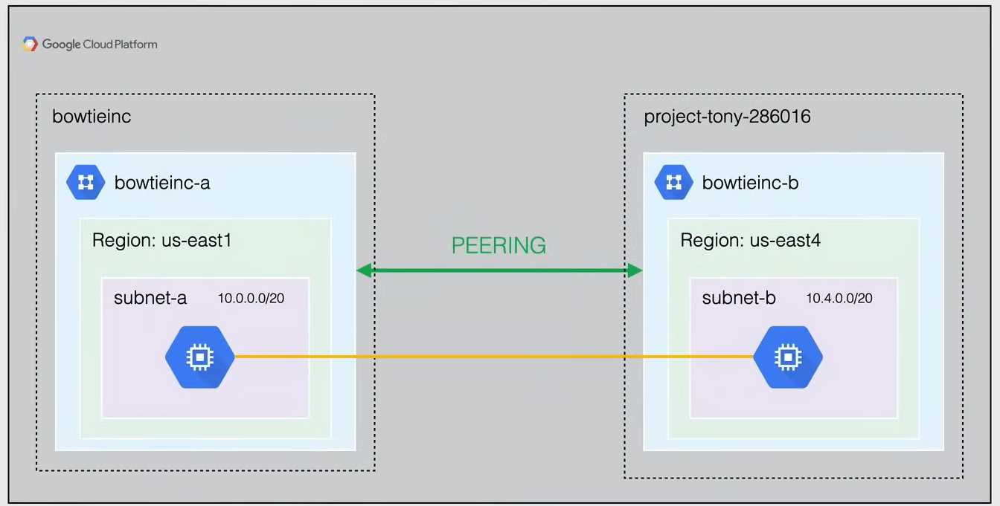
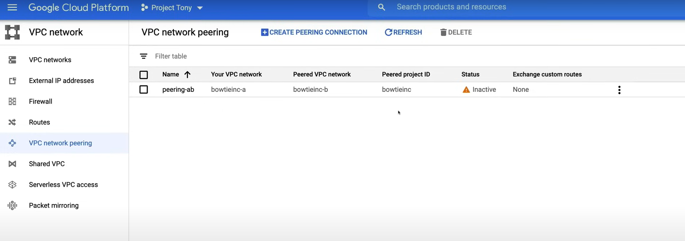
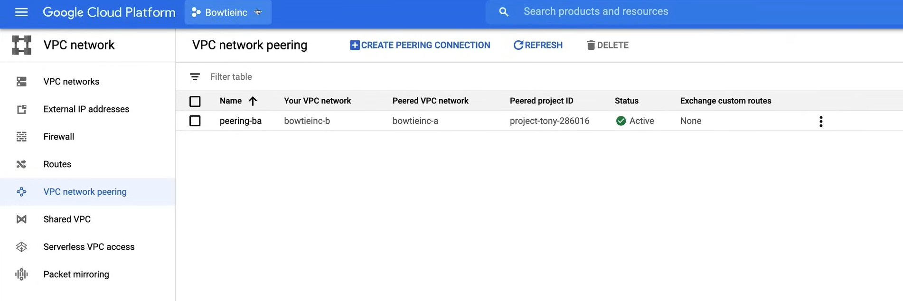

# VPC Network Peering

To communicate between two VPCs, you can use **VPC Network Peering**. VPC Network Peering allows you to establish a direct connection between two VPCs. This connection allows instances in either VPC to communicate with each other as if they were within the same network.

VPC Network Peering:

- Allows private connectivity across two VPC networks.
  - enable you to peer VPCs, so that woarkloads in different VPCs can communicate in a private space that follow the **RC1918** standard.
  - the traffic between the VPCs never traverse the public internet.
- Peer across the same or different projects and organizations.
- Reduce networl **latency**, because all peering traffic stays within Google's high-speed network.
- Increase network **security**
- Reduce network **costs**, as you save on egress costs for traffic leaving GCP.

The VPC Network Peering follows some characteristics:

- **VPC peering networks** remain administratively separate, meaning that routes, firewall rules, VPNs, and other traffic management tool are administered and applied separately.
  - this applies to each VPC independently, which also means that each side of a peering association is set up independently.
- when you connect one VPC to the other, you have to go into each VPC that you are connecting to both initiate and establish the connection.
- peering becomes active only when the configuration is complete on both sides, this also means that each VPC can delete the peering association at any given time.
- During VPC peering, the VPC peers always exchange all subnets routes, you also have the option to exchange custom routes
  - Subnet and Static routes are global 
  - Dynamic routes are regional or global
- A given VPC network can peer with multiple VPC networks, but there is a limit

The **VPC Network Peering** has some restrictions:

- you should be aware of first off a subnet cider range in one peered VPC network cannot overlap with a static route in another peered VPC network.
  - This rule covers both subnet route and static route
  - When a VPC subnet is created or a subnet IP range is expanded, Google Cloud perform a check to make sure that the new subnet IP range does not overlap with any static route in any peered VPC network. If it does, the operation fails.
- when you create a new subnet in appeared VPC network, VPC Network Peering doesn't provide granular route controls to filter out which cider ranges are reachable across the peering connection.
- To allow ingress traffic from VM instances in a peer network, you must create ingress allow firewall rules. By default, ingress traffic to VMs is blocked by the ***implied deny ingress rule***.
- Transitive peering is not supported and only directly peered networks can communicate with each other.
- You can't use a tag or service account from one peered network in the other peered network.
- Internal DNS is not accessible for compute engine in peered networks, as they must use an IP to communicate.


## Demo

In this demonstration we are going to go through the steps to create a VPC Network Peering between two VPCs in two different projects. A video demo is available [here](https://youtu.be/jpno8FSqpc8?si=WwAGmqeeaRCB2P74&t=30009).



### Step 1: Create the VPC Networks

We start from the project `Project Tony`.

1. Go to the **VPC Network** page in the Google Cloud Console.
2. Create a new VPC network called `bowtieinc-a` with the following configuration:
   - Name: `bowtieinc-a`
   - Description: `VPC Network for Bowtie Inc.`
   - Subnet Creation Mode: `Custom`
     - Subnet Name: `subnet-a`
     - Region: `us-east1`
     - IP Address Range: `10.0.0.0/20`
3. Click on **Create**.

Now move to the project `Bowtieinc`.

1. Go to the **VPC Network** page in the Google Cloud Console.
2. Create a new VPC network called `bowtieinc-b` with the following configuration:
   - Name: `bowtieinc-b`
   - Description: `VPC Network for Bowtie Inc.`
   - Subnet Creation Mode: `Custom`
     - Subnet Name: `subnet-b`
     - Region: `us-east4`
     - IP Address Range: `10.4.0.0/20`
3. Click on **Create**.


### Step 2: Create the Firewall Rules

Go back to the project `Project Tony` to create the firewall rules.

1. Go to the **VPC Network** page in the Google Cloud Console.
2. Click on **Firewall** section.
3. Click on **Create Firewall Rule**.
    - Name: `project-tony-a`
    - Description: `Allow traffic from bowtieinc-b`
    - Logs: `Off`
    - Network: `bowtieinc-a`
    - Priority: `1000`
    - Direction of traffic: `Ingress`
    - Action on match: `Allow`
    - Targets: `All instances in the network`
    - Source filter: `IP ranges`
    - Source IP ranges: `0.0.0.0/0`
      - Do not use this in production
    - Protocols and ports: `Specified protocols and ports`
      - tcp: `22`
      - icmp
4. Click on **Create**.

Go back to the project `Bowtieinc` to create the firewall rules.

1. Go to the **VPC Network** page in the Google Cloud Console.
2. Click on **Firewall** section.
3. Click on **Create Firewall Rule**.
    - Name: `bowtieinc-b`
    - Description: `Allow traffic from project-tony-a`
    - Logs: `Off`
    - Network: `bowtieinc-b`
    - Priority: `1000`
    - Direction of traffic: `Ingress`
    - Action on match: `Allow`
    - Targets: `All instances in the network`
    - Source filter: `IP ranges`
    - Source IP ranges: `0.0.0.0/0`
      - Do not use this in production
    - Protocols and ports: `Specified protocols and ports`
      - tcp: `22`
      - icmp
4. Click on **Create**.

### Step 3: Create the instances

Now we can create the instances.

In the project `Bowtieinc`.

1. Go to the **Compute Engine** page in the Google Cloud Console.
2. Click on **Create Instance**.
    - Name: `instance-b`
    - Region: `us-east4`
    - Zone: `us-east4-c`
    - Machine type: `e2-micro`
    - on **Management, security, disks, networking, sole tenancy** section:
      - **Networking** tab, under the **Network interfaces** section, click on **Network interface**.
        - Network: `bowtieinc-b`
        - Subnet: `subnet-b`
      - Click on **Done**. 
3. Click on **Create**.

Go back to the project `Project Tony`.

1. Go to the **Compute Engine** page in the Google Cloud Console.
2. Click on **Create Instance**.
    - Name: `instance-a`
    - Region: `us-east1`
    - Zone: `us-east1-b`
    - Machine type: `e2-micro`
    - on **Management, security, disks, networking, sole tenancy** section:
      - **Networking** tab, under the **Network interfaces** section, click on **Network interface**.
        - Network: `bowtieinc-a`
        - Subnet: `subnet-a`
      - Click on **Done**.
3. Click on **Create**.

### Step 4: Create the VPC Network Peering

From the project `Project Tony`. To connect to a VPC network in another project, we need the project ID of the other project, and the name of the VPC network.

1. Go to the **VPC Network** page in the Google Cloud Console.
2. Click on **VPC Network Peering** section.
3. Click on **Create Connection**.
    - Name: `peering-ab`
    - Your VPC network: `bowtieinc-a`
    - Peered VPC network: `In another project`
      - Project ID: `bowtieinc`
      - VPC network: `bowtieinc-b`
3. Click on **Create**.

As we can see in the following image, after the process the connection still `Inactive`, this is because we need to accept the connection from the other side.



So, go to the project `Bowtieinc`.

1. Go to the **VPC Network** page in the Google Cloud Console.
2. Click on **VPC Network Peering** section.
3. Click on **Create Connection**.
    - Name: `peering-ba`
    - Your VPC network: `bowtieinc-b`
    - Peered VPC network: `In another project`
      - Project ID: `project-tony`
      - VPC network: `bowtieinc-a`
3. Click on **Create**.

Now, in both projects, the connection is `Active`.



### Step 5: Test the connection

In project `Project Tony`.

1. Go to the **Compute Engine** page in the Google Cloud Console.
2. Copy the internal IP of the instance `instance-a`.

Now go to the project `Bowtieinc`.

1. Go to the **Compute Engine** page in the Google Cloud Console.
2. Click on the **SSH** button of the instance `instance-b`.
3. Now you can ping the instance `instance-a` using the internal IP.

```bash
ping [internal-ip-instance-a]
```

Finally, remember to delete the resources to avoid unnecessary charges.