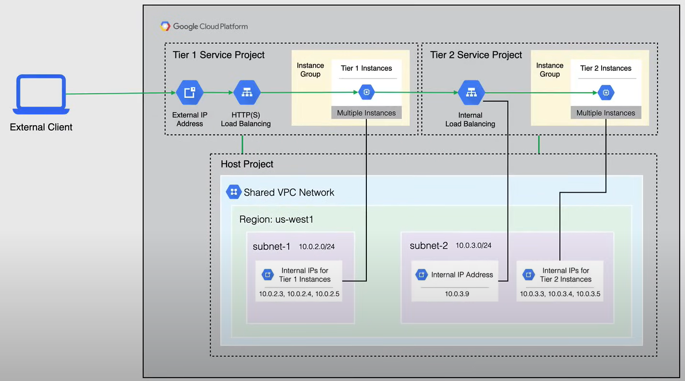

# Shared VPC

When a VPC is created is usually tied to a specific project. What happen when we want to share resource across different projects, but still have separate billing and access within the projects themselves?

This is where Shared VPC comes in.

**Shared VPC** allow an organization to connect resources from multiple projects to a common VPC network, so that they can communicate with each other securely and efficiently using internal IPs from that VPC network.

When you use Shared VPC you designate a project as a host project, and attach one or more other projects as service projects.

The VPC network in the host project is considered the shared VPC network.

**Remark**:

- A project that participates in a Shared VPC is either a host project or a service project, ***but not both***.

  - A *host project* can contains one or more Shared VPC networks.
  - A *service project* is any project that is attached to a Shared VPC network. Each service project can only be attached to one Shared VPC network.

- A project that does not participate in a Shared VPC is called a **standalone project**.

A S**hared VPC admin** has the permissions to enable host projects attach service projects to host projects, and delegate access to some or all of the subnets, in shared VPC networks, to service projects admins.

When it comes to a service project admin, this is a shared VPC admin for a given host project and is typically its project owner as well. Although, when defining each service project admin a shared VPC admin can grant permission to use the whole host project or just some subnets.

So there are two separate levels of permissions that can be applied:

- **Project level permissions**:
  - This is a service project admin that can be defined to have permission to use all subnets in the host project.
- **Subnet level permissions**:
  - This is a service project admin that can be defined to have permission to use only specific subnets in the host project.

## Use Cases

### First Use Case - Shared VPC

The following diagram shows the first use case scenario:

Here, an host project is created with a VPC network. Then, two service projects are created and attached to the host project. The service projects can use the subnets in the host project's VPC network.

The Service Project Admin in the Service Project A, can be configured to access all or some of the subnets in the Shared VPC network.
Service Project Admin with at least subnet level permissions to the `10.0.2.0/24` subnet has created VM1 in a zone located in the us-west1 region. This instance receives its internal IP address `10.0.2.15` from the `10.0.2.0/24` cidr block.

The Service Project Admin, in the Service Project B, can be configured to access all or some of the subnet in the Shared VPC network. A Service Project with at least subnet level permissions to the `10.10.4.0/24` subnet has created VM2 in a zone located in the us-central1 region. This instance receives its internal IP address `10.10.4.6` from the `10.10.4.0/24` cidr block.

And, of course, the Standalone Project does not participate in the Shared VPC network.

Finally, instances in Service Projects attached to a Host Project using the same SHared VPC network can communicate with each other using either ephemeral or reserved internal IP addresses.

### Second Use Case - Multiple Hosts Project

The following diagram shows the second use case scenario:

In this case, an organization is using two separate host projects, **Develonment** and **Production**, and each Host Project has two Service Projects attached to it. 
Both Host Projects have one Shared VPC network, with subnet configured to use the same CIDR ranges, both the testing and production networks have been purposely configured in the same way, so this way, when you work with resources tied to a subnet range, it will automatically translate over from one environment to the other.

### Third Use Case - Hybrid Environment

In this use case the organization has a single host project with a single Shared VPC network.

The Shared VPC network is connected via Cloud VPN to an on-premises network. 

Some services and applications are hosted on GCP, while others are hosted on-premises.

In this way separate teams can manage each of their own projects, and each project has no permissions to the other Service Projects, as well each Service Project can also be billed separately.

Subnet level or project level permissions have been granted to the necessary Service Project Admins, so they can create instances that use the Shared VPC network.

Instances in these Service Projects can be configured to communicate with internal services, such as database or directory servers located on premises.

### Fourth Use Case - Two tier web service

In this use case, an organization has a web service that is separated into two tiers, and different teams manage each tier.

The tier one Service Project represents the externally facing components behind an HTTP (or HTTPS) load balancer, such as a web server.

The tiers two Service Project represents an internal service, upon which the tier one service depends, and it is balanced using an internal TCP or UDP load balancer.

The Shared VPC allows mapping of each tier of the web service to different projects, so that they can be managed by different teams, all sharing a common VPC network, to host resources that are needed for both tiers.

