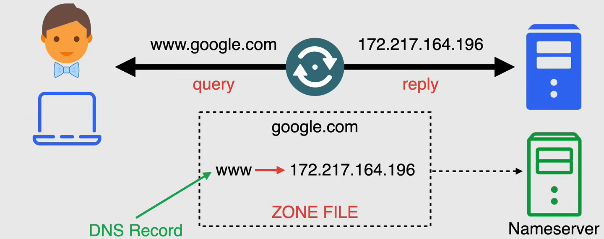
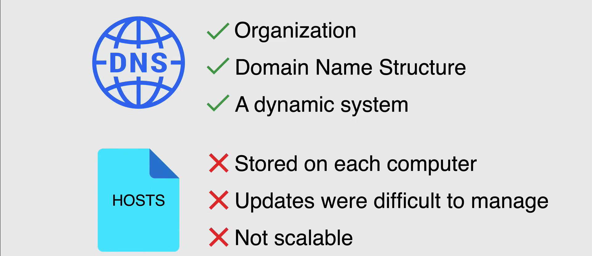

# DNS Fundamentals

The **Domain Name System (DNS)** is a global, decentralized, distributed database that provides a mapping between human-readable names and IP addresses. It is a hierarchical system that allows for the translation of domain names to IP addresses and vice versa.

The information to convert domain names to IP addresses is stored in **DNS zones**. A DNS zone is a portion of the DNS namespace that is managed by a specific organization or administrator. Each zone contains a collection of resource records that map domain names to IP addresses.

## Why DNS

In early computer networks, a simple text file colled a **hosts file** was used to map domain names to IP addresses. This file was maintained on each computer and was used to resolve domain names to IP addresses. However, as the number of computers on the network grew, maintaining the hosts file became cumbersome and inefficient.

To overcome this limitation, the DNS was developed. DNS provides a scalable and distributed system for resolving domain names to IP addresses. It is a critical component of the Internet and is used by every device that connects to the Internet.

## DNS Structure

The structure all begins with the a dot, the **root**, and it can be found after very domain name, but you don't see it, because the browser hides it. The root is the top of the DNS hierarchy and is represented by a dot (.) in DNS notation. Below the root are the **top-level domains (TLDs)**, which are the highest level of the DNS hierarchy. Examples of TLDs include .com, .org, .net, .edu, and .gov.

The domain name space consist of a hierarchical data structure, each node has a label, and zero or more resource records, which hold information associated with the domain name.

The domain name itself, consists of the labels concatenated together, with the name of its parent on the right, separated by a dot. So, the DNS is always assembled from right to left.

This tree is divided into zones, which are sections of the DNS namespace that are managed by a specific organization or administrator. Each zone contains a collection of resource records that map domain names to IP addresses.

## How DNS works

In the DNS lookup process, there are eight steps that occur when a user enters a domain name into a web browser:

1. The **DNS Client**, i.e. the user, enters a domain name into a web browser, such as www.example.com, and queries the **DNS Recursive Resolver**, a server that receives the begins the process of resolving the domain name to an IP address. The recursive resolver is typically provided by the user's Internet Service Provider (ISP).

2. The recursive resolver queries the **Root Name Servers**, which are the top-level servers in the DNS hierarchy. The root servers provide the IP addresses of the TLD servers that are responsible for the domain name.

3. The DNS Root Servers respond with the IP addresses of the TLD servers that are responsible for the .com TLD.

4. The recursive resolver queries the **.com TLD Servers** for the IP address of the authoritative name servers for the domain name www.example.com.

5. The .com TLD Servers respond with the IP addresses of the authoritative name servers for the domain name www.example.com.

6. The recursive resolver queries the **Authoritative Name Servers** for the domain name www.example.com for the IP address of the domain name.

7. The Authoritative Name Servers respond with the IP address of the domain name www.example.com.

8. The recursive resolver caches the IP address of the domain name www.example.com and returns the IP address to the DNS client.

