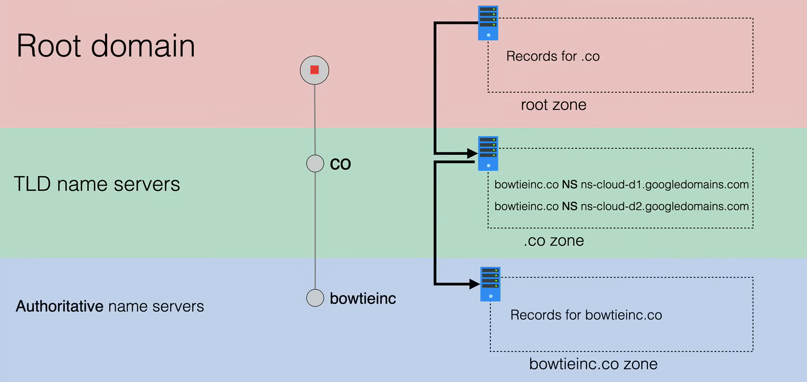
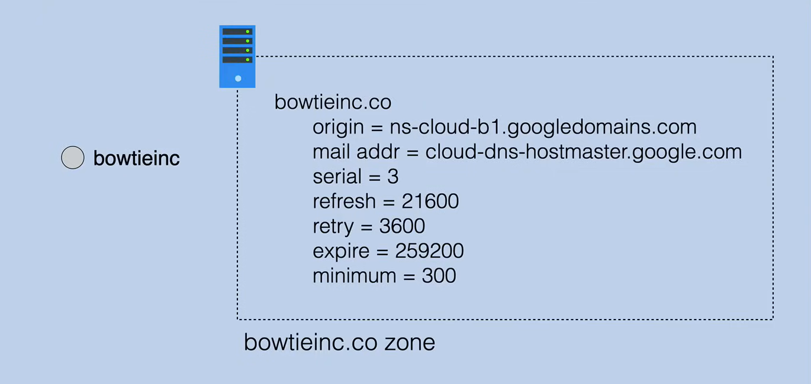

# DNS Record Types

DNS resource records are the basic information elements of the Domain Name System (DNS). They are entries in the DNS database which provide information about a particular host, and they are physically stored in a zone file on the name server.

The most common types of DNS records are:

- **NS** (Name Server) records
- **A** (Address) and **AAAA** (IPv6 Address) records
- **CNAME** (Canonical Name) records
- **TXT** (Text) records
- **MX** (Mail Exchange) records
- **PTR** (Pointer) records
- **SOA** (Start of Authority) records

## NS (Name Server) Records

NS records identify which DNS server contains the current record for the domain. 

These servers are usually found at a registrar or hosting provider. They are created to identify the name server used for each domain name within a given zone. 

In the following example we have the `.co` zone that will have multiple name server records for `bowtieinc.co`.
These name server record are how the `.co` delegation happens for `bowtieinc.co`, and they point at servers that host the `bowtieinc.co` zone, that is managed by `bowtieinc`.
So the flow of DNS resolution, start from the root zone, going to the `.co` zone, and then to the `bowtieinc.co` zone.

## A and AAAA Records

**A (Address)** records and **AAAA (IPv6 Address)** records, points a domain name to an IP address.

For example when you type `www.bowtieinc.co` in your browser, the DNS system will resolve the domain name to an IP address (e.g. `52.54.92.195`) using the A record information, stored in the `bowtieinc.co` zone file.

**A records** links a website's domain name to an IPv4 address, while AAAA records links a website's domain name to an IPv6 address.

## CNAME (Canonical Name) Records

A **CNAME (Canonical Name)** record is used to maps one domain name to another domain name. This is useful when running multiple services (like FTP server, e-commerce website, etc.) each running on different ports from a single IP address.

So if the IP address of the server changes, you only need to update the A record for the server, and all the CNAME records will automatically point to the new IP address.

For example you can point to `ftp.bowtieinc.co` and `shop.bowtieinc.co` to the same IP address `bowtieinc.co` (an A record pointing to the IP address). 

### TXT (Text) Records

A **TXT (Text)** record is used to store any text-based information that can be grabbed when needed. These record values can be either human-readable or machine-readable. 

In many cases, TXT records are used to verify domain ownership, or provide human-readable information about a server, like the SPF record.

A domain can have multiple TXT records associated with it.

In the following example, Google want to verify that you own the domain `bowtieinc.co`, so that G-Suite can be setup and needs verification through the domain to Google through creating a TXT record and adding it to the zone.
Google then supplies a text verification record to add to the domain host's DNS records and start to scan for the text record to verify the domain.
The supplied text record is then added to the zone file for `bowtieinc.co`, by the domain administrator. Behind the scenes, Google is doing a verification check at timed intervals, and when finally sees the TXT record, the domain is verified.

## MX (Mail Exchange) Records

**MX (Mail Exchange)** records are used to direct email to a mail server. They indicate how email messages should be routed and to which server mail should go to.

Like `CNAME` records, an `MX` record must point to a domain, not an IP address. The domain must have an `A` record that points to the IP address of the mail server.

The MX record consists of two parts: the **priority** and the **domain name**. 

- The priority is a number (before the domain) that indicates the order in which the mail servers should be used. The lower the number, the higher the priority.
- The domain name is the mail server that will receive the email.

## PTR (Pointer) Records

**PTR (Pointer)** records are used for reverse DNS lookups. They map an IP address to a domain name. So they are the opposite of **A records**.

When a user attempts to reach a domain, the DNS server will look up the IP address of the domain. The DNS lookup is the opposite of this process. It looks up the domain name of an IP address.

While the **A records** are stored under the given domain name, the **PTR records** are stored under the IP address.

**PTR records** are used for anti-spam measures, troubleshooting email delivery issues, and logging.

## SOA (Start of Authority) Records

**SOA (Start of Authority)** records are created for you when you create your managed zone and specifies the authoritative information, including global parameters about the DNS zone.

This type of record stores important information about a domain or zone such as the email address of the administrator, when the domain was last updated, and how long the server should wait between refreshes.

Every DNS zone registered must have an SOA as per the RFC1035 standard, and there is exactly one SOA record per zone. It contains the core information about your zone, so it is not possible for your zone work without that information.

They are used to reduce bandwidth between names servers, increase the speed of website access, and ensure the site is alive even if the primary server goes down.

