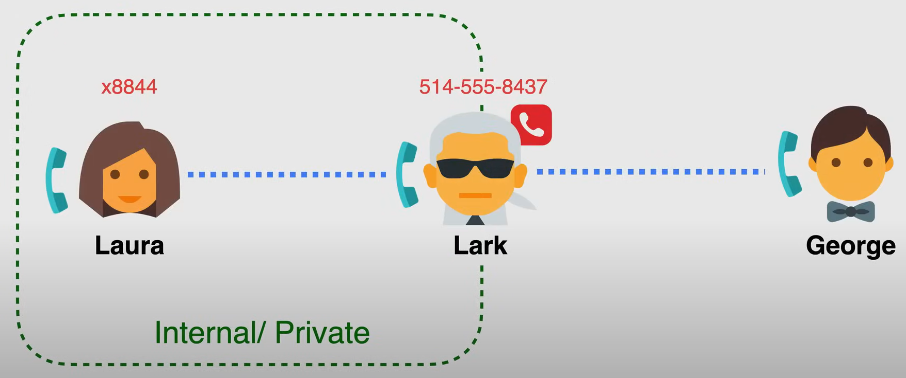

# Network Address Translation

NAT is a way to **map multiple local private IP addresses to a public IP address**, before transferring the information.

- This is done by altering the network address data in the IP header of the data packet while in transit.

- It is originally designed to deal with the **scarcity of free IPv4 addresses**.

  - IPv6 networks do not require NAT as their are no shortage of addresses.

- Provides **security** and **privacy** by hiding the IP addresses of the devices on the local network.

There are different types of NAT:

- **Static NAT**: Maps a single private IP address to a single public IP address on a one-to-one basis.
- **Dynamic NAT**: Maps a single private IP address to a single public IP address from a pool of public IP addresses.
- **PAT (Port Address Translation)**: Maps multiple private IP addresses to a single public IP address by using different ports.

## Static NAT

Static NAT is a one-to-one mapping of private IP addresses to public IP addresses.

In the following example, we have an private network on the left and a public IP space on the right, with a router or a NAT device in the middle.

In this example there is a server on the left that needs to access to external services, and for this example the external service is the `bowterest` service, an image sharing site for all sorts of bow ties.

The server on the left is private, with a private IP address of `192.168.0.15`, and it means it has an address in the IPv4 private address space, meaning that it cannot route packets over the public internet, because it only has a private IP address. The `bowterest` on the other hand is a public service, and it has a public IP address of `54.5.4.9`.

So they cannot communicate directly, because the server on the left has a private IP address, and the `bowterest` service has a public IP address. So, we need to translate the private IP address of the server to a public IP address, so that it can communicate with the `bowterest` service.

The NAT device maps the private IP address of the server to a public IP address, using a **NAT table**. The NAT table is a table that keeps track of the mappings between the private IP addresses and the public IP addresses.

1. the private server sends a packet (as normal) to the public service, but the packet goes through the NAT device, that is the default gateway of the private network.
2. The NAT device then translates the private IP address of the server to a public IP address, and sends the packet to the public service.
3. The process is reversed when the public service sends a packet back to the server.
4. The NAT device translates the public IP address of the public service to the private IP address of the server, and sends the packet to the server.

A common analogy for NAT is the telephone operator, that connects a private phone line to a public phone line, so that the private phone line can communicate with the public phone line.

## Dynamic NAT

**The NAT devices maps a private IP with a public IP in a NAT table, and public IP addresses are allocated randomly and dynamically from a pool of public IP addresses.**

This method is similar to static NAT, but devices are not allocated a permanent public IP address. Instead, they are allocated from a pool of public IP addresses as they are needed, and the mapping of public to private is allocation based.

This type of NAT is used when multiple internal hosts with private IP addresses are sharing an equal or fewer amount of public IP addresses.

In the following example, we have a private network on the left, with two devices, and according to the NAT table, we have two public IP addresses available in the pool.

1. So when the laptop on the left is looking to access the `bowterest` service, it will generate a packet where the source IP is the private address of `192.168.0.13`, and the destination IP is the public address of `54.5.4.9`.
2. The router on the middle is the default gateway, so it checks if the private IP has a current allocation of public addressing from the pool, and if it does not, and one is available, it will allocate one dynamically, in this case the public IP of `73.6.2.34`. And then the packet is sent to the `bowterest` service.
3. Multiple private devices can share the same public IP address, as long as they are using different ports, and the NAT device keeps track of the port numbers in the NAT table. So when the device finishes the communication, the NAT device will free the public IP address for future use.
4. In the example there is another IP address available in the pool, so when the private server on the left is looking to access the `fashiontube` service, it will generate a packet where the source IP is the private address of `192.168.0.37`, and the mapping will be done to the public IP of `73.6.2.33`.

**NOTE:** If there is no public IP address available in the pool, the NAT device will not be able to allocate a public IP address, and the device will not be able to communicate with the public service.

The following image is an example of the dynamic NAT with the telehone operator analogy.

## PAT (Port Address Translation)

**PAT is a type of NAT that maps multiple private IP addresses to a single public IP address by using different ports.**

PAT is also known as NAT Overload, because it allows multiple devices to share a single public IP address, and it does this by using different ports.

In the following example, we have a private network on the left, with three different devices, and a single public IP address on the right, i.e. `fashiontube` at `62.88.44.88` with TCP port `443`, and a NAT device in the middle.

To allow multiple devices to share the same public IP address, the NAT device uses different ports to keep track of the different devices.

The source port is randomly assigned by the client, so as long the source port is always unique, then many private clients can use the same public IP address, and all of these information are recorder in the **NAT table** on the NAT device.

For example, when the device `192.168.0.13` generate a packet to the `fashiontube` service, with the destination IP of `62.88.44.88`, and the destination port of `443`, the source port is randomly assigned by the client (eg. `35535`), and the NAT device will keep track of the mapping between the private IP address and the source port, and the public IP address and the destination port.

When the device `192.168.0.14` did the same thing, the same process is repeated. The same with the device `192.168.0.15`.

The NAT device records the source IP and source port in a NAT table.
The source IP is replaced with a public IP, and public source port are allocated from a pool that allows overloading many to one.

For the telephone analogy, is equal to having an operator that connects multiple private phone lines to a single public phone line, and the operator keeps track of the different phone lines by using different extensions.

