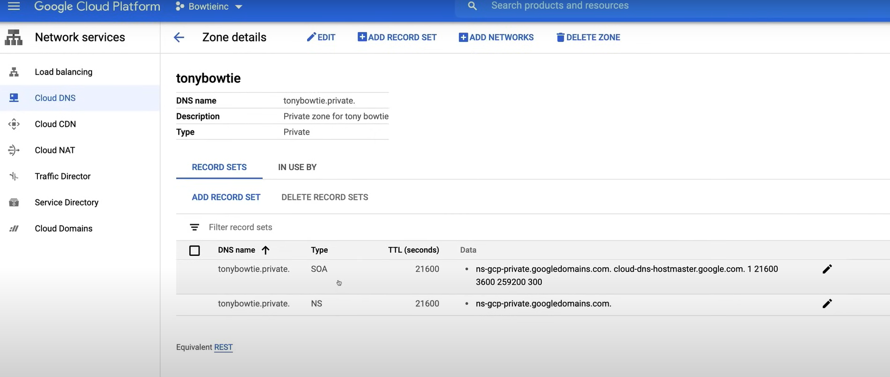

# Cloud DNS

**NOTE:** It shows up in the exam only in an high level.

**Cloud DNS** is a fully managed service that manages DNS servers for your specific zones.

It acts as an **authoritative DNS server** for public zones, that are visible to the internet, and private zones, that are only visible to your VPC networks. It is also called as **DNS as a Service**.

Cloud DNS has servers that span the globe, making it a **globally resilient service**, and it is also highly available, with a 100% uptime SLA.

in order to use Cloud DNS with a specific publicly available domain, a domain name must be purchased through a domain registrar, and you can register a domain through Google Domains, or any other domain registrar. So, you can't register a domain through Cloud DNS, but you can use Cloud DNS to manage the DNS records for that domain.

It offers the flexibility of hosting:

- **Public Zone**: visible to the internet.
- **Private Zone**: visible only to your VPC networks.

**NOTE:** The VPC network that you authorize to use the private zone must be in the same project as the private zone.

Each managed zone that you create is associated with a Google Cloud project, and once this zone is created it is hosted by Google's managed name servers. These zones are always hosted on Google's managed name servers, within Google Cloud so you would create records and records sets, and these servers would then become allocated to that specific zone hosting you records and record sets.

**Remark:** A **record set** is a collection of DNS records in a zone that have the same name and type.

## Demo

A video demo is available [here](https://youtu.be/jpno8FSqpc8?si=V_4Nc0V9y0RXIOEE&t=35004).

1. Go to **Newotk Services** > **Cloud DNS**.
2. Click on **Create Zone**, and fill in the details.
   - Zone type: `Private`.
     - Zone name: `tonybowtie`.
     - DNS name: `tonybowtie.private`.
     - Description: `Tony's private zone`.
     - Optional: `Default (private)`.
     - Network: `default`.
3. Click on **Create**.

The same process can be done with command line:

```bash
gcloud beta dns 
    --project=tonybowtieinc 
    managed-zones create tonybowtie 
        --description="Tony's private zone"
        --dns-name=tonybowtie.private
        --visibility=private
        --networks=default 
```

In the following image, you can see the newly created zone, with some DNS records.

In the **IN USE BY** tab, you can see the VPC networks that are using this private zone.



**NOTE for the exame:** When creating a zone these records are always created by default:

- **SOA**: Start of Authority.
- **NS**: Name Server.

