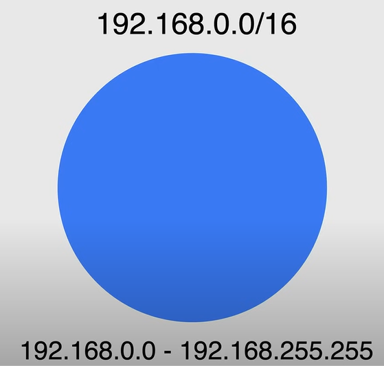

# Ripasso sul Networking

## Protocollo Internet - IP

Per identificare un dispositivo in una rete, utilizziamo un indirizzo IP. Un indirizzo IP è un numero a 32 bit diviso in quattro ottetti da 8 bit ciascuno. Ogni ottetto è separato da un punto.

Quindi la comunicazione tra dispositivi in una rete avviene utilizzando gli indirizzi IP.

## Modello di Interconnessione dei Sistemi Aperti - Modello OSI

Il modello OSI è un quadro concettuale che standardizza le funzioni di un sistema di telecomunicazioni o di elaborazione in sette livelli di astrazione. Questo modello ci aiuta a capire come i dati fluiscono da un dispositivo all'altro su una rete.

I sette livelli sono:

1. **Livello fisico**: Questo livello si occupa della connessione fisica tra i dispositivi. Definisce l'hardware e il supporto fisico utilizzato per trasmettere i dati.
2. **Livello di collegamento dati**: Questo livello si occupa della connessione logica tra i dispositivi. Definisce come i dati vengono formattati per la trasmissione e come i dispositivi vengono indirizzati sulla rete.
3. **Livello di rete**: Questo livello si occupa dell'instradamento e dell'inoltro dei dati. Definisce come i dati vengono instradati da un dispositivo all'altro.
4. **Livello di trasporto**: Questo livello si occupa della comunicazione end-to-end. Definisce come i dati vengono trasmessi tra i dispositivi.
5. **Livello di sessione**: Questo livello si occupa dell'instaurazione, della gestione e della terminazione delle connessioni tra i dispositivi.
6. **Livello di presentazione**: Questo livello si occupa della traduzione e della crittografia dei dati. Definisce come i dati vengono presentati al livello di applicazione.
7. **Livello di applicazione**: Questo livello si occupa delle interfacce utente e dei servizi applicativi. Definisce come le applicazioni interagiscono con la rete.

Ora descriveremo alcuni dei livelli importanti del modello OSI, ovvero i livelli di rete, trasporto e applicazione.

### Livello di rete

Ci sono due versioni del Protocollo Internet (IP) che operano al livello di rete:

- **IPv4**: Questa è la versione più utilizzata di IP.
- **IPv6**: Questa è l'ultima versione di IP.

#### IPv4

È la versione più utilizzata di IP.

1. Utilizza uno schema di indirizzamento a 32 bit che consente un totale di 2^32 indirizzi.
2. Può essere rappresentato in formato decimale puntato (ad esempio 192.168.255.255).
3. Ogni gruppo di 8 bit è chiamato ottetto e varia da 0 a 255.
4. L'indirizzo IP è diviso in due parti: ID di rete e ID di host.
   1. L'ID di rete identifica la rete a cui il dispositivo appartiene.
   2. L'ID di host identifica il dispositivo sulla rete.
5. Utilizza classi per definire la dimensione dell'ID di rete e dell'ID di host:

    

##### Indirizzi IP privati

Alcuni indirizzi IP sono riservati per uso privato e sono definiti dallo standard **RFC1918**. Questi indirizzi non sono instradabili su Internet.

Questi sono i tre blocchi di indirizzi IP riservati per uso privato:

- **Singola rete di classe A**: va da 10.0.0.0 a 10.255.255.255, ovvero 16.777.216 indirizzi.
- **16 reti di classe B**: vanno da 172.16.0.0 a 172.31.255.255, ovvero 1.048.576 indirizzi.
- **256 reti di classe C**: vanno da 192.168.0.0 a 192.168.255.255, ovvero 65.536 indirizzi.

##### Classless Inter-Domain Routing (CIDR)

La notazione **CIDR** (Classless Inter-Domain Routing) viene utilizzata per rappresentare gli indirizzi IP. È un metodo per l'allocazione degli indirizzi IP e il routing IP. Viene utilizzato per creare identificatori unici per reti e dispositivi individuali.

Ad esempio, l'indirizzo IP `192.168.0.0/16` in cui la prima parte è chiamata **Indirizzo di rete** e la seconda parte è chiamata **Prefisso**, che rappresenta la dimensione della rete. **Più piccolo è il prefisso, più grande è la rete e viceversa.**

Questo processo di divisione dell'indirizzo IP in ID di rete e ID di host è chiamato **Subnetting**.

Riferimenti utili:

- **192**.168.0.0/8: 16+ milioni di indirizzi IP.
- **192.168**.0.0/16: 65.536 indirizzi IP.
- **192.168.0**.0/24: 256 indirizzi IP.

#### IPv6

È l'ultima versione di IP.

1. Utilizza uno schema di indirizzamento a 128 bit che consente un totale di 2^128 indirizzi.
2. Può essere rappresentato in formato esadecimale (ad esempio 2001:0db8:85a3:0000:0000:8a2e:0370:7334).
3. Utilizza i due punti per separare i gruppi di 16 bit.
4. Utilizza due punti doppi per rappresentare più gruppi di 16 bit di zeri (ad esempio 2001:0db8::7334).
5. È progettato per sostituire IPv4.

Il processo di subnetting in IPv6 è simile a IPv4. Ad esempio, l'indirizzo IP `2001:de3::/64`.

### Livello di trasporto

Il livello di trasporto è responsabile della comunicazione end-to-end tra dispositivi. Definisce come i dati vengono trasmessi tra i dispositivi.

I dati trasmessi vengono chiamati **pacchetti IP**. Questi pacchetti sono divisi in quattro parti:

1. **Indirizzo IP di origine**: L'indirizzo IP del mittente.
2. **Indirizzo IP di destinazione**: L'indirizzo IP del destinatario.
3. **Numero di porta del protocollo**: Il numero di porta dell'applicazione che sta inviando o ricevendo i dati.
4. **Dati**: I dati effettivi che vengono trasmessi.

Ci sono due protocolli che operano al livello di trasporto:

- **Transmission Control Protocol (TCP)**: È un protocollo orientato alla connessione che fornisce una consegna affidabile dei dati. Assicura che i dati vengano consegnati nell'ordine corretto e senza errori.
- **User Datagram Protocol (UDP)**: È un protocollo senza connessione che fornisce una consegna non affidabile dei dati. Non garantisce che i dati vengano consegnati nell'ordine corretto o senza errori.

### Livello di applicazione

Il livello di applicazione è responsabile delle interfacce utente e dei servizi applicativi. Definisce come le applicazioni interagiscono con la rete.

Ci sono molti protocolli che operano al livello di applicazione, alcuni dei più comuni sono:

- **Hypertext Transfer Protocol (HTTP)**: Viene utilizzato per la trasmissione di pagine web su Internet.
- **File Transfer Protocol (FTP)**: Viene utilizzato per il trasferimento di file su Internet.
- **Simple Mail Transfer Protocol (SMTP)**: Viene utilizzato per l'invio di email su Internet.
- **Post Office Protocol (POP)**: Viene utilizzato per la ricezione di email su Internet.
- **Internet Message Access Protocol (IMAP)**: Viene utilizzato per l'accesso alle email su Internet.
- **Domain Name System (DNS)**: Viene utilizzato per tradurre i nomi di dominio in indirizzi IP.
- **Dynamic Host Configuration Protocol (DHCP)**: Viene utilizzato per assegnare indirizzi IP ai dispositivi in una rete.
- **Secure Shell (SSH)**: Viene utilizzato per l'accesso remoto sicuro ai dispositivi in una rete.