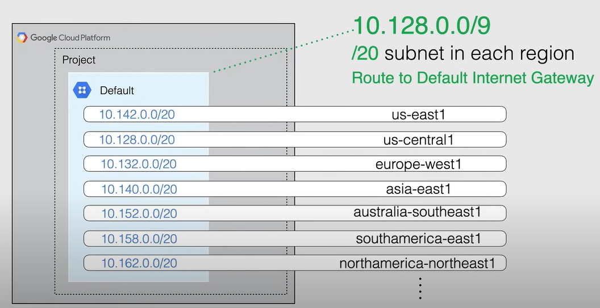
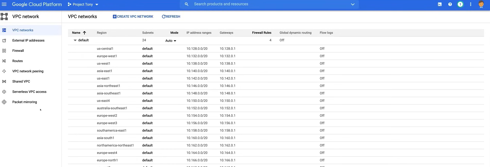
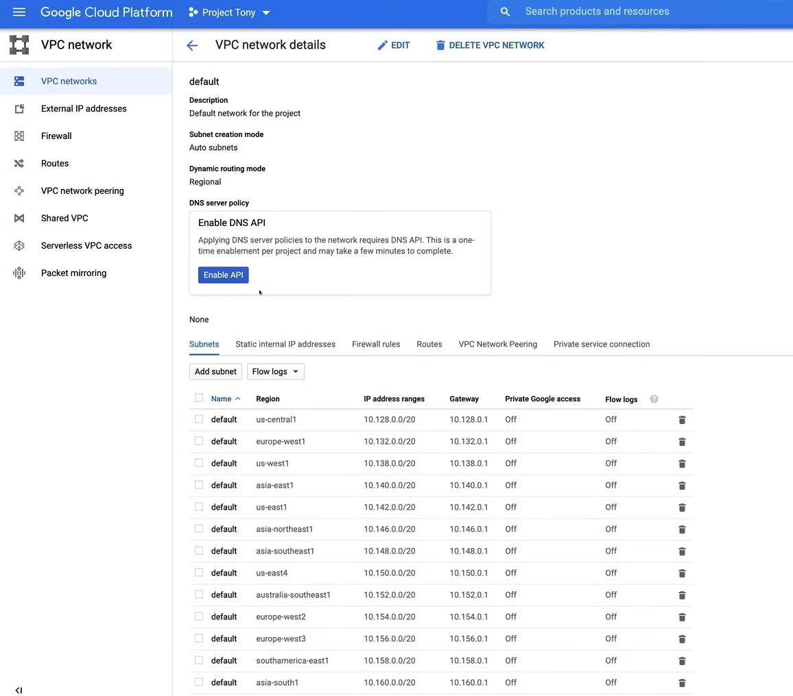
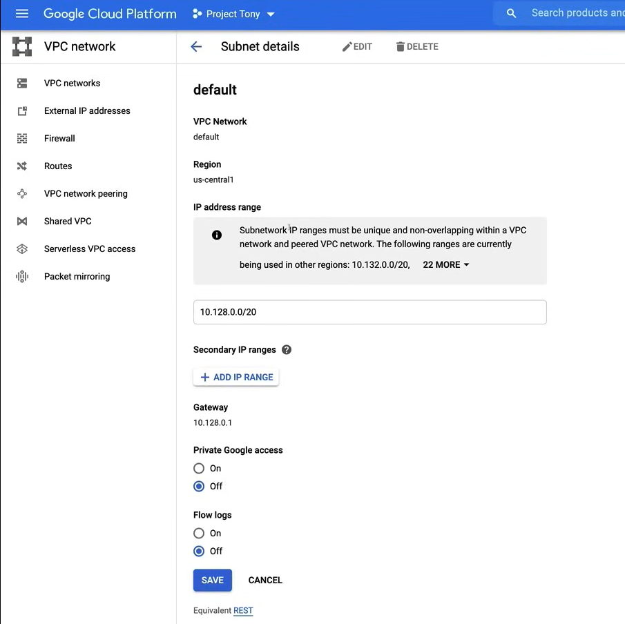
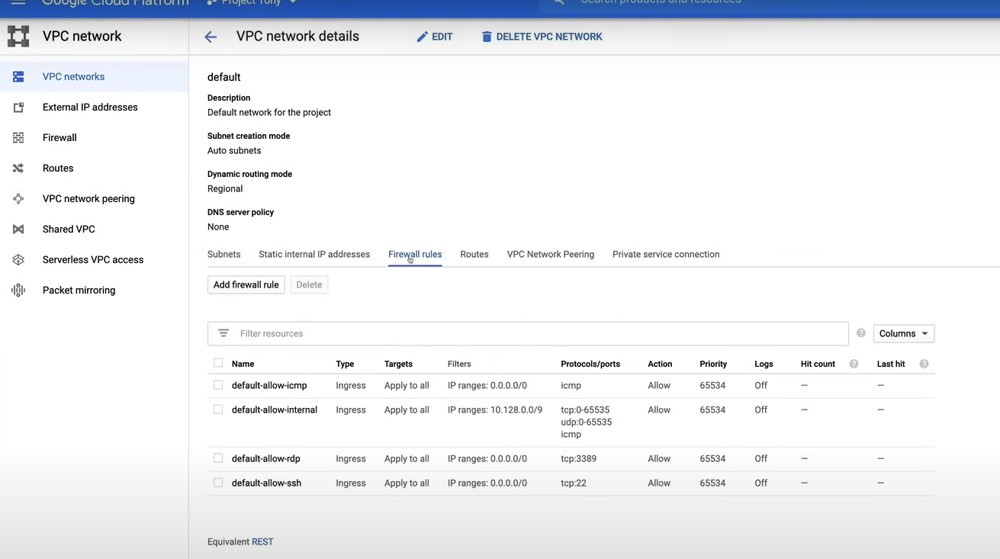
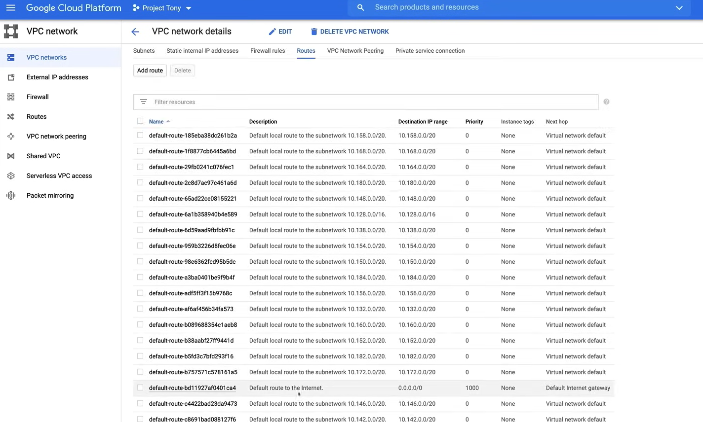
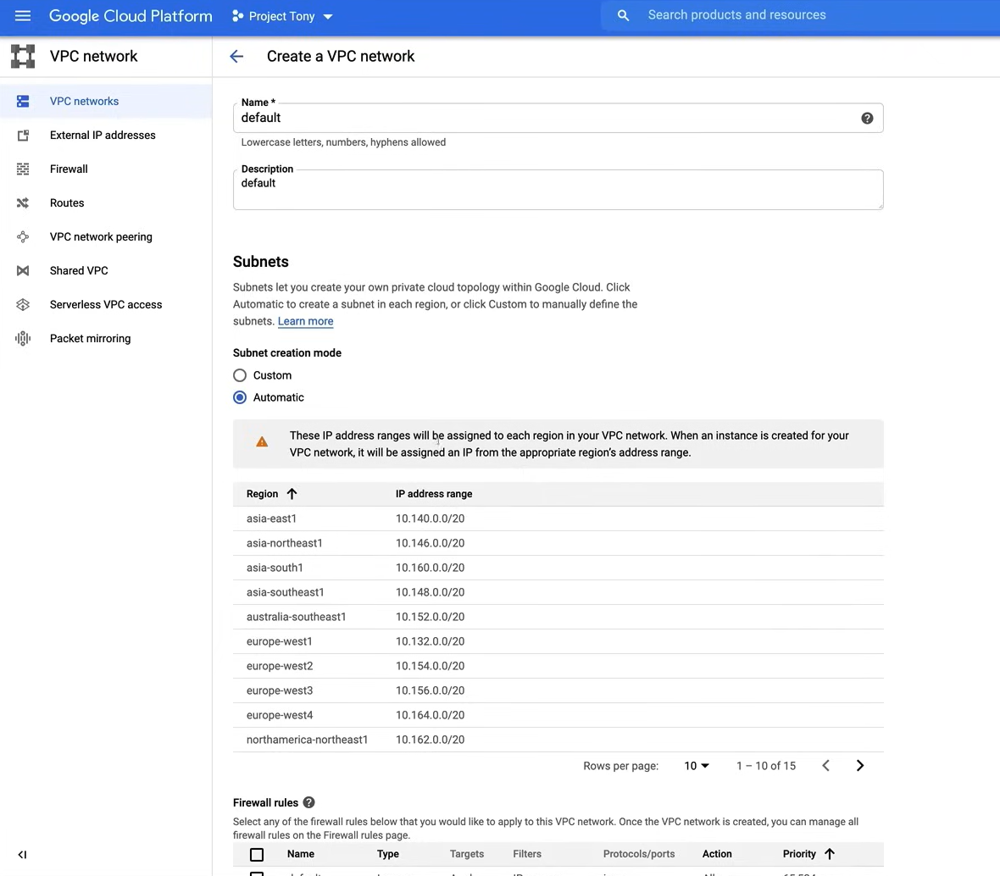

# Virtual Private Cloud

**NOTA:** Questa sezione è importante, perché la maggior parte delle domande nell'esame sono basate su questo argomento.

**Virtual Private Cloud (VPC)** è un servizio che ti permette di creare reti all'interno di Google Cloud con opzioni di connettività sia private che pubbliche, sia per le implementazioni in-cloud che per le implementazioni ibride on-premise.

- **Rete Virtualizzata** all'interno di Google Cloud.
  - Gestisce la funzionalità di rete per le tue risorse di Google Cloud, è una rete definita dal software e non è limitata dalle limitazioni fisiche della rete in un data center, infatti è astratta per te.
- Una VPC è una ***Risorsa Globale***.
  - Non è limitata a una singola regione, è una risorsa globale che può coprire più regioni.
  - Questo include le sue rotte associate e le regole del firewall.
- Incapsula **all'interno di un Progetto**.
  - I progetti sono il contenitore logico dove vive la tua VPC.
- Le VPC **non hanno alcun intervallo di indirizzi IP** associato a loro.
  - Sono semplicemente una costruzione di tutti gli indirizzi IP individuali e servizi all'interno di quella rete.
  - Gli indirizzi IP e gli intervalli sono definiti all'interno delle sottoreti.
- Le **regole del firewall** controllano il traffico in entrata e in uscita dalla VPC.
  - Le regole sono implementate sulle stesse istanze VM, quindi il traffico può essere controllato e registrato mentre lascia o arriva alla VM.
- Le risorse all'interno di una VPC **possono comunicare tra loro** utilizzando indirizzi IPv4 interni (privati).
  - Questi sono soggetti alle regole del firewall di rete applicabili.
  - Queste risorse **devono essere sulla stessa VPC** per la comunicazione, altrimenti devono attraversare l'internet pubblico con un IP pubblico assegnato o utilizzando una connessione di peering VPC o stabilire una connessione VPN.
- VPC supporta **solo indirizzi IPv4**.
  - IPv6 non è supportato.
  - Tuttavia, è possibile creare un intervallo di indirizzi IPv6 per un bilanciatore di carico globale.
- Ogni VPC contiene una **rete predefinita**.
  - Ogni nuovo progetto inizia con una rete predefinita in una VPC.
  - La rete predefinita è una rete VPC in modalità auto con sottoreti predefinite, allocate per ogni regione con blocchi di cider non sovrapposti (intervalli di indirizzi IP).
  - Ogni rete predefinita ha una **regola del firewall predefinita** che consente tutto il traffico interno tra le istanze.

Ci sono due tipi di reti VPC:

- **Modalità Auto**
  - Ha una sottorete per regione.
  - La rete predefinita è una rete in modalità auto.
  - Queste sottoreti create automaticamente, utilizzano un insieme di intervalli di indirizzi IP predefiniti, con un prefisso `/20`, che può essere espanso a un prefisso `/16`.
  - Possono **essere convertite in modalità personalizzata**, ma questa conversione è irreversibile.

- **Modalità Personalizzata**
  - Sono più flessibili e meglio adatte per ambienti di produzione.
  - Google raccomanda l'uso di reti VPC in modalità personalizzata negli ambienti di produzione.


L'immagine sopra è un esempio di un progetto che contiene tre reti diverse, e tutte si estendono su più regioni in tutto il mondo, e ogni rete contiene VM separate.

Quindi le VM nella stessa rete (o VPC) possono comunicare privatamente anche quando sono collocate in regioni separate.

- Poiché le VM nella rete A sono nella stessa VPC, possono comunicare tra loro in modo privato.
- Invece le VM nelle reti B e C sono in VPC separate, quindi devono comunicare attraverso l'internet pubblico, anche se si trovano nella stessa regione.

## VPC Predefinita

A meno che non crei una policy che impedisce la creazione di una VPC predefinita, quando crei un nuovo progetto, viene automaticamente creata una VPC predefinita, che ha una sottorete per regione.

Ogni sottorete utilizza un insieme di intervalli di indirizzi IP predefiniti, che è descritto nell'immagine seguente:



Quando una nuova regione di Google Cloud diventa disponibile, viene automaticamente creata una nuova sottorete nella VPC predefinita, utilizzando un intervallo di indirizzi IP da quel blocco.

Puoi anche aggiungere manualmente più sottoreti alle VPC in **modalità auto** nelle regioni che scegli utilizzando intervalli di indirizzi IP al di fuori di `10.128.0.0/9`.

**Se stai utilizzando una VPC predefinita, o hai già creato una VPC in modalità auto, puoi passare a una VPC in modalità personalizzata, ma questa conversione è irreversibile.**

## Demo

Una demo video è disponibile [qui](https://youtu.be/jpno8FSqpc8?si=1-uBHvINWgnVUUdx&t=23221).

Vai alla pagina **VPC Network** nella Console di Google Cloud, utilizzando il menu di navigazione a sinistra.

1. Possiamo facilmente convertire la VPC predefinita in una VPC personalizzata cliccando sul menu a discesa (**Auto**), sotto la colonna **Modalità**, e selezionando **Personalizzata**.



Cliccando sulla rete **predefinita**, possiamo vedere le sottoreti che vengono create automaticamente in ogni regione.



 1. Possiamo abilitare l'**API DNS** per la rete predefinita, cliccando sul pulsante **Abilita API**.
 2. Se clicchiamo sul pulsante **Modifica**, possiamo gestire la configurazione della rete predefinita, come le **Modalità di routing** (personalizzata o auto) o la **Modalità di routing dinamico** (regionale o globale), e la **policy del server DNS**.
 3. Per espandere una sottorete possiamo cliccarci sopra, e nella nuova pagina cliccare il pulsante **Modifica**, e poi possiamo cambiare l'**intervallo di indirizzi IP** ad esempio a `/16`. Infine possiamo cliccare il pulsante **Salva**.

     
 
 **NOTA:** Non possiamo cambiare l'indirizzo IP di tutte le sottoreti contemporaneamente, dobbiamo farlo una alla volta.

Poi, sempre nella pagina della rete predefinita, possiamo cliccare sulla scheda **Regole del firewall**, per vedere le regole del firewall predefinite che vengono create automaticamente, come:

- le regole per il traffico in entrata SSH, RDP, e ICMP.
- la regola predefinita che consente le connessioni in entrata per tutti i protocolli e le porte, tra le istanze nella stessa rete.



Poi, possiamo passare alla scheda **Routes**, dove una delle rotte più importanti è la **Rotta predefinita per l'internet**, che viene creata automaticamente quando viene creata la rete predefinita, e senza di essa, nessuna delle sottoreti nella VPC sarebbe in grado di comunicare con l'internet.



Per eliminare la rete predefinita, possiamo cliccare sul pulsante **Elimina**, e poi dobbiamo confermare l'eliminazione digitando il nome della rete.

Dopo l'eliminazione, possiamo creare una nuova rete VPC, cliccando sul pulsante **Crea rete VPC**.




**NOTA:** Nella scheda **Regole del firewall**, se non selezioniamo nessuna regola, la rete ***verrà creata senza alcuna regola del firewall***.

## Linea di Comando

Vogliamo aumentare la dimensione della sottorete nella rete predefinita, utilizzando la linea di comando.

Possiamo utilizzare lo strumento di linea di comando `gcloud` per fare questo.

```bash
gcloud compute networks subnets expand-ip-range [NOME_SOTTORETE] --region [REGIONE] --prefix-length [LUNGHEZZA_PREFISSO]

# Esempio
gcloud compute networks subnets expand-ip-range default --region us-west1 --prefix-length 16
```

Per controllare le modifiche, possiamo utilizzare il seguente comando:

```bash
gcloud compute networks subnets describe [NOME_SOTTORETE] --region [REGIONE]

# Esempio
gcloud compute networks subnets describe default --region us-west1

# Possiamo vedere il nuovo intervallo di indirizzi IP nel campo "ipCidrRange"
```