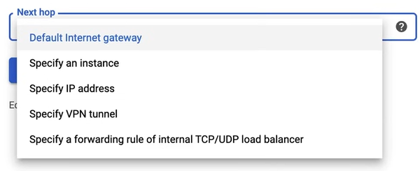
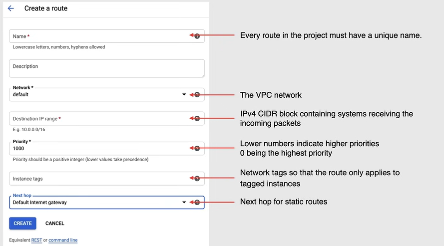
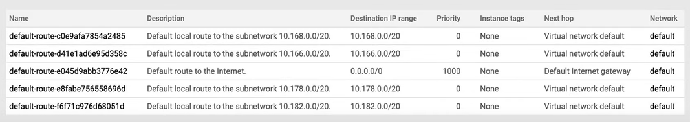
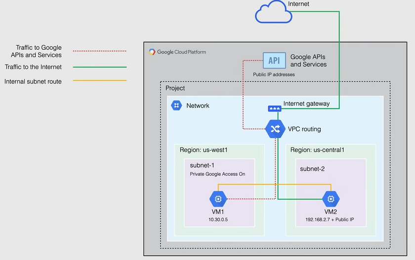

# Routing e Accesso Privato a Google

## Routing

- Le **route di Google Cloud definiscono i percorsi che il traffico di rete percorre** da un'istanza VM verso altre destinazioni.

  - Queste destinazioni possono essere all'interno della rete VPC (ad esempio un'altra VM) o all'esterno di essa.

- In una rete VPC, le route consistono in una **singola destinazione (CIDR) e un singolo next hop**.

  - Quando un'istanza in una rete VPC invia un pacchetto, Google Cloud consegna il pacchetto al next hop della route se l'indirizzo IP di destinazione del pacchetto è all'interno dell'intervallo di destinazione della route.

- Tutte le route sono **memorizzate nella tabella di routing** per la rete VPC.

- Ogni pacchetto che lascia una VM viene consegnato al next hop di una route applicabile **in base a un ordine di routing**.

### Tipi di Routing

Ci sono diversi tipi di routing disponibili in Google Cloud:

- **Route generate dal sistema**
  - Vengono create automaticamente da Google Cloud, sia per le reti VPC automatiche che per quelle personalizzate.
  - Offrono la *route predefinita* e la *route di subnet*.
    - **Route predefinita**
      - Definisce il percorso fuori dalla rete VPC, inclusa la via per accedere a Internet.
      - Fornisce un percorso standard per l'accesso privato a Google.
      - Può essere eliminata solo sostituendola con una **route personalizzata**.
      - Ha la **priorità più bassa**, perché la sua destinazione è la più ampia possibile.
    - **Route di subnet**
      - Route generate dal sistema che **definiscono i percorsi per ogni subnet** nella rete VPC.
      - Ogni subnet ha **almeno una route di subnet** la cui destinazione corrisponde all'intervallo IP primario della subnet.
      - Quando viene creata una subnet, viene creata automaticamente una corrispondente route di subnet sia per l'intervallo IP primario che per l'intervallo IP secondario.
      - Non è possibile eliminare una route di subnet a meno che non si modifichi o elimini la subnet stessa.

- **Route personalizzate**
  - Sono route definite dall'utente che supportano il routing *statico* e *dinamico*.
    - **Route statiche**
      - Possono utilizzare la funzionalità di next hop.
      - Possono essere create manualmente.
      - Le route statiche per i selettori di traffico remoti vengono **create automaticamente durante la creazione dei tunnel Cloud VPN**.

        
        

    - **Route dinamiche**
      - Sono gestite da uno o più Cloud Router.
      - Scambiano dinamicamente le route tra una VPC e una rete on-premises.
      - Raggiungono intervalli di indirizzi IP esterni alla rete VPC.
      - Vengono utilizzate con VPN e interconnessioni con routing dinamico.

### Ordine di Routing

L'ordine di routing gestisce la priorità delle route in una rete VPC.

Le route di subnet sono sempre considerate **prima**, perché Google Cloud richiede che le route di subnet abbiano le destinazioni più specifiche, corrispondenti agli intervalli di indirizzi IP delle rispettive subnet.

Se non viene trovata alcuna destinazione applicabile, Google Cloud scarta il pacchetto e risponde con un errore di rete non raggiungibile.

Le route generate dal sistema si applicano a tutte le istanze nella rete VPC, lo scopo delle istanze a cui si applicano le route di subnet non può essere modificato, anche se è possibile sostituire la route predefinita.

**NOTA:** Le route statiche personalizzate si applicano a tutte le istanze o a istanze specifiche nella rete VPC.

### Percorso di Ritorno Speciale

Il percorso di ritorno speciale è una funzionalità che consente di specificare un next hop diverso per il percorso di ritorno di un pacchetto.

Queste route sono definite al di fuori della tua rete VPC, nella rete di produzione di Google.

Non appaiono nella tabella di routing della rete VPC, non è possibile rimuoverle o sovrascriverle, né eliminare o sostituire una route predefinita nella tua rete VPC, anche se è possibile controllare il traffico verso questi servizi utilizzando le regole del firewall.

I servizi coperti includono bilanciatori di carico, proxy consapevoli di Internet o IAP e Cloud DNS.

## Accesso Privato a Google

Le istanze VM che hanno solo indirizzi IP interni possono utilizzare l'Accesso Privato a Google per raggiungere gli indirizzi IP esterni delle API e dei servizi di Google.

L'indirizzo IP di origine del pacchetto può essere l'indirizzo IP interno primario dell'interfaccia di rete o un indirizzo in un intervallo di indirizzi IP alias assegnato all'interfaccia.

Se si disabilita l'accesso privato a Google, le istanze VM non potranno più raggiungere le API di Google e saranno in grado di inviare solo traffico all'interno della rete VPC.

L'Accesso Privato a Google non ha effetto sulle istanze che hanno indirizzi IP esterni e che possono ancora accedere a Internet.

L'Accesso Privato a Google viene abilitato su base di subnet ed è abilitato per impostazione predefinita per tutte le subnet in una rete VPC.

Riferendosi al seguente diagramma:

- Le regole del firewall nella rete VPC sono state configurate per consentire l'accesso a Internet.

- `VM1` può accedere alle API e ai servizi di Google, inclusa Cloud Storage, perché la sua interfaccia di rete si trova in `Subnet1`, che ha l'Accesso Privato a Google abilitato, e perché questa istanza ha solo un indirizzo IP interno, l'Accesso Privato a Google si applica a questa istanza.

- `VM2` può anche accedere alle API e ai servizi di Google, inclusa Cloud Storage, perché ha un indirizzo IP esterno, quindi l'Accesso Privato a Google non ha effetto su questa istanza, in quanto ha un indirizzo IP esterno e l'Accesso Privato a Google non è stato abilitato su quella subnet.

- E poiché entrambe queste istanze si trovano nella stessa rete, sono comunque in grado di comunicare tra loro tramite una route di subnet interna.

