# Indirizzamento IP

L'indirizzamento IP in Google Cloud comprende diverse categorie e inizia con la determinazione se si desidera comunicare all'interno della rete VPC o con Internet.

Una volta determinato il tipo di comunicazione desiderata, è possibile decidere se è necessario:

- Indirizzi IP interni
- Indirizzi IP esterni

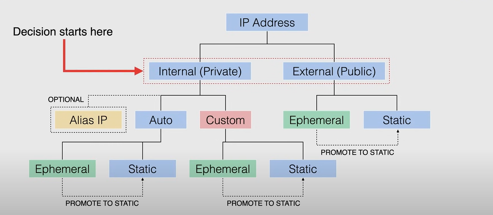

## Indirizzi IP interni

Gli indirizzi IP interni non vengono pubblicizzati pubblicamente, vengono utilizzati solo all'interno della rete VPC.

Ogni rete VPC o rete in locale ha almeno un intervallo di indirizzi IP interni. Le risorse all'interno degli indirizzi IP interni comunicano con altre risorse come se fossero tutte nella stessa rete privata.

Ogni istanza VM può avere un indirizzo IP interno primario, univoco per la rete VPC, e è possibile assegnare un indirizzo IP interno specifico quando si crea un'istanza VM o è possibile riservare un indirizzo IP interno statico per il progetto e assegnare tale indirizzo alle risorse.

Se non si specifica un indirizzo, ne verrà assegnato automaticamente uno alla VM, in entrambi i casi l'indirizzo deve appartenere all'intervallo IP del sottoinsieme.
Se la rete è una rete VPC in modalità automatica, l'indirizzo proviene dal sottoinsieme della regione.
Se la rete è una rete VPC in modalità personalizzata, è necessario specificare da quale sottoinsieme proviene l'indirizzo IP.

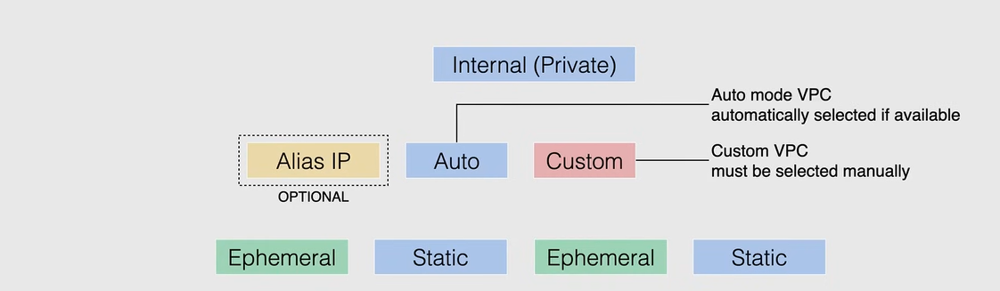

Tutti i sottoinsiemi hanno un intervallo primario che è l'intervallo degli indirizzi IP interni che definisce i sottoinsiemi. Ogni istanza VM ottiene il proprio indirizzo IP primario da questo intervallo.

È anche possibile allocare intervalli di alias IP da tale intervallo primario o è possibile aggiungere un intervallo secondario al sottoinsieme e allocare intervalli di alias IP da tale intervallo secondario.

L'uso degli intervalli di alias IP non richiede intervalli secondari di sottoinsiemi, questi intervalli secondari di sottoinsiemi forniscono semplicemente uno strumento organizzativo.

Quando si utilizza l'alias IP, è possibile configurare più indirizzi IP interni che rappresentano contenitori o applicazioni ospitati in una VM, senza definire un'interfaccia di rete separata.

È possibile assegnare intervalli di alias IP VM sia dall'intervallo primario che da quello secondario del sottoinsieme. Quando vengono configurati intervalli di alias IP, Google Cloud installa automaticamente le route di rete VPC per gli intervalli IP primari e di alias per il sottoinsieme dell'interfaccia di rete primaria.

Il tuo orchestratore di container o GKE non deve specificare la connettività di rete VPC per queste route, semplificando così il routing del traffico e la gestione dei container.

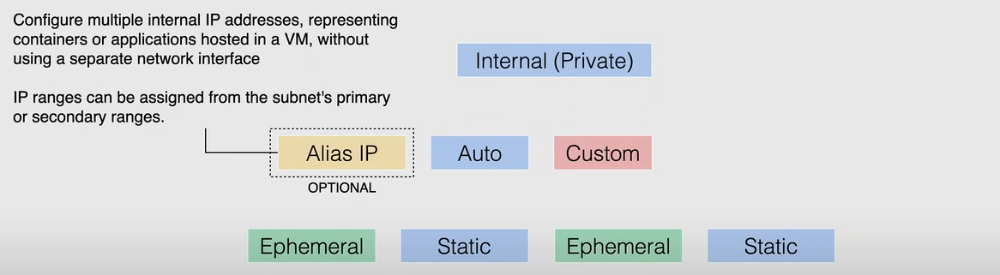

Quando si sceglie una VPC in modalità automatica o una VPC personalizzata, si avrà la possibilità di scegliere tra un indirizzo IP interno *ephemeral* o *statico*.

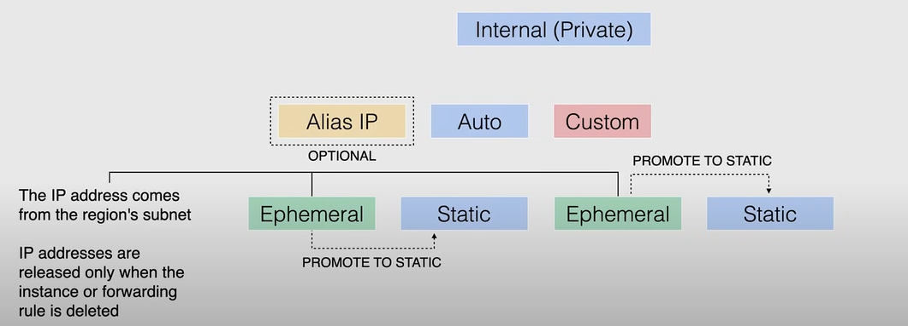

- Un indirizzo IP interno **ephemeral** è un indirizzo IP che non persiste oltre la durata della risorsa. Quando si elimina o si arresta la risorsa, l'indirizzo IP viene restituito al pool generale degli indirizzi IP interni disponibili. Gli indirizzi IP effimeri vengono assegnati automaticamente da Google Cloud quando si crea una risorsa e non si specifica un indirizzo IP.

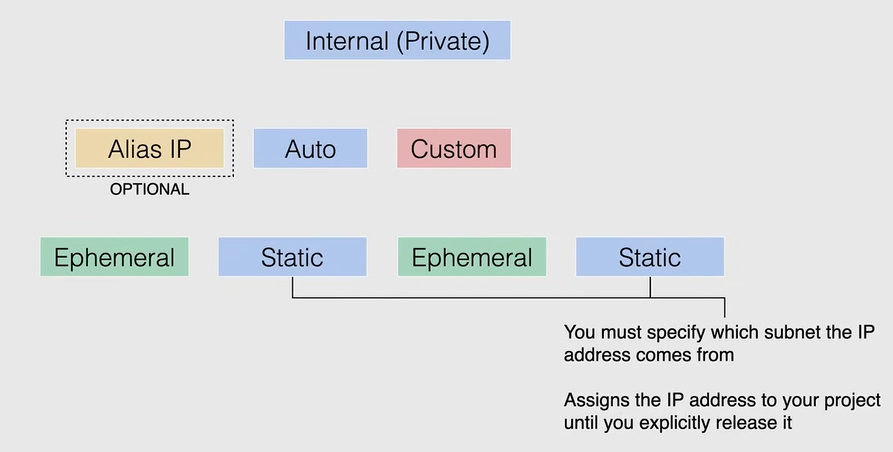

- Un indirizzo IP interno **statico** è un indirizzo IP che si riserva in una specifica regione e si assegna a una risorsa. È possibile assegnare un indirizzo IP interno statico a una risorsa quando si crea la risorsa o è possibile riservare un indirizzo IP interno statico per il progetto e assegnare tale indirizzo alle risorse. Per riservare un indirizzo IP interno statico, è necessario conoscere il valore dell'indirizzo IP che si desidera promuovere.

## Indirizzi IP esterni

È possibile assegnare un indirizzo IP esterno a un'istanza o a una regola di inoltro se si desidera comunicare con l'istanza da Internet.

Come gli indirizzi IP interni, gli indirizzi IP esterni possono essere **ephemeral** o **statici**.

- Un indirizzo IP esterno **ephemeral** è un indirizzo IP che non persiste oltre la durata della risorsa, quindi segue le stesse regole dell'indirizzo IP interno effimero. Se si desidera assegnare permanentemente un indirizzo IP esterno a una risorsa, è necessario riservare un indirizzo IP esterno statico.

- Un indirizzo IP esterno **statico** è un indirizzo IP che si assegna al progetto fino a quando non viene rilasciato esplicitamente. È disponibile come risorsa regionale o globale. *È utile quando si dipende da un indirizzo IP specifico per un servizio specifico, come un server web o un bilanciamento del carico globale che necessita di accesso a Internet.*

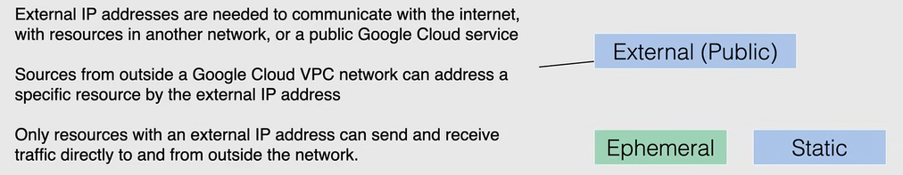

## Riserva indirizzo IP interno

Gli indirizzi IP interni statici consentono di riservare indirizzi IP interni dall'intervallo IP configurato nel sottoinsieme e quindi assegnare tali indirizzi IP interni riservati alle risorse secondo necessità.

La riserva di un indirizzo IP interno **rimuove tale indirizzo dal pool di allocazione dinamica** e impedisce a Google Cloud di assegnare tale indirizzo a un'altra risorsa (allocazione automatica).

La possibilità di riservare indirizzi IP interni statici consente di utilizzare sempre lo stesso indirizzo IP per la stessa risorsa, anche se è necessario eliminare e ricreare la risorsa.

Quando si tratta di riserva degli indirizzi IP interni, è possibile:

1. riservare un indirizzo IP interno statico prima di creare una risorsa, oppure
2. è possibile promuovere un indirizzo IP interno effimero a un indirizzo IP statico dopo la creazione di una risorsa.

Nell'immagine seguente sono presenti due esempi:

1. Nel primo esempio (in alto a sinistra fino all'angolo in alto a destra)
   1. creiamo un sottoinsieme dalla nostra rete VPC,
   2. quindi riserviamo un indirizzo IP interno dall'intervallo IP primario di tale sottoinsieme (contrassegnato come `10.12.4.3`) e verrà mantenuto come riservato per un uso successivo con una risorsa e poi,
   3. quando decidiamo di creare un'istanza VM o un bilanciamento del carico interno, possiamo utilizzare l'indirizzo IP riservato precedentemente, quindi questo indirizzo IP viene contrassegnato come riservato e in uso.

2. Nel secondo esempio (in alto a sinistra fino all'angolo in basso a sinistra)
   1. creiamo un sottoinsieme dalla nostra rete VPC,
   2. quindi creiamo un'istanza VM o un bilanciamento del carico interno, con un indirizzo IP effimero assegnato automaticamente o un indirizzo IP specifico scelto all'interno di tale sottoinsieme specifico e quindi
   3. quando è in uso, possiamo promuovere quell'indirizzo IP effimero a un indirizzo IP statico, quindi diventa riservato e in uso.

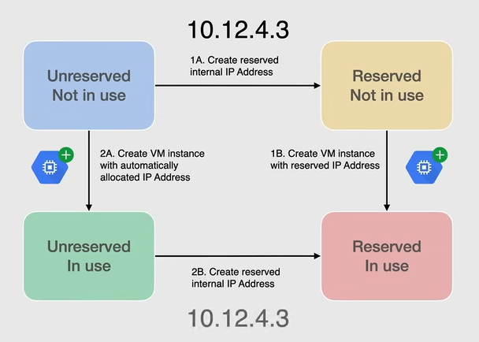

## External IP Address Reservation

Con la prenotazione di indirizzi IP esterni, è possibile ottenere un indirizzo IP esterno statico, seguendo uno dei seguenti metodi:

- Prenota un nuovo indirizzo IP esterno statico e poi assegnalo a una risorsa.
- Specifica un indirizzo IP esterno effimero per una risorsa e poi promuovi l'indirizzo.

Nel caso della prenotazione di indirizzi IP esterni, è possibile prenotare due diversi tipi di indirizzi IP:

- Indirizzi IP esterni **regionali**, utilizzati da istanze VM con una o più interfacce di rete, o da bilanciatori di carico di rete. Questi indirizzi IP possono essere creati sia nella console che attraverso la linea di comando con la limitazione che sarai solo autorizzato a creare indirizzi IP IPv$.


    ```
    gcloud compute addresses create [ADDRESS_NAME] --region=[REGION]
    ```

- **Global** indirizzi IP esterni, utilizzati dai global load balancers, e possono essere creati nella console o tramite la riga di comando, con la limitazione che devi scegliere il livello di servizio di rete premium, al fine di creare un indirizzo IP globale, e dopo aver riservato l'indirizzo IP, puoi assegnarlo a un'istanza, durante la creazione dell'istanza o a un'istanza esistente.

    ```
    gcloud compute addresses create [ADDRESS_NAME] --global --ip-version=[IPV4|IPV6]
    ```

## Demo - Creating Internal and External IP Addresses

A video demo is available [here](https://youtu.be/jpno8FSqpc8?si=C1WC8rjL8s3In6WL&t=25920).

For the demo we use a project with a default VPC network.

To check if the project has a default VPC network:

1. Go to the **VPC network** page in the Google Cloud Console.
2. Move to the **VPC networks** tab.
3. If there is a network named `default` then the project has a default VPC network.

### Internal IP Address

#### Creating a Static Internal IP Address

Utilizzeremo un'istanza VM per creare un indirizzo IP interno statico.

1. Vai alla pagina **Compute Engine** nella Console di Google Cloud.
2. Fai clic su **Crea istanza** per creare una nuova istanza VM.

   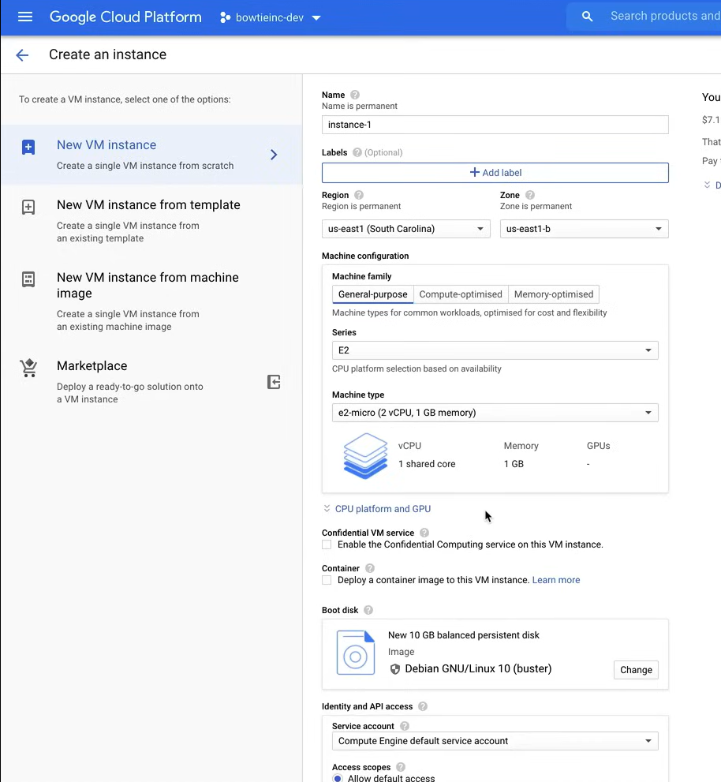

   1. Fai clic sulla voce **Gestione, sicurezza, dischi, networking, tenuta esclusiva**.
   2. Seleziona la scheda **Networking**.
   
      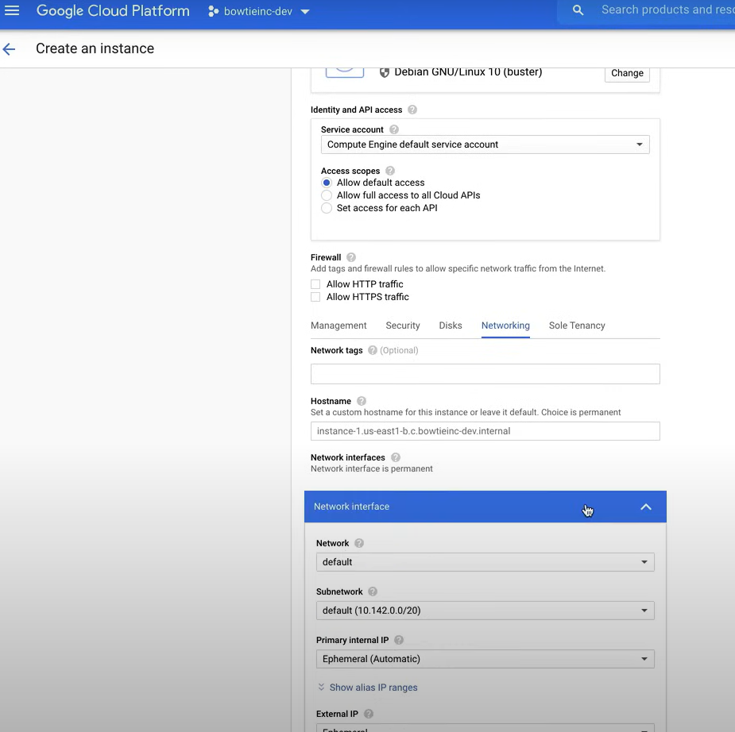

   3. Sotto **Interfacce di rete**, seleziona l'interfaccia di rete **default**.
   4. In questa sezione possiamo creare il nostro indirizzo IP interno statico.
   5. Fai clic sul menu a discesa **IP interno primario** e seleziona **Riserva un indirizzo IP interno statico**.
   6. Si aprirà la seguente finestra, dove è possibile riservare un nuovo indirizzo IP interno statico.

      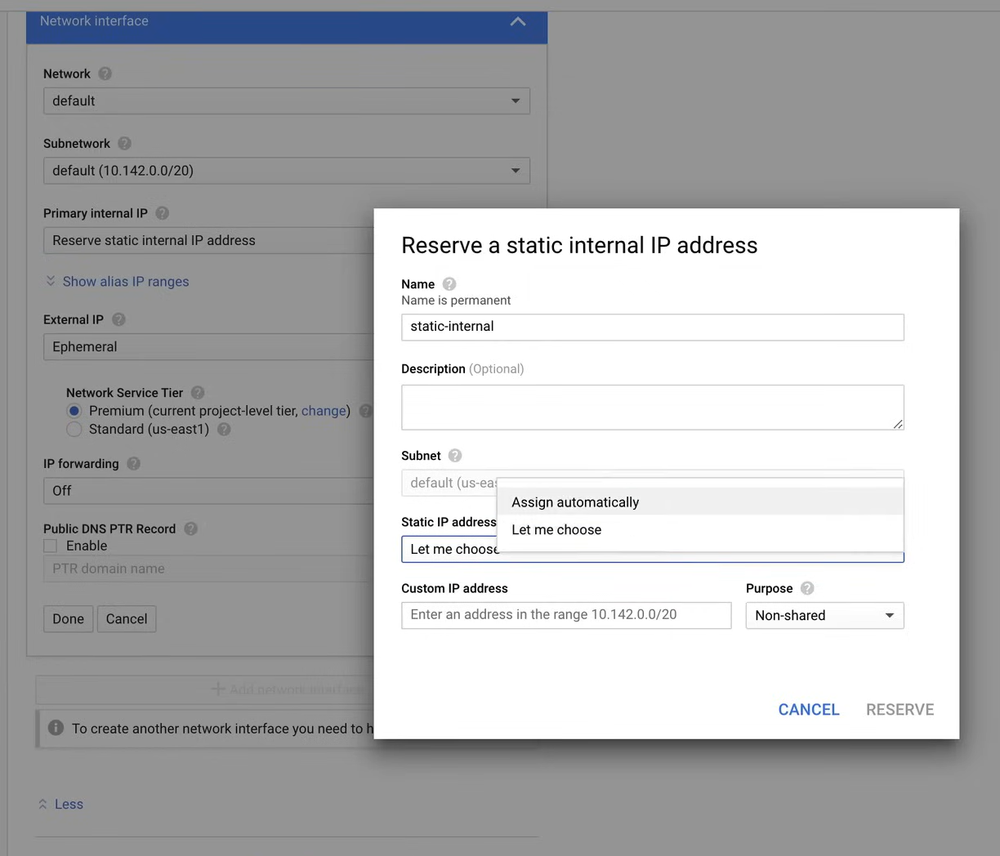
   
   7. Infine, fai clic su **Crea**.

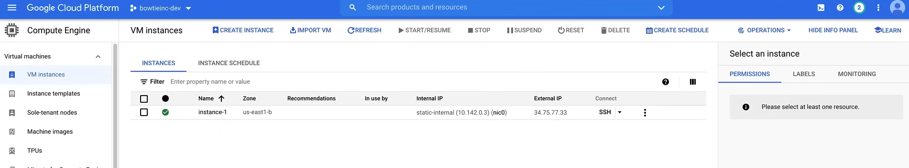

Per visualizzare l'elenco degli indirizzi IP interni disponibili, è possibile utilizzare il seguente comando:

```bash
gcloud compute addresses list

# Output
# NAME          ADDRESS/RANGE  TYPE      PURPOSE       NETWORK  REGION    SUBNET   STATUS
# static-ip-1   10.142.0.3     INTERNAL  GCE_ENDPOINT           us-east1  default  IN_USE
```

**Nota**: L'indirizzo IP interno statico persiste anche se l'istanza VM viene eliminata.

Per dimostrarlo, elimineremo l'istanza VM, cliccando sul pulsante **Elimina** in cima alla pagina. Ora possiamo eseguire lo stesso comando per controllare l'elenco degli indirizzi IP interni, e vedremo che l'indirizzo IP è ancora riservato.

Ora possiamo creare una nuova istanza VM, e assegnare `static-ip-1` ad essa, cliccando su **Crea istanza** e poi sulla scheda **Networking** (della voce **Gestione, sicurezza, dischi, networking, tenuta esclusiva**), e sotto **Interfacce di rete** selezionare l'interfaccia di rete **default**, e nel menu a discesa **IP interno primario** selezionare **static-ip-1**.

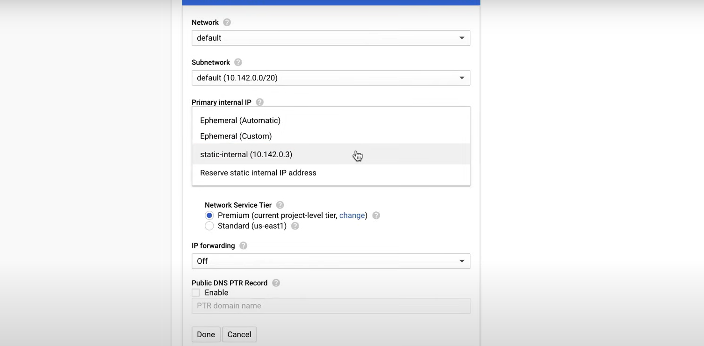

#### Promuovere un indirizzo IP interno effimero a indirizzo IP interno statico

Dall'immagine precedente, invece di selezionare `static-ip-1`, possiamo selezionare l'opzione **Effimero (Automatico)**, e poi creare l'istanza VM.

Ora possiamo cliccare sull'istanza VM, e poi sul pulsante **Modifica**, e nella sezione **Interfacce di rete**, possiamo trovare il menu a discesa **Tipo di IP interno**, dove possiamo selezionare l'opzione **Statico**, e poi, nella nuova finestra popup, possiamo selezionare l'indirizzo IP interno statico:

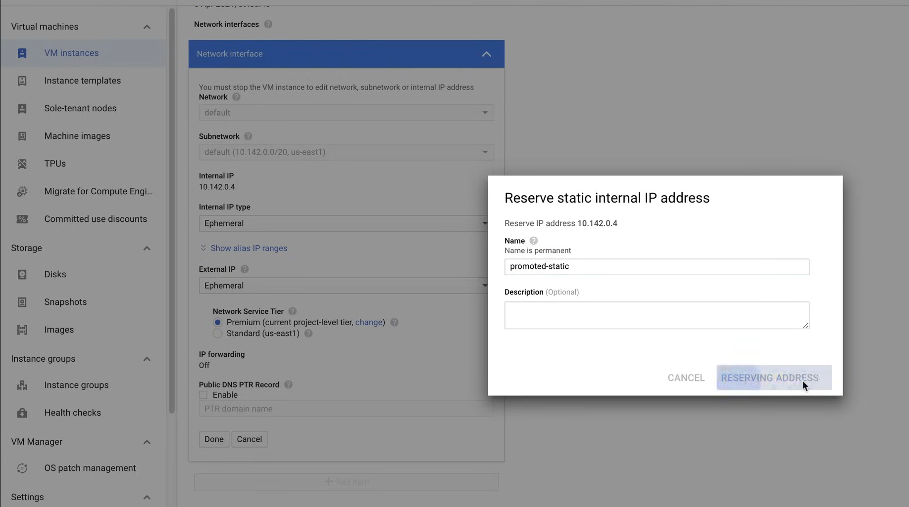

Possiamo controllare le modifiche con lo stesso comando di prima:

```bash
gcloud compute addresses list

# Output:
# NAME               ADDRESS/RANGE  TYPE      PURPOSE       NETWORK  REGION    SUBNET   STATUS
# promoted-static    10.142.0.4     INTERNAL  GCE_ENDPOINT           us-east1  default  IN_USE
# static-ip-1        10.142.0.3     INTERNAL  GCE_ENDPOINT           us-east1  default  RESERVED
```

### External IP Address

#### Creating a Static External IP Address

Go to the **VPC network** page in the Google Cloud Console, and then to the **External IP addresses** tab, you can click on the **Reserve Static Address** button, and then you can create a new static external IP address.

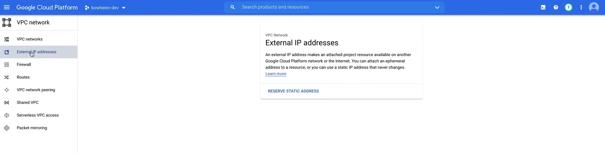

**NOTE:**

- IPv6 addresses can be used only with global load balancers (and only for the Premium network tier).
- *Static IP addresses not attached to an instance or load balancer are billed at an hourly rate.*, so if you are not using any Static IP address, you can release them to avoid being billed.

Now we can fill the form to create a new static external IP address, and then click on **Reserve**.

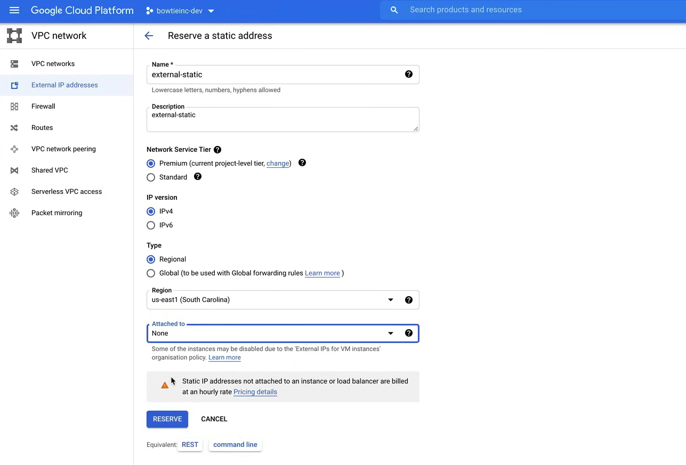

We can see the new static external IP address, in the following page:

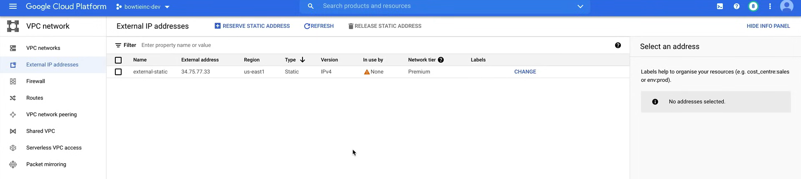

Now we need to attach the static external IP address to a resource, for example to a VM instance.

1. Go to the **Compute Engine** page in the Google Cloud Console.
2. Click on the **VM instances** page, and create a new VM instance.

   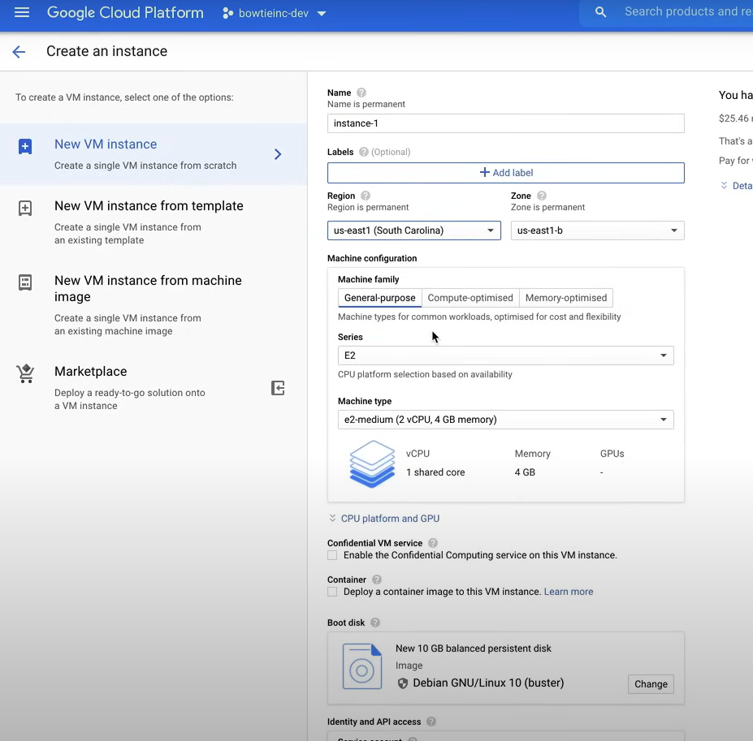

   1. Click on the voice **Management, security, disks, networking, sole tenancy**.
   2. Select the **Networking** tab.
   3. Under **Network interfaces** select the **default** network interface.
   4. In the **External IP** dropdown menu, select the `external-static` IP address.

      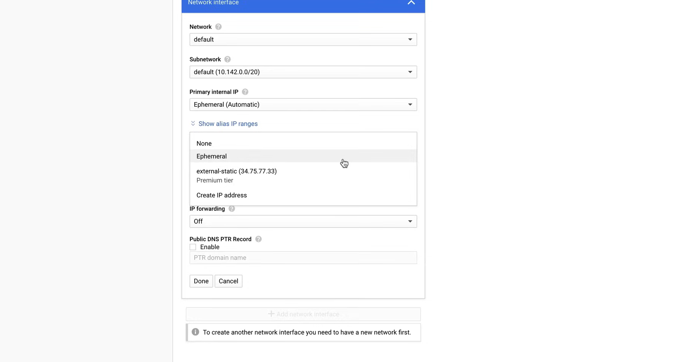

   5. Finally, click on **Create**.

We can verify that the external IP address is attached to the VM instance, by using the following command:

```bash
gcloud compute addresses list

# Output:

# NAME               ADDRESS/RANGE  TYPE      PURPOSE       NETWORK  REGION    SUBNET   STATUS
# external-static    34.75.77.33    EXTERNAL                         us-east1           IN_USE
# promoted-static    10.142.0.4     INTERNAL  GCE_ENDPOINT           us-east1  default  RESERVED
# static-ip-1        10.142.0.3     INTERNAL  GCE_ENDPOINT           us-east1  default  RESERVED
```

#### Promote an Ephemeral External IP Address to a Static External IP Address

To do this create a new VM instance.

1. Go to the **Compute Engine** page in the Google Cloud Console.
2. Click on the **VM instances** page, and create a new VM instance.

   

   1. Click on the voice **Management, security, disks, networking, sole tenancy**.
   2. Select the **Networking** tab.
   3. Under **Network interfaces** select the **default** network interface.
   4. In the **External IP** dropdown menu, select the **Ephemeral (Automatic)** option.
   5. Finally, click on **Create**.

So, we have created a new VM instance with an ephemeral external IP address (`instance-2`).

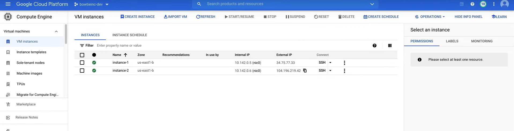

To promote the ephemeral external IP address to a static external IP address, we can use the following command:

```bash
gcloud compute addresses create [ADDRESS_NAME] --addresses [ADDRESS] --region [REGION]

# Example: Copy the IP address from the Console
gcloud compute addresses create promoted-external --addresses 104.196.219.42 --region us-east1
```

We can verify that the external IP address is attached to the VM instance, by using the following command:

```bash
gcloud compute addresses list

# Output:
# NAME               ADDRESS/RANGE     TYPE      PURPOSE       NETWORK  REGION    SUBNET   STATUS
# external-static    34.75.77.33       EXTERNAL                         us-east1           IN_USE
# promoted-external  104.196.219.42    EXTERNAL                         us-east1           IN_USE
# promoted-static    10.142.0.4        INTERNAL  GCE_ENDPOINT           us-east1  default  RESERVED
# static-ip-1        10.142.0.3        INTERNAL  GCE_ENDPOINT           us-east1  default  RESERVED
```

Now we need to clean up any leftover resources, to avoid being billed.

1. Delete the VMs instances, `instance-1` and `instance-2`, using the console in the **VM instances** page (**Compute Engine** section). This frees up the external IP addresses, so they can be released.
2. Go to the **VPC network** page in the Google Cloud Console, and then to the **External IP addresses** tab, and release the external IP addresses, `external-static` and `promoted-external` clicking on the **Release Static Address** button.
3. Now we can delete the static internal IP addresses using the command line:

   ```bash
   gcloud compute addresses delete [ADDRESS_NAME] --region [REGION]

   # Example
   gcloud compute addresses delete promoted-static --region us-east1
   gcloud compute addresses delete static-ip-1 --region us-east1
   ```