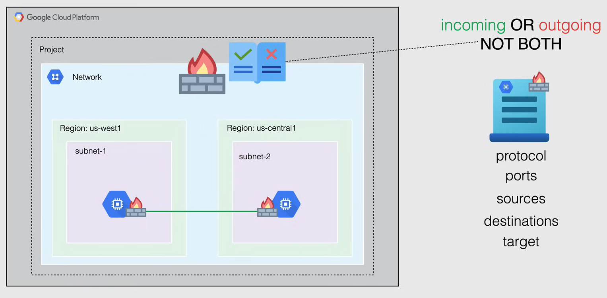
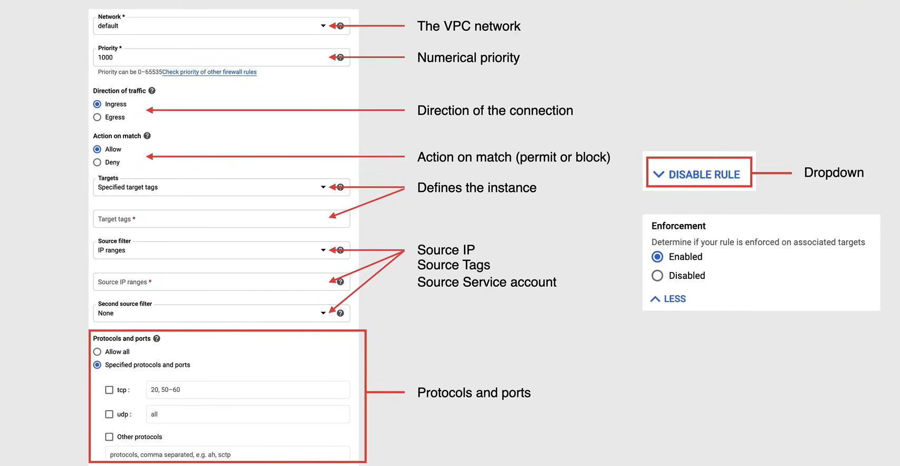

# Firewall and Firewall Rules

## VPC Firewall Rules

**VPC Firewall Rules** è un servizio utilizzato per filtrare il traffico in ingresso e in uscita, basato su un insieme di regole definite dall'utente. Viene utilizzato per proteggere la rete VPC dall'accesso non autorizzato.

- Le regole del firewall VPC si applicano a un determinato progetto e rete, ed è anche possibile applicarle a livello di organizzazione.

- Le regole del firewall VPC ti consentono di consentire o negare le connessioni da o verso le tue istanze VM in base a una configurazione che specifici.
  - Queste regole vengono applicate solo alle connessioni in ingresso o in uscita, ma ***mai entrambe contemporaneamente***.
  - Le regole del firewall VPC abilitate vengono sempre applicate, indipendentemente dalla loro configurazione e dal sistema operativo, anche se non sono ancora avviate.

- Ogni rete VPC funziona come un firewall distribuito
  - Quando le regole del firewall vengono definite a livello di rete, le connessioni vengono consentite o negate su base per-istanza.
  - Quindi, è possibile pensare alle regole del firewall VPC come esistenti non solo tra le tue istanze e altre reti, ma anche tra singole istanze all'interno della stessa rete.

- Quando crei una nuova regola del firewall VPC, specifici una rete VPC e un insieme di componenti che definiscono la regola.
  - I componenti ti consentono di indirizzare determinati tipi di traffico, in base a:
    - protocolli e porte del traffico,
    - sorgenti e
    - destinazioni del traffico.
  - Puoi specificare le istanze a cui si applica la regola utilizzando il componente *target* della regola.

### Implied and pre-populated rules

In aggiunta alle regole che definisci, le reti VPC hanno un insieme di regole implicite e predefinite che vengono applicate automaticamente a tutto il traffico in ingresso e in uscita.

- Ad esempio, Google Cloud non consente determinati protocolli IP, come il traffico in ingresso sulla porta TCP 25 (utilizzata per SMTP), all'interno di una rete VPC.

- E i protocolli come TCP, UDP, ICMP e GRE verso gli indirizzi IP esterni delle risorse di Google Cloud sono bloccati per impostazione predefinita.

Google Cloud consente sempre la comunicazione tra un'istanza VM e il **metadata server**, all'indirizzo `169.254.169.254`, e questo server è essenziale per le operazioni delle istanze VM, **quindi l'istanza può accedervi anche se è presente una regola del firewall che nega tutto il traffico in ingresso.**

- Il metadata server fornisce all'istanza alcuni servizi di base, come:
  - DHCP,
  - Risoluzione DNS,
  - Metadati dell'istanza e
  - Servizi NTP (Network Time Protocol).

**NOTA:** Ogni rete ha due regole implicite del firewall che consentono le connessioni in uscita e bloccano le connessioni in ingresso. Le regole del firewall che crei possono annullare queste regole implicite.

- **Regola di consenti egresso**, consente a qualsiasi istanza nella rete di inviare traffico a qualsiasi destinazione, ad eccezione del traffico bloccato da Google Cloud.
   - **Azione:** consenti
   - **Destinazione:** tutti gli IP
   - **Priorità:** La più bassa possibile
- **Regola di blocco ingresso**, blocca tutto il traffico in ingresso alle istanze nella rete.
  - **Azione:** blocca
  - **Origine:** tutti gli IP
  - **Priorità:** La più bassa possibile

Le regole della tabella precedente consentono connessioni in ingresso da qualsiasi origine a qualsiasi istanza della rete, per quanto riguarda i protocolli ICMP, RDP (sulla porta 3389) e SSH (sulla porta 22). L'ultima regola consente connessioni in ingresso per tutti i protocolli e le porte tra le istanze nella rete e permette connessioni in ingresso alle istanze VM da altre istanze nella stessa rete. Infine, tutte queste regole hanno una priorità di 65534, che è la seconda più bassa possibile.

**NOTA:** Queste regole possono essere eliminate o modificate secondo necessità.

### Firewall Rule Characteristics

Ogni regola del firewall ha le seguenti caratteristiche:

- Ogni regola del firewall si applica solo alle connessioni in ingresso o in uscita, e ***non entrambe contemporaneamente***.

- Le regole del firewall supportano solo indirizzi IPv4.

- L'azione di ogni regola del firewall è o ***consenti o nega***, non è possibile avere entrambe contemporaneamente.

- La regola si applica alle connessioni solo se è attiva.
  - Ad esempio, è possibile disabilitare una regola per scopi di risoluzione dei problemi e quindi riattivarla una volta completata.

- Quando si crea una nuova regola del firewall, è necessario selezionare una rete VPC. Anche se la regola viene applicata a livello di istanza, la sua configurazione è associata alla rete VPC.
  - Ciò significa che ***non è possibile condividere le regole del firewall tra reti VPC***, comprese le reti connesse tramite VPC Network Peering o tramite tunnel Cloud VPN.

- Le regole del firewall sono ***stateful***, il che significa che quando una connessione viene consentita attraverso il firewall in una direzione (in ingresso o in uscita), il traffico di risposta corrispondente a quella connessione viene automaticamente consentito.
  - Non è possibile configurare le regole del firewall per negare il traffico di risposta associato.
  - Il traffico di risposta deve corrispondere alla tupla dei cinque elementi del traffico di richiesta accettato, ma con gli indirizzi IP di origine e destinazione invertiti.
    - Una tupla è un insieme di cinque valori che identifica univocamente una connessione:
      - Indirizzo IP di origine,
      - Porta di origine,
      - Indirizzo IP di destinazione,
      - Porta di destinazione e
      - Protocollo.

- Google Cloud associa i pacchetti in ingresso con i pacchetti in uscita corrispondenti utilizzando una tabella di tracciamento delle connessioni. Google Cloud implementa il tracciamento delle connessioni indipendentemente dal fatto che il protocollo supporti le connessioni.
  - Se una connessione è consentita tra una sorgente e una destinazione, o viceversa, tutto il traffico di risposta è consentito fintanto che lo stato di tracciamento delle connessioni del firewall è attivo.
  - Lo stato di tracciamento delle connessioni di una regola del firewall è attivo se almeno un pacchetto viene inviato ogni 10 minuti.

### Firewall Rule Components

I componenti di una regola del firewall sono:

- **La rete VPC** a cui si desidera applicare la regola del firewall.
- **La priorità numerica** della regola, che determina l'ordine in cui viene valutata rispetto alle altre regole.
  - Numeri di priorità più alti indicano una priorità più bassa e viceversa.
- **La direzione del traffico** a cui si applica la regola, ingresso o uscita.
- **L'azione in caso di corrispondenza**, che può essere consentire o negare.
- **Il target**, che specifica le istanze a cui si applica la regola. Possiamo utilizzare tre opzioni:
  - *Tutte le istanze nella rete*.
  - *Istanze con un tag specifico*.
  - *Istanze con un account di servizio specifico*.
- **Il filtro di origine**, che specifica la fonte del traffico a cui si applica la regola.
  - *Intervalli di indirizzi IP*.
  - *Tag*.
  - *Account di servizio*.
- **Protocollo e porte**, che specificano il tipo di traffico a cui si applica la regola.
  - *Protocollo*, che può essere TCP, UDP o ICMP (possiamo selezionare anche una combinazione di essi).
  - *Porte*, che possono essere una singola porta, un intervallo di porte o tutte le porte.
- **Esecuzione**, che specifica se la regola è attiva o meno.
  - *Abilitata*.
  - *Disabilitata*.

