# Custom VPC

Una demo su come creare una rete VPC personalizzata e subnet in Google Cloud è disponibile [qui](https://youtu.be/jpno8FSqpc8?si=0xmIyuWvFpUL8zHP&t=28034).

In questa sezione, costruiremo la seguente topologia di rete:

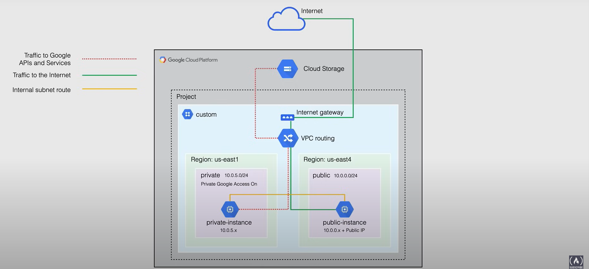

Quindi creeremo:

- una rete VPC personalizzata,
- due subnet, una privata e una pubblica in due regioni separate,
- un bucket di Cloud Storage,
- alcune istanze VM per dimostrare l'accesso al bucket di Cloud Storage, così come la comunicazione tra le istanze VM,
- alcune regole del firewall per instradare il traffico tra le istanze VM.
- implementeremo anche l'accesso privato a Google e dimostreremo l'accessibilità ai file in Cloud Storage dall'istanza privata senza un indirizzo IP esterno.

## Demo

First create a new project called `Bowtieinc` from the Console, and select it.

### Create the Custom VPC Network

Ora possiamo creare la rete VPC personalizzata.

1. Vai alla pagina **Rete VPC** nella Console.
2. Abilita l'**API di Compute Engine** se non è già abilitata (questo perché le reti VPC sono legate all'API di Compute Engine).
3. Quindi abbiamo la rete VPC predefinita, ma ne creeremo una nuova, cliccando su **Crea rete VPC**.

4. Dobbiamo impostare una subnet `Personalizzata`, in particolare abbiamo bisogno di:
  1. Subnet pubblica
      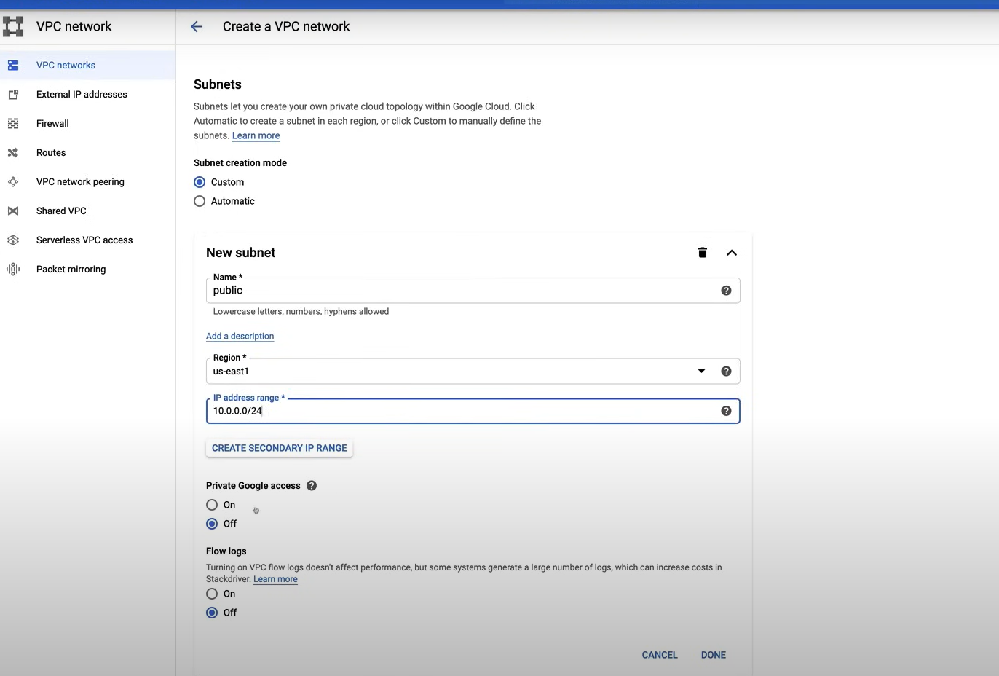
  2. Subnet privata.
      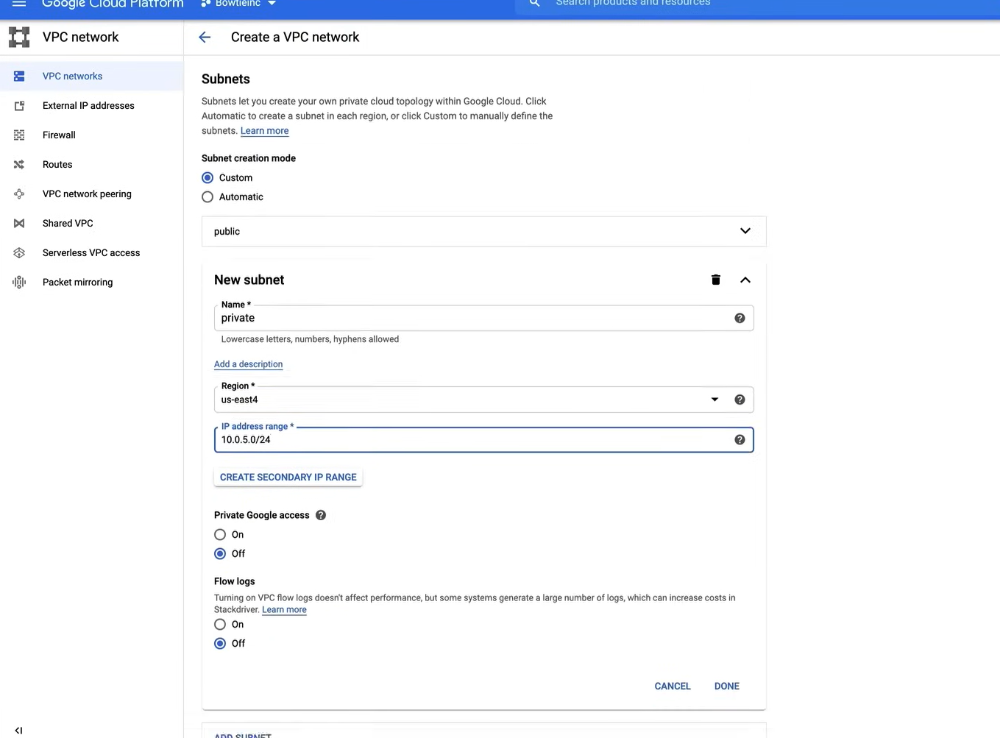

5. Abilita l'**API di Cloud DNS** se non è già abilitata.

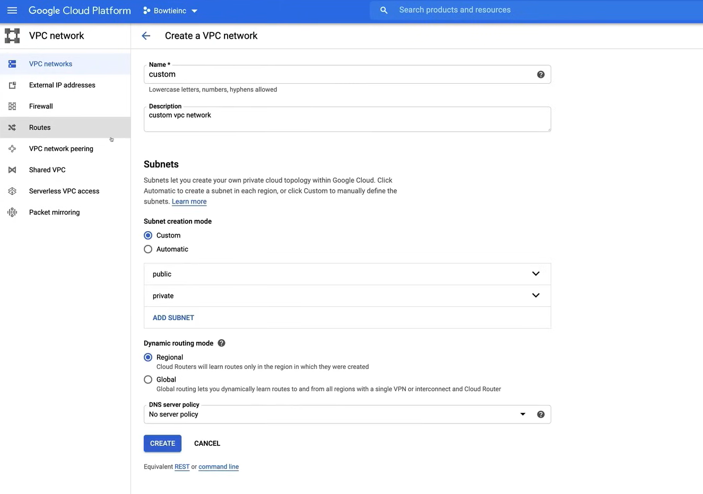

Questo processo può essere eseguito anche tramite la riga di comando:

```bash
# Create the custom VPC network
gcloud compute networks create custom --project=PROJECT_NAME --description=custom\ vpc\ network --subnet-mode=custom --bgp-routing-mode=regional

# Create the public subnet
gcloud compute networks subnets create public --project=PROJECT_NAME --range=10.0.0.0/24 --network=custom --region=us-east1

# Create the private subnet
gcloud compute networks subnets create private --project=PROJECT_NAME --range=10.0.5.0/24 --network=custom --region=us-east4
```

So the result is:

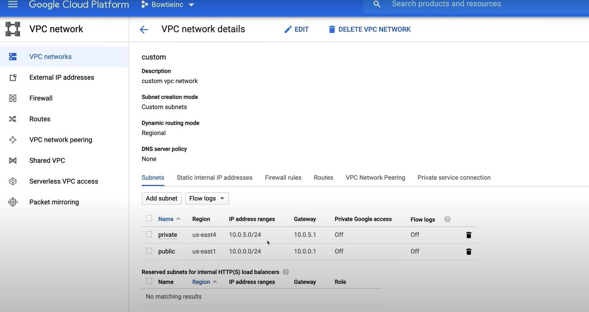

### Creare il Bucket di Cloud Storage

1. Vai alla pagina **Storage** nella Console.
2. Clicca su **Crea Bucket**, e compila i dettagli.
  1. *Il nome del bucket deve essere univoco in tutto Google Cloud.*
3. Carica alcuni file nel bucket, cliccando prima sul nome del bucket, e poi su **Carica file**.

Per creare il bucket tramite la riga di comando:

```bash
gsutil mb gs://BUCKET_NAME
```

So now, we are at the following situation:

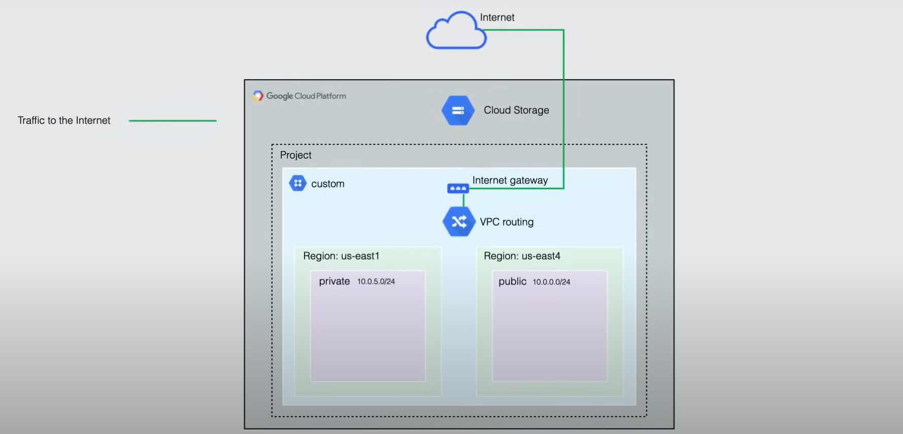

### Create the VM Instances

1. Vai alla pagina **Compute Engine** nella Console.
2. Clicca su **Crea istanza**, e compila i dettagli.
  
  1. Prima crea l'istanza `public-instance`, con

       - etichetta `env:public`
       - regione `us-east1`
       - tipo di macchina `e2-micro`
       - account di servizio `Compute Engine default service account`
       - ambiti di accesso `Imposta l'accesso per ogni API`
         - abilita `Cloud Storage` `Lettura/Scrittura`
         - abilita `Compute Engine` `Lettura/Scrittura`
       - seleziona la scheda **Networking** nella sezione **Gestione, sicurezza, dischi, networking, tenuta esclusiva**
         - seleziona `public` sotto **Tag di rete**
         - seleziona `custom` sotto **Interfacce di rete**, e `Ephemeral` sotto **IP esterno**

3. Clicca su **Crea istanza**, e compila i dettagli.
   1. Poi crea l'istanza `private-instance`, con
      
      - etichetta `env:private`
      - regione `us-east4`
      - tipo di macchina `e2-micro`
      - account di servizio `Compute Engine default service account`
      - ambiti di accesso `Imposta l'accesso per ogni API`
       - abilita `Cloud Storage` `Lettura/Scrittura`
      - seleziona la scheda **Networking** nella sezione **Gestione, sicurezza, dischi, networking, tenuta esclusiva**
       - seleziona `private` sotto **Tag di rete**
       - seleziona `custom` sotto **Interfacce di rete**, e `None` sotto **IP esterno**

Utilizzando la riga di comando:

```bash
gcloud beta compute 
    --project=PROJECT_NAME 
    instances create private-vm 
        --zone=us-east4-c
        --machine-type=e2-micro
        --subnet=private
        --no-address
        --maintenance-policy=MIGRATE
        --service-account=ACCOUNT_NUMBER-compute@developer.gserviceaccount.com
        --scopes=https://www.googleapis.com/auth/devstorage.read_only,https://www.googleapis.com/auth/logging.write,https://www.googleapis.com/auth/monitoring.write,https://www.googleapis.com/auth/servicecontrol,https://www.googleapis.com/auth/service.management.readonly,https://www.googleapis.com/auth/trace.append
        --tags=private
        --image=debian-10-buster-v20200910
        --image-project=debian-cloud
        --boot-disk-size=10GB
        --boot-disk-type=pd-standard
        --boot-disk-device-name=instance-1
        --no-shielded-secure-boot
        --no-shielded-vtpm
        --no-shielded-integrity-monitoring
        --reservation-affinity=any
```

So now, we are at the following situation:

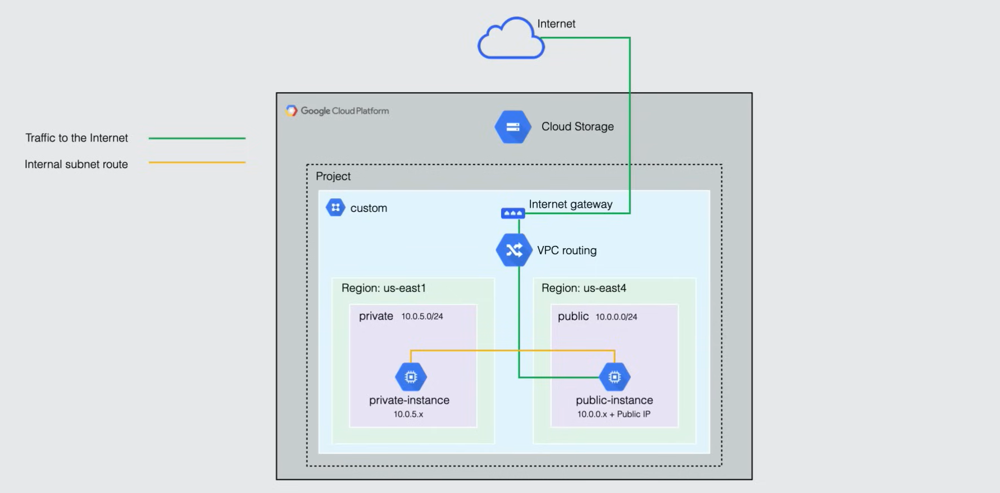

### Create the Firewall Rules

1. Go to the **VPC network** page in the Console.
2. Go to the **Firewall** section.

    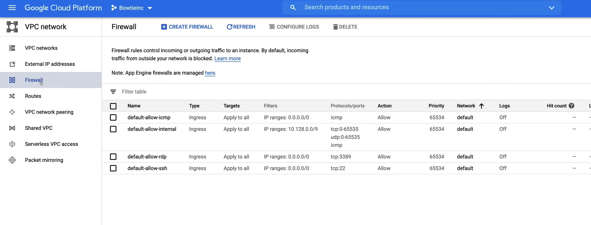

3. Click on **Create Firewall Rule**, to create the public firewall rule.
   1. Fill in the details for the `public-access` rule.
        - `Name`: `public-access`
        - `Description`: Allow public access to the public instance
        - Set `Logs` to On
        - `Network`: custom
        - `Priority`: 1000
        - `Direction of traffic`: Ingress
        - `Action on match`: Allow
        - `Targets`: Specified target tags
          - `Target tags`: public
        - `Source filter`: IP ranges
        - `Source IP ranges`: 0.0.0.0/0
        - `Protocols and ports`: Specified protocols and ports
          - `tcp`: 22
          - `Other protocols`: icmp
        - `Enforcement`: Enabled
   2. Click on **Create**.

4. Click on **Create Firewall Rule**, to create the private firewall rule.
   1. Fill in the details for the `private-access` rule.
        - `Name`: `private-access`
        - `Description`: Allow private access to the private instance
        - Set `Logs` to Off
        - `Network`: custom
        - `Priority`: 1000
        - `Direction of traffic`: Ingress
        - `Action on match`: Allow
        - `Targets`: Specified target tags
          - `Target tags`: private
        - `Source filter`: IP ranges
        - `Source IP ranges`: 10.0.0.0/24
        - `Protocols and ports`: Specified protocols and ports
          - `tcp`: 22
          - `Other protocols`: icmp
   2. Click on **Create**.

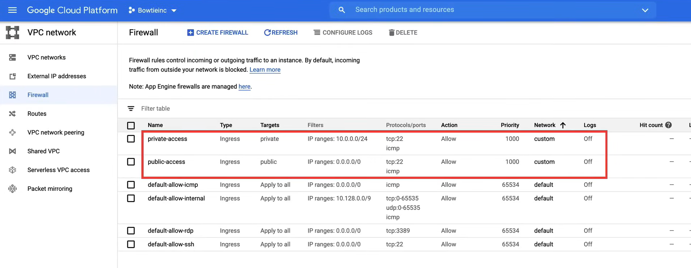

Also in the VPC network page, we can see the firewall rules:

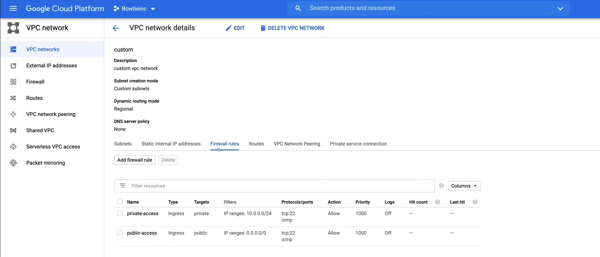

We can also create the firewall rules via the command line:

```bash
# Create the public-access firewall rule
gcloud compute 
    --project=PROJECT_NAME 
    firewall-rules create public-access 
        --direction=INGRESS 
        --priority=1000 
        --network=custom 
        --action=ALLOW 
        --rules=tcp:22,icmp 
        --source-ranges=0.0.0.0/0 
        --target-tags=public

# Create the private-access firewall rule
gcloud compute 
    --project=PROJECT_NAME
    firewall-rules create private-access
        --direction=INGRESS 
        --priority=1000 
        --network=custom 
        --action=ALLOW 
        --rules=tcp:22,icmp 
        --source-tags=public 
        --target-tags=private
```

### Test the Communication

Now login to the `public-instance` to test the communication between the instances.

1. Go to the **Compute Engine** page in the Console.
2. Click on the `SSH` button for the `public-instance`, and it will open a terminal.
   1. In is possible to use the `gcloud` command to SSH into the instance as well.

    ```bash
    gcloud compute ssh --project PROJECT_NAME --zone us-east1-b public-instance
    ```

3. Run the following commands to see if we have access to the files in the Cloud Storage Bucket, i.e. list the files in the bucket.

```bash
gsutil ls gs://BUCKET_NAME
```

4. Next copy the IP of the `private-instance` and try to ping it.

```bash
ping PRIVATE_INSTANCE_IP
```

Now login to the `private-instance` from the public instance to test the communication between the instances.

So, run the following commands:

```bash
gcloud compute ssh --project PROJECT_NAME --zone us-east4-c private-instance --internal-ip
```

The console asks to enter the passphrase for the SSH key, and then we are logged in.

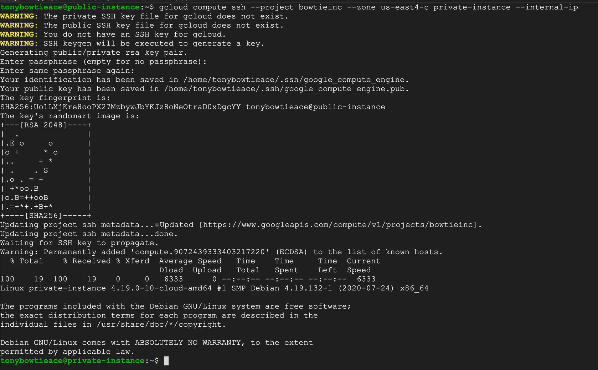

When you log into an instance on Google Cloud with OS login disable, Google manage the authorized keys file, for new user accounts based on SSH keys in metadata.

Now we can try to ping the `public-instance` from the `private-instance`.

```bash
ping PUBLIC_INSTANCE_IP
```

Finally we can try to access the files in the Cloud Storage Bucket from the `private-instance`. After we press `Enter`, we will not get an immediate response, and the command will hang. This is because the external access is needed to reach Cloud Storage, but this instance have only an internal or private IP address.

```bash
gsutil ls gs://BUCKET_NAME
```

### Enable Private Google Access

Now, in order to access the files in the Cloud Storage Bucket from the `private-instance`, we need to enable the Private Google Access on the subnet.

1. Go to the **VPC network** page in the Console.
2. Go to the **VPC networks** section.
3. Click on the `private` subnet, to edit it, click on **Edit**.
4. Turn on the **Private Google Access**.
5. Click on **Save**.

Now we can execute the command to list the files in the Cloud Storage Bucket from the `private-instance`.

**MOTE**: remember to delete the instances and the bucket to avoid charges.